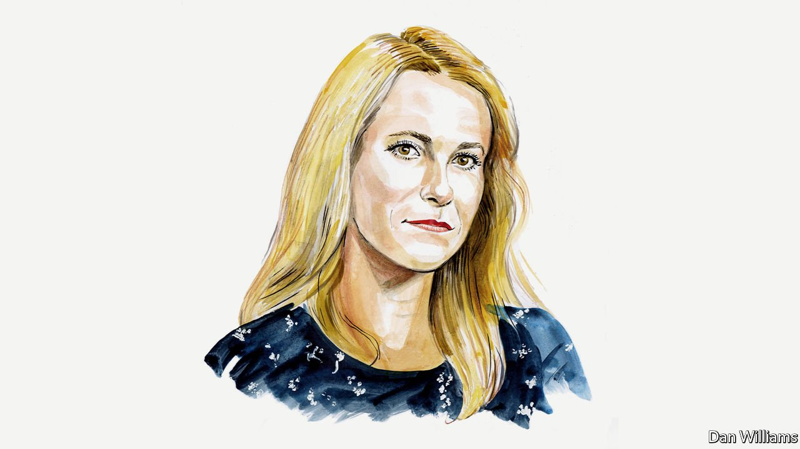

###### Russia and Ukraine

# Kaja Kallas on the atrocities in Ukraine 

##### Estonia’s prime minister argues that although the Soviet Union collapsed, its imperialist ideology never did 

 

> Apr 9th 2022 

I AM WRITING this essay as the world has woken up to the horrific scenes from Irpin and Bucha, suburbs of Kyiv in Ukraine. We see pictures of mass graves and civilians murdered by Russian troops. These photos remind Estonians of the killings by the Soviet regime and the NKVD, its law-enforcement ministry. Its machine of state terror murdered civilians in exactly the same way. Deportations and filtration camps take me and every other Estonian family back to painful memories of repression under Soviet occupation and of Gulag prison camps.

Placing civilians at the frontline is a Russian war tactic. The proof? There are more civilian victims than there are military casualties—especially if you consider that it’s not accidental that a quarter of Ukraine’s population has been forced to flee from their homes or that Russia has engineered humanitarian catastrophes in cities such as Mariupol. Targeting civilians is a war crime according to international law. Ukraine is not a battlefield; it’s a crime scene. So too were Rwanda and Srebrenica.


The perpetrators of these atrocities must be brought to justice. The free world should lend its full support—both political and practical—to the investigation launched last month by the chief prosecutor of the International Criminal Court into war crimes and crimes against humanity. These crimes do not expire and so neither should the investigation. We still know about only a fraction of the atrocities that Russian troops have committed; the true scale of the Kremlin’s brutality is yet to be seen.

As a mother, it hurts my soul to see how thousands are losing their lives in Ukraine. The Kremlin is sending its youth to die and is slaughtering innocent people and shelling their homes en masse. And what for? For the sake of Vladimir Putin’s imperialist ambition. By now it has become abundantly clear that although the Soviet Union collapsed, its imperialist ideology never did.

The suffering and devastation in Ukraine is far from over as Mr Putin's strategic aims have not changed. Negotiations at gunpoint offer no magic formula for avoiding another war and peace at any price does not mean that atrocities will end. Here I am speaking from the experience of my own country. For Estonia and many others after the second world war, peace meant the beginning of the Soviet occupation with its huge human cost. It brought renewed suffering through mass killings, repressions, mass deportations and other crimes against humanity.

Estonia’s experience reminds us that our first focus today must be on how to help Ukraine free itself from occupying forces, restore its territorial integrity and stop Russian aggression. I cannot help but admire the brave fight Volodymyr Zelensky is leading and the extremely difficult choices he faces.

All of the warning signs were there in recent decades: imperial nostalgia, the narrative of Russian victimhood and Mr Putin’s wars in Chechnya, Georgia, Donbas and Crimea. We heard statements that Ukraine—which has a population of 44m and is the third-largest country by territory in Europe (after Russia and Turkey)—had no right to exist. In December Russia gave ultimatums to NATO to limit its deployment of troops and weapons and in effect to reverse the enlargement of its membership so as to take it back to its size in 1997.

The past three of Mr Putin’s wars illustrate why he must not win this one and why Moscow cannot be allowed to pretend that it has gained anything in the process. We have let Mr Putin get away with this aggression several times before. We can’t let him get away with it again now. Were that to happen, his appetite would only grow, and more atrocities and more human suffering would follow.

Russia’s war against Ukraine has made it once again crystal-clear why countries in central and eastern Europe, after breaking free from Soviet occupation, quickly asked to join NATO. The alliance doesn’t exist to threaten Russia: it is for defence. It exists to keep tens of millions from being enslaved and slaughtered by dictators. And it is the actions of the Soviet Union, and later Russia, that explain why so many countries wanted to join NATO. Those blaming it for “expansion” and “escalation” succumb to the very imperial ideology and language pursued by the Kremlin. These run counter to the principles of state sovereignty and democracy.

We are at an era-defining moment and the decisions we make now will stick with us for decades. The war touches the European Union’s own borders. Our response and support to Ukraine will determine if lasting peace is possible on our continent. I believe the steps we need to take should come under the label “smart containment”.

First, military aid to Ukraine must be our top priority. This means, among other things, sending weapons and materiel that the Ukrainians need and have requested. They need help not only to better protect their skies, but also to take back their cities and to free people from Russian occupation and repression. The brave people of Ukraine have not yet tired and so neither can we. There is a lot more we should do and we must commit ourselves to it for years to come.

Second, we must disarm the Kremlin and its war machine financially. Unless we quickly dry up its revenues, Russia will be able to continue its aggression and slaughter. Hydrocarbons were a major source of Russian state budget revenue (more than 40%) last year. This year they are rapidly turning into the biggest source because of increased demand and increasing prices. If the free world wants to stop financing Mr Putin”'s war, our focus must be on drying up these revenues as soon as possible. If we are not ready to stop the purchases of hydrocarbons all at once, we should set up a special third-party escrow account to reserve part of the money paid for Russian oil and gas. This would rapidly diminish the income received by the Kremlin. It would send a clear signal to Mr Putin: this war will cost Russia a fortune. Not only will Russia pay for every bullet its army shoots, but it will also pay for every bridge destroyed and house shelled in Ukraine. The Kremlin must pay its due for the damage caused.

Third, NATO must demonstrate that it is determined, able and ready to defend every inch of its territory and, if need be, to use force. Sometimes the best way to achieve peace is to be willing to use military strength.

Life at the frontline of the free world means we in Estonia must do a lot more ourselves for our own defence. My government has decided to significantly increase our own contribution: our defence expenditure next year will be more than NATO’s target of 2% of GDP. We will bring it up to 2.5% of GDP.

I keep getting asked whether I think Estonia will be the next country to be invaded by Russia. We should be doing everything to make sure that no country will be next. If we fail here, then the question will become whether NATO is next. It is the most successful defence alliance ever and has never been militarily invaded in its history. There is a clear reason for that: its deterrence has worked. To keep it thus we need to make the effort to adapt our military posture adequately.

We need a long-term policy shift in NATO’s defence posture. This means more combat-ready troops stationed permanently in the Baltic States, supported by long-range artillery, air defence and other enabling capabilities. It would also mean more NATO fighters in our skies and more ships in the Baltic Sea. The work is under way and final decisions will be made at the NATO summit in Madrid in June.

Ukraine is not the victim of a one-time miscalculation by a madman. We are witnessing a long-planned campaign by the Kremlin to exert control over neighbouring countries by brute force, no matter the human cost. We need strategic patience and long-term persistence with policies to halt this aggression and to prevent new outbursts of it.

Russia’s aggression against Ukraine is an attack against humanity and its consequences will be global. It takes courage, moral clarity and action to stand up against it and stop it. We have promised “never again”. We must act now if we really want this to be the last time. Indifference is the mother of all crimes.

_______________

Kaja Kallas is the prime minister of Estonia.

Read more of our recent coverage of the .

