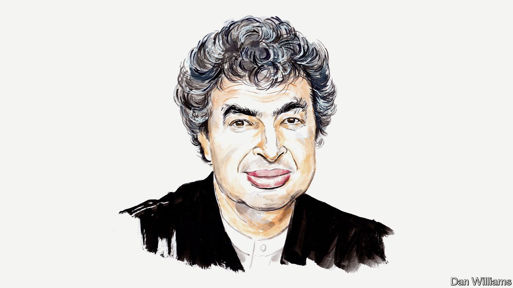

###### Russia and Ukraine

# Semyon Bychkov speaks out for creative freedom amid conflict 

##### The conductor says bleak choices await Russia’s artists 

 

> Apr 9th 2022 

The Russian invasion of Ukraine has dealt a profound blow to Russian culture and its vitality, both at home and abroad. Everything that is Russian has become toxic, leading to bans on Russian works of art and cancellations of Russian artists’ performances. It is an irrational reaction on the part of the global community, but it reflects the intensity of revulsion felt at the horrors of war and suffering inflicted on the people of Ukraine. It also reflects our sense of helplessness, our pain and the desire to do something to register our rejection of, and revolt against, violence.

Culture defines who we are and who we aspire to be. It mirrors the human condition in its infinite complexity. It is meant to enlighten and to nourish the good in us, but also reveals and warns us of its opposite. Art in itself is meant to serve human society. So are the artists.


Art cannot and should not be used for political ends or to justify any ideology. That is fundamental in a democratic society, built on the idea of pluralism. Not so in totalitarian regimes where art is kidnapped to defend the indefensible and used by rulers to brainwash their people, to make them adhere to dogma and to prevent them from thinking for themselves. Art is used to stop them searching for the existential truth, finding it and deciding how to deal with it.

What choice do artists in Russia have when faced with the almighty power of the state? They can conform and become its faithful servants, publicly and enthusiastically subscribing to the notion formulated by the speaker of Russia’s Parliament, Vyacheslav Volodin: “If there is no Putin, there is no Russia.” A shower of rewards in a variety of forms will follow. But the price to pay is the corruption of the soul. To join the power is to become its instrument.

Another choice for artists is to remain true to their own convictions, but to remain silent. Emigrate inside your conscience and live with the pain of it—as the composer Shostakovich did in Soviet times and as so many others did in their time, and as so many do today. A third choice is to openly oppose the regime and to perish, perhaps through Novichok poison, in return. The last choice is to leave the country, if possible.

These are the options, and each of them carries an enormous price that must be borne by the whole of Russian society. The country’s cultural realm is meant to be in the forefront of intellectual thinking, and is presupposed to reflect the conscience of the nation. Yet today, as in Soviet times, it is once again expected to endorse a war forced upon a much smaller country. Ukraine’s only sins are its desire to be independent and democratic, and its wish to preserve its statehood, its language and its culture.

Any war will produce either national unity in the face of a common threat, or profound division when the reasons for it cannot be understood or justified. The war in Ukraine created an extraordinary unity among the Ukrainian people but deepened the divisions inside Russian society. The world of arts and culture has been cleft, too. The very regime which indiscriminately sheds blood in Ukraine is mercilessly unforgiving towards those who dare to oppose it. The world of arts included.

Mr Putin and his coterie talk endlessly and piously of the great Russian cultural tradition: its music, its literature and its “power”. Power is the key word for them, the only thing they can relate to and identify with. True, Russia’s artistic legacy has enormous and universal power to enrich our lives through its humanistic ideas. It should not be used to oppress or subjugate, nor to awaken the worst instincts of human nature. Not to destroy but help create a better world in which everyone has space and chance to find fulfilment, where there is room for diversity and true freedom of self expression.

Works of art and artists themselves cannot assume guilt for the sins of those who rule the country where they were born—unless we have a reason to identify them with Mr Putin’s regime itself. This cannot be true in the case of Mussorgsky’s opera “Boris Godunov”: it was composed in the 19th century. Yet its performances have been cancelled by the Polish National Opera. The work shows us what absolute power does to destroy an individual, an austere ruler of Russia, and his people. As such it should be performed ten times every day!

We need to recognise how much grey lies between the black and white; how different and complex are the circumstances of each human life and the content of each work of art. Otherwise more injustice is committed, creating more wounds that won’t heal.

In the second world war the city of Leningrad (as St Petersburg was known under the Soviets) lived under siege for almost 900 days. The Leningrad Radio Symphony Orchestra helped people survive the inhumanity of their condition. The orchestra would regularly broadcast performances of the music of many different composers. Beethoven was one of them, even though the German army was only a few kilometres away from the city’s centre.

Tchaikovsky and Tolstoy, Mussorgsky and Pushkin, Shostakovich and Akhmatova, among countless others, have given us gifts through their immortal creations. Are we to refuse them now solely because of their Russian origins? If we did, what would separate us from the Nazis burning books and forbidding music that didn’t suit either their ideology or racial prejudice? What would distinguish us in spirit from last century’s Soviet establishment? It persecuted some of its best writers, composers and performers. How would our thinking be different from that of Mr Putin’s Russia today? It does the same to anyone daring to oppose its so-called “special military operation” in Ukraine.

This is not who we believe ourselves to be.

These are not our values.

This is not how we want to define ourselves.

_______________

Semyon Bychkov is chief conductor and music director of the Czech Philharmonic. He was born in the Soviet Union but emigrated in his 20s.

Read more of our recent coverage of the .

