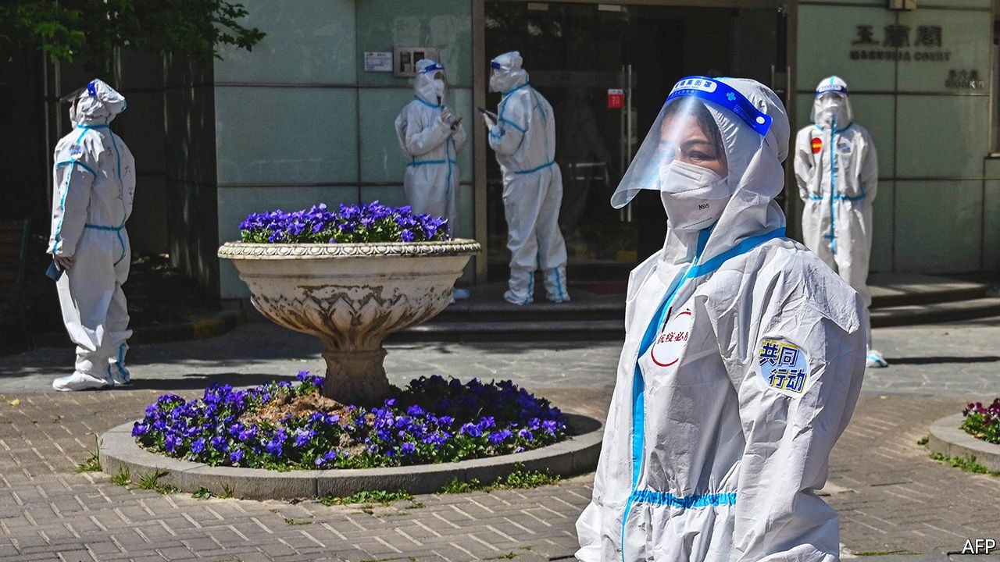
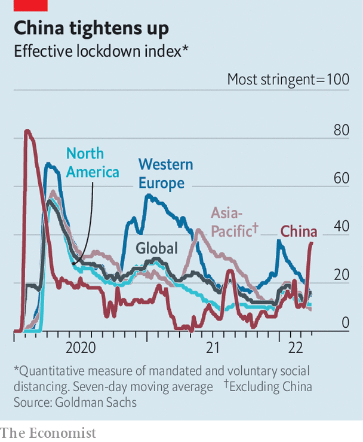

###### Shanghai swoons

# A clumsy lockdown of Shanghai is testing the “zero-covid” strategy 

##### Short of food and medicine, residents of China’s financial hub are growing angry 

 

> Apr 9th 2022 

THE EFFORT to stamp out covid-19 in Shanghai has taken on the characteristics of a military campaign. The army has published photos of planes offloading personnel and supplies. Tens of thousands of medical workers have marched into the city. At least as many covid patients will be spirited out—bused to field hospitals in neighbouring areas, sometimes hundreds of kilometres away. The rest of the city’s 25m residents will remain locked down as the fight against the virus drags on.

For two years China’s business and finance hub remained relatively unscathed by covid. Shanghai was evidence of the government’s skilful handling of the pandemic. The country’s “zero-covid” approach, involving mass testing and strict lockdowns to crush outbreaks, led to fewer deaths and stronger economic growth than in other big countries. Xi Jinping, the president, has hailed the strategy as a great success—and proof that China’s socialist system is superior to Western democracy.


But the situation in Shanghai is testing all that. Not since the start of the pandemic, when the government sealed off Wuhan, a city of 11m people, have the country’s covid measures come under such scrutiny. The campaign in Shanghai has been nothing short of a mess, say residents. They have faced varying restrictions since early March and are now confined to their homes. Food shortages are a problem. People complain of going without medicine. In China’s largest city the government’s strict covid controls are stoking anger.

 


For weeks the authorities in Shanghai experimented with a looser approach. They used targeted lockdowns on housing compounds to contain the virus. But the highly transmissible Omicron variant continued to spread. The government tried to quash any talk of harsher measures in the offing, even detaining people for spreading rumours. “We’re not going to use the lockdown strategy for now,” said Zhang Wenhong, who runs Shanghai’s covid response, on March 25th. Three days later a two-phase lockdown was announced. First the east side of the city was closed for four days, then the west side. Even that proved ineffective. So, as the staggered lockdown came to an end, the government closed the entire city indefinitely.

Unsurprisingly, the authorities were unready to support people during the hastily conceived lockdowns. And residents themselves were given little time to prepare. Some rushed to supermarkets, leaving aisles empty. Getting basic provisions has become a struggle. Messaging boards linked to Weibo, a popular Twitter-like platform, have been inundated with pleas for help. One woman said her father, who is suffering from cancer, was blocked from leaving his home and is “considering suicide”. A man sought epilepsy medication for his young son; he “did not dare consider the consequences” of failing to obtain it. Videos show people fighting over boxes of food. This correspondent has struggled to obtain potable water.

Abandoned warehouses, expo centres and shipping containers have been converted into makeshift isolation centres for those who test positive. Videos show patients protesting against a lack of food, water and treatment. Health workers have been filmed striking people or pulling them by their hair from their homes. But the authorities’ most controversial policy has been separating covid-positive children from their parents. Videos of dozens of children, some just months old, lying five to a bed, caused an uproar. The government has since said that infected parents could accompany their covid-positive offspring, and that healthy parents of infected children with special requirements could apply to go with them.

People have also been angered by the leaked recording of a phone call purportedly between a Shanghai resident and an official from the local office of the Chinese Centre for Disease Control and Prevention. On the call, which The Economist has not verified, the official says Shanghai’s policies have been driven by political considerations, not public-health concerns. She says that co-ordination between hospitals has been poor and that medical supplies are running low. People with mild or no symptoms should quarantine at home, she suggests, contradicting official policy. She also says tests have been rigged to show negative results in order to free up capacity in the overwhelmed health system while appearing to adhere to the government’s zero-covid mandate.

News of the call was quickly followed by a visit to Shanghai by Sun Chunlan, a deputy prime minister in charge of fighting covid, who reiterated the state’s “unswerving adherence to the dynamic zero-covid approach”. Until recently that strategy has seemed broadly popular, as it has allowed most of China’s 1.4bn people to lead relatively normal lives. But the fast spread of Omicron means the number of people caught up in the state’s covid controls is growing, including all of Shanghai’s residents. The grumbling is getting louder on social media, despite the state’s best efforts to censor it. Complaints from Shanghai resonate loudly among China’s leaders: the city is of immense political importance, being home to many of the country’s rich and powerful.

There is no easy remedy for its sufferings. Mr Xi is expected to gain a third term as party chief later this year, in violation of recent norms. He does not want that moment of triumph to be overshadowed by pandemic-related chaos. A relaxation of controls might cause an even bigger surge of infections that could imperil far more of the country’s rickety health infrastructure. But maintaining them would be risky, too. Analysts believe the measures are dealing a big blow to , which may not grow at all this quarter compared with the last.

What effect this will have on China’s politics is a subject of much speculation. One name to watch is that of Li Qiang, Shanghai’s party secretary and a close ally of the president. Experts expect Mr Li to be picked for the seven-member Politburo Standing Committee, the country’s most powerful political body, later this year. Some think he will become the next prime minister. But the mess in Shanghai may dim Mr Li’s prospects. In Hong Kong, central-government frustration with the city’s handling of a recent covid wave could be one reason why Carrie Lam has announced she will not stand again as the .

For now, cases in Shanghai continue to rise. Food is growing scarcer. Residents have been filmed on their balconies, chanting to be set free. But most old people have not been vaccinated and relatively few Chinese have natural immunity. A large outbreak in the country could result in millions of deaths. The effort in Shanghai may look like a military campaign, but it is to avoid a broader war. ■

Dig deeper

All our stories relating to the pandemic can be found on our . You can also find trackers showing ,  and the virus’s spread across .

