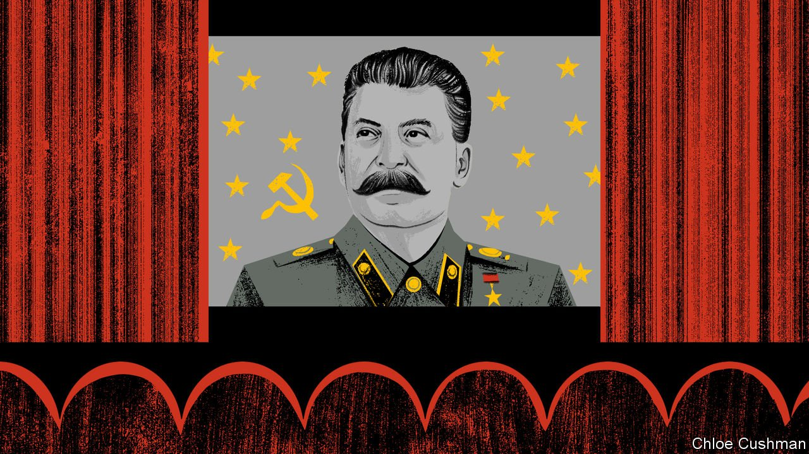

###### Chaguan

# Don’t underestimate Xi Jinping’s bond with Vladimir Putin 

##### Shared security concerns bring China and Russia close. But so do similar views of history 

 

> Apr 9th 2022 

EACH NEW Russian atrocity in Ukraine prompts a question about China. Surely, foreign governments wonder, China’s leader, Xi Jinping, must distance himself from Vladimir Putin soon—if only to avoid harming his own national interests?

Alas, the history of outsiders telling leaders in Beijing how to judge China’s interests is long, and littered with disappointment. The Ukraine conflict is no exception. One reason for this involves geopolitics, and an argument made by Chinese officials and state media, as well as in special classes being organised by universities to give academics and students a “correct understanding” of the war. This says that Mr Putin attacked Ukraine in self-defence, after America encroached on Russia by pushing European nations into the NATO military alliance. No matter that this turns history on its head, and ignores the pleas of ex-Soviet satellite states to join NATO as a defence against Russian aggression. To China, NATO enlargement is a hostile act which calls to mind American alliance-building in Asia. That makes Russia an invaluable partner in a global contest against American bullying, which China can ill afford to abandon. By this cold logic, Ukraine’s agonies are a distraction.


A second explanation for China’s embrace of Russia is harder to see and hear, for it involves an indoctrination campaign within the Communist Party. This draws lessons from the “tragedy” of the Soviet Union’s disintegration. It takes its lead from Mr Xi, who casts the Soviet collapse as a crisis of lost communist faith. Several times during his first decade as leader, Mr Xi has condemned Soviet party leaders and officials for becoming a self-serving caste and for losing political control of the army. Above all, Mr Xi blames the Soviet collapse on “historical nihilism”, jargon for allowing ideological foes to dwell on dark episodes in history.

A new, 101-minute Chinese documentary made for internal party use, “Historical Nihilism and the Soviet Collapse, Reflections on 30 years since the Disintegration of the Soviet Party and Nation”, takes up that charge. Though not widely publicised, the film has been studied since late last year. There are brief reports of screenings all around China, in central and provincial government bodies but also at universities and law courts, municipal party committees and at least one local forestry bureau: evidence of a campaign ordered from the top. The film has not been released in cinemas or on television, but may be found online.

The film lionises Stalin. It blames famines that followed his collectivisation of agriculture on rich peasants hoarding grain. It denies that his political purges killed millions, though it admits to some excesses. The documentary calls it slander to accuse Adolf Hitler and Stalin of jointly launching the second world war (Poland, which the two tyrants invaded from the west and the east, might disagree). It expresses outrage at those who question whether some Soviet-era heroes and martyrs are inventions. And it accuses the West of scheming to undermine the Soviet Union for decades by handing Nobel prizes to dissenting writers, inviting reform-minded officials on academic exchanges and, by the late 1980s, supporting civil society and a free press. The film’s villains include Stalin’s successor, Nikita Khrushchev, whose denunciation of Stalin’s personality cult is called “90% lies”. The last Soviet leader, Mikhail Gorbachev, is blamed for capitalist policies that—the film asserts—destroyed a planned economy that had outperformed America’s. There follow scenes of post-Soviet chaos crafted to appal watching officials, involving toppled communist memorials and mobs attacking former oppressors. Then comes the Putin era, with proud war veterans and goose-stepping troops in a sunlit Red Square, over the strains of Russia’s national anthem. Mr Putin is hailed for commissioning new, patriotic history books.

The film is revealingly odd. It reflects some obsessions of Putin-era Russia, from celebrating wartime victories to paranoia about Western infiltration. But its defence of collectivisation and of the planned economy would strike even Putin loyalists as bizarre: they believe in crony capitalism, not Marxism. Nor does the Kremlin propaganda machine expend energy downplaying Stalin’s cult of personality, or insisting that long-ago heroes literally existed. These choices are more Chinese than Russian. Time and again the film defends aspects of the Stalin era that bring to mind Communist China’s founder, Mao Zedong. Mao set in motion rural famines and political purges that killed millions. His planned economy left the country bankrupt. He ordered the masses to learn from the faked or invented achievements of model communes and model heroes, often to disastrous effect. Meanwhile the film praises aspects of Mr Putin’s record that also apply to Mr Xi. China’s leader has had history textbooks rewritten and passed laws against disrespecting martyrs and heroes. Under Mr Xi, such values as freedom of speech are called tools of Western subversion, designed to topple the party through “peaceful evolution”.

Backing Russia’s war is good domestic politics

Above all, the film helps Mr Xi by suggesting that intensely personalised rule is no bad thing, at one point showing young Russians kissing images of Mr Putin. Later this year Mr Xi is expected to seek a third term as party chief, upending norms put in place after the horrors of Mao’s decades-long reign. Reports about screenings of the documentary end in strikingly similar ways: officials stress the importance of “correct” history, then conclude that what matters most is loyalty to the Communist Party of China and to Mr Xi.

There is a warning here for foreign governments wondering why Mr Xi will not repudiate Mr Putin’s crimes. China’s support for Russia is in part geopolitical, with Mr Putin seen as an irreplaceable comrade in a fight with America. But it involves domestic political calculations, too. Chinese ideologues see benefits in identifying Mr Xi’s brand of nationalism with Mr Putin’s. As long as that holds true, asking Mr Xi to disown Russia and side with the West is like asking him to break with himself. ■

Read more from Chaguan, our columnist on China: (Apr 2nd)

 (Mar 26th)

 (Mar 19th)

