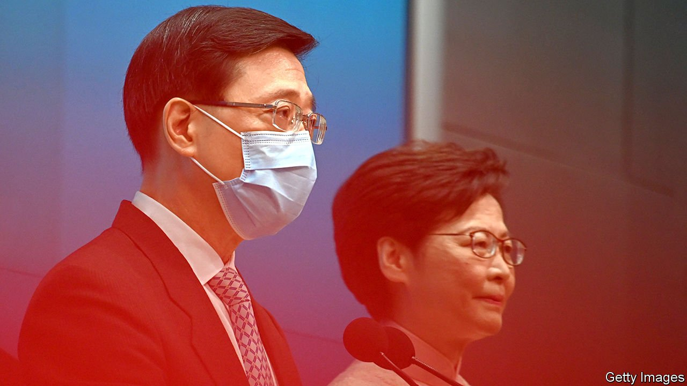

###### A new sheriff in town

# John Lee, a tough former policeman, looks set to lead Hong Kong 

##### It is easy to see why China’s Communist Party would like him 

 

> Apr 9th 2022 

LESS THAN three years ago, news of her imminent departure would have been greeted with joy on the streets of Hong Kong. Carrie Lam, the territory’s leader (pictured, right), was reviled by the pro-democracy protesters whose demonstrations in 2019 snowballed into the biggest unrest of its kind in the territory’s history. But Mrs Lam’s announcement on April 4th that she would not seek another term in office—meaning she has less than three months to serve—stirred little cheer. The central government plans to replace her with a tough ex-policeman, John Lee (pictured, left). What the public thinks matters little.

Interaction between the Communist Party in Beijing and Hong Kong’s chief executive, as the city’s leader is known, is shrouded in secrecy. So it is hard to work out whether Mrs Lam had a choice. She said she had told the central authorities a year ago that she did not want another five-year term, “entirely” for family reasons. But that could be a smokescreen. The party probably wants her to go. Newspapers in Hong Kong that are under the party’s thumb have expressed no disappointment about her decision. They have intimated that Mr Lee, who was Hong Kong’s security chief during the upheaval, is a shoo-in to succeed her.


One reason for wanting a new leader may be Mrs Lam’s handling of the territory’s latest wave of covid-19, for which it was ill prepared. Thousands of people, most of them elderly, have died: vaccination rates within this group are low. Despite (and because of) Hong Kong’s “zero-covid” policy, which matches mainland China’s, medical facilities have been overwhelmed by covid patients. The central authorities have been quick to punish local leaders on the mainland for much smaller outbreaks within their jurisdictions. Hong Kong notionally enjoys a “high degree of autonomy”, but the party may want to make a point that on this matter, no laxity is allowed.

Officials in Beijing may also resent Mrs Lam’s seeming failure to anticipate the unrest in 2019, which was triggered by her plan to introduce a bill that would allow criminals to be extradited for trial by the mainland’s party-controlled courts. But the party’s support for Mr Lee suggests it does not have big misgivings about her handling of the protests: he was her main adviser on how to police them.

According to Hong Kong’s mini-constitution, the Basic Law, the chief executive is selected locally and appointed by the central government. In practice the party controls the selection process, too. Mrs Lam timed her announcement with the start of a two-week period during which aspiring candidates for the post must secure sufficient nominations from the 1,500 members of an election committee, stacked with the party’s loyalists. On May 8th the committee will choose the winner by vote. Most members will cast their ballots as the party wishes. Last year changes were made to the composition of the committee to make it even more compliant.

Since the end of British rule in Hong Kong in 1997, the party has selected people either with broad experience in the territory’s civil service (such as Mrs Lam) or who are prominent business leaders. All of them have struggled to keep both the leadership in Beijing and Hong Kong’s public happy. None has yet served two five-year terms, the maximum allowed.

The choice of Mr Lee is a striking departure from the norm. He has spent most of his career as a police officer. Even on the security-obsessed mainland, local leaders are rarely people with such a specialist background. Only in the past decade has the 64-year-old served in a more political role, first as under-secretary and then as secretary for security (a cabinet post, in effect). His only experience outside the security realm has been in the past year, as Mrs Lam’s deputy. On April 6th he resigned from that post and declared his bid for the chief-executive position.

It is easy to see why the party would like him. He has enthusiastically embraced the draconian national-security law that the central government imposed on the territory in 2020 to prevent a resurgence of the previous year’s unrest (tougher police tactics and pandemic social-distancing measures having helped to stifle it). The police have used the new bill, and colonial-era laws, to arrest thousands of people for protest-related offences.

Crushing dissent in Hong Kong remains the party’s priority. On the day that Mr Lee announced his campaign, a businessman in Hong Kong with close ties to China’s leadership, Lo Man Tuen, published an article in the local press. It said the territory needed an “iron man” leader who could resist “American and British pressure” and implement the security law with “no second thoughts”. The party seems to think Mr Lee fits the bill. ■

