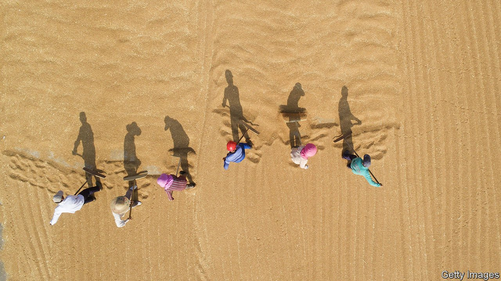

###### A big appetite

# When China worries about food, the world pays 

##### Critics accuse it of hoarding grain 

 

> Apr 9th 2022 

THE COMMUNIST PARTY has a way with words. Take the prosaic topic of food security. The pandemic, geopolitical tensions and heavy rainfall last year (which may lead to a wretched wheat crop) threaten China’s grain supply. Lately officials have been echoing the exhortation of President Xi Jinping that “the people’s rice bowl must be firmly held in their own hands at all times.” In non-party-speak, the government is thinking hard about how to keep the world’s most populous country fed.

Past leaders have at times struggled with this task. Tens of millions of Chinese perished in the famine caused by Mao Zedong’s ruinous policies in the late 1950s. Such a catastrophe is inconceivable today. But rows with Australia and Canada have made Chinese officials worry that the copious amounts of grain the two countries supply might one day be cut off. They note that soyabean imports from America plunged when Donald Trump launched his trade war. The conflict in Ukraine adds another layer of concern. Though China has tacitly backed Russia’s invasion (and abruptly lifted its ban on Russian wheat), the turmoil could mean less, or pricier, food in Chinese bowls. Last year Ukraine supplied China with 29% of its imported corn and 26% of its imported barley.


Global food prices were rising even before the war started to affect the supply of grains and fertiliser ingredients. The conflict scares China for another reason, too. The harsh sanctions imposed on Russia by Western countries make China nervous that it would face similar punishment were it to invade Taiwan. How, officials in Beijing ask, can China rely on such fickle foreigners for its basic needs?

The regime has dealt with these concerns in two important ways. It has stockpiled food—or, as critics say, hoarded it. Over the past five years China’s purchases of everything from soyabeans to pork have soared. America’s Department of Agriculture predicts that by the middle of this year China will hold 69% of the world’s maize (corn) reserves, 60% of its rice and 51% of its wheat. All this to feed 18% of the world’s population. Last year a Chinese official said that the country’s grain stocks were “historically high” and that it had enough wheat to meet demand for 18 months. China’s big purchases have pushed up global prices, say analysts.

In the longer term China may hope to diversify its suppliers. This will be difficult, says Zhang Hongzhou of Nanyang Technological University in Singapore. So it is also trying to become self-sufficient. One benchmark calls for Chinese producers to meet 95% of the country’s demand for basic grains. On rice they pass. On sorghum and barley they fail. On maize and wheat they come close. Genetically modified crops would help. The government favours the technology, but it has been slow to introduce it because of public concern.

“Even if China decides it wants to be self-sufficient, it is now pretty much impossible,” says Dr Zhang. That may not stop it from trying, though. Mr Xi, a fervent nationalist, wants more of what China consumes to be made at home. Or, as he put it last year: “The rice bowl must mainly contain Chinese grain.” ■

