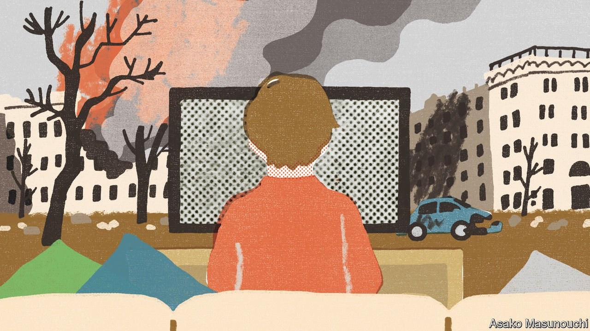

###### Children’s news

# How do you explain war to a six-year-old? 

##### News outlets for youngsters grapple with events in Ukraine 

 

> Apr 9th 2022 

HOW MUCH of the battlefield should be broadcast into the living room? News editors everywhere face a balancing act in determining what to include in their war reporting. The dilemma is especially acute for those composing reports for television’s most impressionable yet most curious audience: children.

“Newsround”, the BBC’s programme for six- to 12-year-olds, has more experience than most. On April 4th it completed half a century of daily bulletins, which in 1986 included the first report in Britain of the Challenger space disaster. Its eight-minute shows have provided a template for public-service broadcasters elsewhere in Europe, such as “Ultra Nyt” on Denmark’s DR.


War footage is carefully edited. “Newsround” shows the aftermath of attacks but not the moment of impact; wide shots of destruction are used instead of harrowing close-ups. People are not portrayed in severe distress. Reports often focus on children, as in recent packages showing Ukrainian refugees starting school in Poland, or celebrating Purim in Israel. Reporting aims to provide “honest reassurance”, says the programme’s editor, Lewis James. A recent Q&amp;A with the BBC’s man in Kyiv emphasised that no British troops had been deployed.

Everything must be explained: viewers may not know who Vladimir Putin is or even, at the younger end of the age range, what Russia is. Producers and presenters visit schools to try out bulletins and see what is misunderstood. Ahead of big events like elections, researchers do fieldwork to find out what children already know (Donald Trump needed little introduction, they discovered).

It is tempting to protect youngsters from bad news. Yet “children are most disturbed when there’s an information vacuum”, Mr James argues. Amber Williams, who edits the New York Times’s monthly supplement for children, adds that they anyway “experience all the things we as adults try to shield them from”. When the Times for Kids ran an interview with a survivor of the Parkland school shooting, the story carried a warning. But, notes Ms Williams, most American children have done active-shooter drills since kindergarten.

On-demand television means children no longer need to sit through the news to get to the cartoons, and ever-fewer households have a newspaper lying on the kitchen table (Ms Williams says some of her readers get their copy passed on from grandparents). Only about 100,000 children tune in to watch “Newsround” live. But 2m watch each week in schools. Three-quarters of primary-school teachers use its bulletins in their lessons, the BBC says.

And new forms of media may be making children more politically engaged and active. Ms Williams cites recent walk-outs in Florida schools, organised on social networks, in protest at a proposal to limit lessons on sexuality and gender. Wading into sensitive subjects like this for a readership of eight- to 14-year-olds isn’t easy. But the Times article that has provoked the most complaints from parents, Ms Williams says, was on “how to pick a lock”. ■

Read more of our recent coverage of the 

