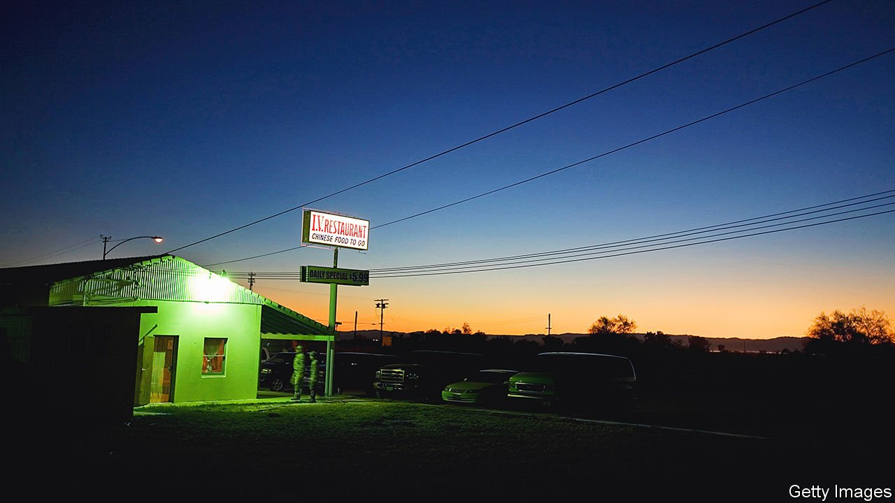

###### New American fiction

# Like Faulkner’s, Susan Straight’s fiction creates its own universe 

##### In “Mecca” she brings to life the working people of southern California 

 

> Apr 9th 2022 

Mecca. By Susan Straight. Farrar, Straus and Giroux; 384 pages; $28

AS WELL AS the holy city of Islam, Mecca is the name of a speck on the map in the Coachella Valley of southern California. It lies in the Inland Empire, the irrigated desert region where Mexican farmworkers harvest cantaloupes and grapes. Writing about its denizens, Joan Didion waspily riffed about “girls for whom all life’s promise comes down to a waltz-length white wedding dress and the birth of a Kimberly or a Sherry or a Debbi.”


These “dreamers of the golden dream” were curiosities to Didion, unimaginably distant from her enclave in Malibu. Susan Straight, a novelist born and brought up in Riverside, not far from Mecca, was shocked by these disparagements. Ms Straight “knew a version of us, of the girls and women here, that was not in [Didion’s] essay”, she wrote in a memoir. “Girls descended from Mexican and black families arrived in the 1920s, and white families arrived from Arkansas after the Korean war.”

In “Mecca”, her triumphant, polyphonic new novel, the working people behind the glamour of the Golden State are revealed in all their multiplicity, with Ms Straight’s trademark tenderness and humour. Through the braided, often heartbreaking stories of half a dozen people of African-American, Mexican, Mixtec and Spanish descent—cop and cleaner, florist, butcher and basketball star—she draws readers into a rich but overlooked world.

She begins from the viewpoint of a motorway patrolman, as if to show that behind every badge or label everyone is human. Johnny Frías has his own sorrows and secrets. He is also part of a tight-knit group of friends whose lives and families the novel charts. Each is lovingly drawn, despite—or because of—their difficulties.

Matelasse is abandoned by a husband dreaming of a flashier life. Dante, a young boy terrified of losing his parents to covid-19, takes solace in the stars. Ximena toils in daily terror of an immigration raid. Terrible events abound, including a police shooting, thefts and rape. What saves these characters, and uplifts the reader, is their web of mutual support.

Like those of Louise Erdrich and William Faulkner, Ms Straight’s novels (nine in all) have created a fictional universe rooted in one community and place. The author herself moved away from Riverside just once, to study creative writing under James Baldwin. The deep history of southern California is her subject: the stories of those whose families have inhabited it for centuries, whether they were indigenous or first brought as slaves by Mormons or Spanish explorers. Hers are true American tales, at once intimate and epic.

By the closing pages of the book, the reader sees why Ximena thinks Mecca, California, is a “holy place”, too. Set on tribal land in an ancient lake bed, it is, like its namesake, a place people strive to reach, and a place of refuge. ■

