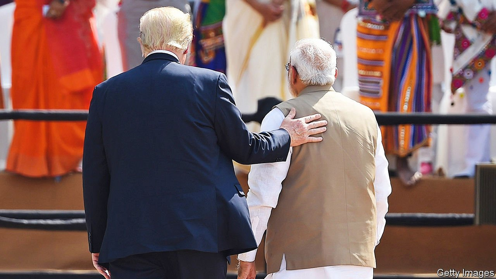

###### Authoritarian leaders

# The rise and risks of “The Age of the Strongman” 

##### Genuine democracies should have seen the strongmen coming, says Gideon Rachman 

 

> Apr 9th 2022 

The Age of the Strongman. By Gideon Rachman. Other Press; 288 pages; $27.99. Bodley Head, £20

WHAT DO XI JINPING, Boris Johnson and Prince Muhammad bin Salman have in common? More than you might think, and more than is good for the rest of humanity, writes Gideon Rachman, a columnist for the Financial Times who previously worked for The Economist. He sees all three men as proof of the advent of “The Age of the Strongman”, as his wide-ranging and astute new book is titled. They present a threat not only to the well-being of their own countries, but also to a world order in which liberal, cosmopolitan ideas are increasingly embattled.


It is hard to dispute the view that those three, along with the likes of Recep Tayyip Erdogan, the president of Turkey, Viktor Orban, the newly re-elected prime minister of Hungary, and Jair Bolsonaro, the president of Brazil, share certain traits. To varying degrees, they all claim to speak for the common man, while undermining institutions, stoking nationalism and cultivating a personal style of politics, if not an outright personality cult. True, Mr Johnson has not been accused of ordering the murder of any critics, as Prince Muhammad, better known as MBS, has been in the case of Jamal Khashoggi (he denies it). But Mr Rachman argues convincingly that the strongman style is a continuum, in which its exponents’ affinities are amplified or muffled by the particular political system in which each operates.

It is striking to see how many contemporary leaders fit the strongman mould. What with Donald Trump and Narendra Modi, the prime minister of India, all three of the world’s most populous countries were led by would-be or actual strongmen until last year, by Mr Rachman’s reckoning. They are present in Europe (Mr Johnson, Mr Orban and Vladimir Putin), in Africa (Abiy Ahmed, Ethiopia’s prime minister) and Asia (Messrs Modi and Xi, plus Rodrigo Duterte, the president of the Philippines). The Middle East furnishes Mr Erdogan, MBS and Binyamin Netanyahu, Israel’s former prime minister; the Americas contribute Mr Bolsonaro and Andrés Manuel López Obrador, the president of Mexico. The roster includes royals, elected politicians and fully fledged autocrats. And they are doing huge damage.

The harm is not just to the people they oppress or the national political systems that they corrode. Strongmen also chip away at global institutions, international norms and multilateral co-operation. Many are suspicious of free trade. Few are inclined to endure much inconvenience to curb climate change. They are prone to adventurism and aggression in foreign policy—witness Mr Putin’s murderous invasion of Ukraine.

But the ongoing war there, which began after the book was written, also suggests the limits of Mr Rachman’s analysis. His strongmen show little solidarity or diplomatic allegiance to one another. Some have sided with Mr Putin, others have opposed him and still others are sitting on the fence. Identifying someone as a strongman is only a partial guide to how he (the book does not mention any strongwomen) is likely to behave.

Mr Rachman’s most powerful point concerns not the strongmen themselves, but Western politicians’ and commentators’ wishful thinking about them (including, on occasion, The Economist). When Mr Putin succeeded Boris Yeltsin, he was hailed as a man who could stabilise Russia’s listing democracy. Mr Erdogan, too, was greeted with optimism, as someone who could reconcile Islam and democracy. Abiy was going to put an end to Ethiopia’s ethnic divisions; MBS was going to drag the Saudi monarchy into the 21st century; and so on. The world’s genuine democracies may not be to blame for the rise of the strongmen, but they have not been very shrewd about warding them off, either. ■

