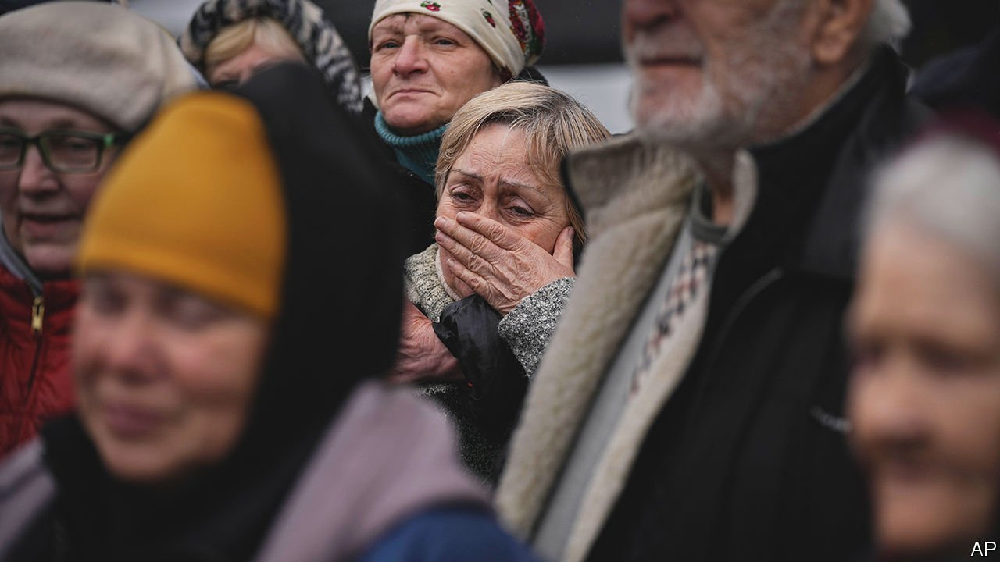
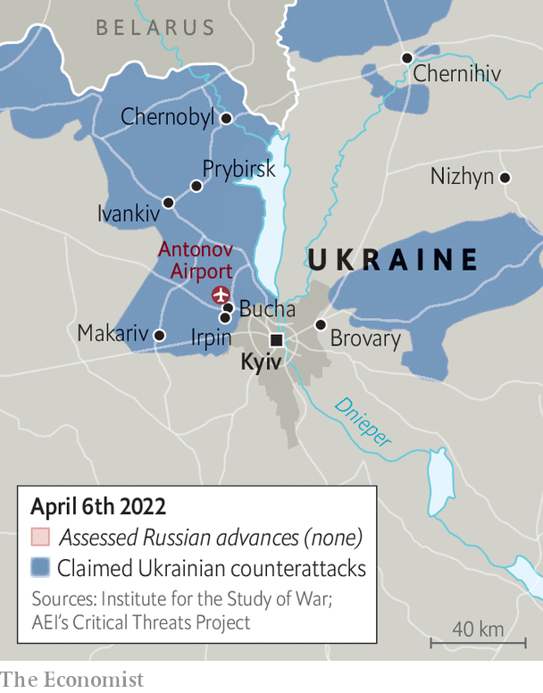

###### After the battle

# As Russian soldiers retreat, they leave evidence of war crimes 

##### A culture of violence pervades the invading army 

 

> Apr 9th 2022 

THE LAST time that Andriy Dvornikov spoke to his common-law wife was on March 5th. He called, speaking very quietly, to say he was in trouble. He had been trapped at a Ukrainian checkpoint in Bucha, a suburb to the north-west of Kyiv, when it came under artillery fire. He was taking shelter in the basement of a nearby house along with seven other men.

One of them, Ivan Skyba, described what happened next. Russian soldiers found the group later that day and moved them to a base. They were told to take their clothes off and lie face down. Their captors searched their telephones and bodies for symbols and tattoos. To make the Ukrainians talk, the Russians killed one of them— “a short, bespectacled guy from Ivano-Frankivsk”, in Mr Skyba’s words.


Mr Dvornikov, who had fought in Donbas in 2015-16, had a paratrooper’s tattoo. After a few hours of torture, an order was issued to kill them. A soldier asked his commander what he should do. The answer was “ yebashit” (“fucking do them in”), but “do it away from the base.” Mr Skyba says they were led to the side of the building and shot. He took a bullet in his side, but it went through his body. He survived by playing dead on the concrete floor. As soon as he heard there were no voices, he fled over a fence to a nearby home. Other Russian soldiers later found him there, but spared his life. Witnesses in Bucha stress that some Russian soldiers were polite. “Some of them even said sorry,” says one.

 


As Russia’s “liberators” have retreated from Kyiv back towards the Belarusian border, they have left a landscape of atrocities. In all, said Ukraine’s prosecutor-general on April 3rd, 410 civilians had been killed around Kyiv. As investigators collected evidence of  and bodies were put into black plastic bags, The Economist was able to verify reports of what appears to have been a summary execution.

We found nine bodies lying at the side of a builder’s yard in Bucha that had been used as a Russian base. All had gunshot wounds to the head, chest or both. At least two of the victims had their hands tied behind their backs. The smell of decomposition, among other things, suggested they were killed before Ukrainian forces liberated Bucha on March 31st.

Such massacres have shocked the world. “Genocide”, Ukraine’s President Volodymyr Zelensky called it. The American president, Joe Biden, said that what happened in Bucha was a war crime and that Vladimir Putin, Russia’s president, should face an international tribunal for it, though the chances of that seem remote. The Kremlin said the whole thing was a “heinous provocation of Ukrainian radicals” and cynically demanded a UN Security Council meeting. At it, Mr Zelensky said: “We are dealing with a state that turns its veto at the UN Security Council into [a] right to [cause] death.” The EU swiftly proposed new sanctions, which would ban Russian coal and close its ports to Russian vessels. But it stopped short of imposing an embargo on oil and gas exports, the corner stones of Russia’s economy.

The atrocities in Bucha fit a pattern. Terror, torture and murder have been Russian military tactics for as long as Vladimir Putin has been in power. “This is not an excess, this is the system which deems extreme violence to be the most effective way of suppressing resistance,” one Russian expert explains. This method was honed during Russia’s second war in Chechnya.

In February 2000, barely a month after Mr Putin assumed Russia’s presidency, his riot police and soldiers entered Novye Aldi, a suburb of Grozny, Chechnya’s capital, and went from house to house murdering civilians, according to eyewitness accounts gathered by Memorial, Russia’s main human-rights organisation, which was banned last year. Sweeps like these became known as zachistka, or “mopping-up” operations. Between 56 and 82 civilians were killed and at least six women were raped in Novye Aldi.

The European Court of Human Rights found the Russian state guilty in that case, as well as others. But in Russia the crimes were never prosecuted, giving a sense of impunity to the armed forces. It was those who documented the crimes who suffered. In 2009 Natalya Estemirova of Memorial was abducted from her home in Chechnya and killed. Anna Politkovskaya, a reporter for Novaya Gazeta, was gunned down three years earlier in Moscow.

An information blockade imposed by the Kremlin has made it easier for Russian forces to get away with murder. So has the acquiescence of the Russian public, who tended to dismiss the war in Chechnya as something that was happening far away. Western governments did not, for the most part, let it get in the way of doing business with Russia.

A cult of aggression has grown like a weed. Coverage of the first Chechen war in the mid-1990s, when Russia still had free media, was dominated by stories of tragedy and despair. But the second Chechen war was dominated by the propaganda of military heroism. Violence was hailed as proof of masculinity. “Many [veterans] deliberately emphasise their ability to commit violence,” says Elena Racheva, a social anthropologist at Oxford. One told her: “I always had principles. My principle was not to leave enemies alive.”

From the early 2000s the Kremlin has led a campaign of military-patriotic mobilisation. Encouraged by state television, today’s soldiers look to a father who fought in Afghanistan and Chechnya and a grandfather who fought in the Great Patriotic War of 1941-45 as their role models. The war in Ukraine is framed as a re-enactment of the latter, with Ukrainians cast as Nazis.

On April 1st the Russian defence ministry released a video featuring Aleksei Shabulin, a commander of a battalion that carried out a zachistka around Kyiv. “My great-grandfather went through the entire second world war and up to the year 1953 chased the fascist devils…through Ukrainian forests,” he said. “I am a glorious successor of this tradition. Now my time has come and I will not disgrace my great-grandfather—and I will go all the way.” ■

 (April 5th)This article has been updated to remove an ambiguity.

Read more of our recent coverage of the 

