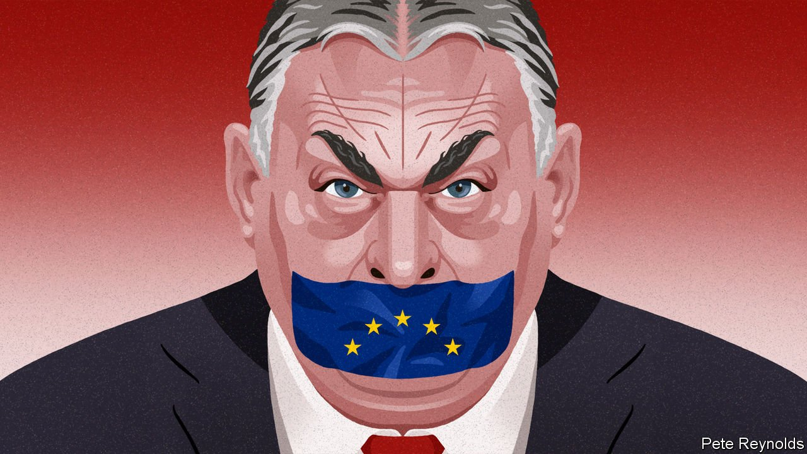

###### Charlemagne

# Europe is learning to cope with Viktor Orban 

##### The strongman matters less and less outside Hungary 

 

> Apr 9th 2022 

FROM A CYNICAL European perspective, Viktor Orban’s election triumphs are like covid-19 waves: nasty and seemingly inevitable, but less concerning once you have worked out how to live with them. And so it seems with the Hungarian prime minister’s victory at the polls on April 3rd, his fourth in a row. The size of Mr Orban’s win surprised the pundits. Yet the symptoms for the rest of Europe will be relatively mild. In recent months Hungary has been in the diplomatic equivalent of quarantine, thanks to its insistence on staying in a bubble with Russia. Better yet, Europe may have found new ways to combat this long-running affliction. Potent though it is at home, Mr Orban’s brand of “illiberal democracy” may finally be fading in virulence.

True, Mr Orban’s victory is one of a long series of unwelcome triumphs by practitioners of despot-lite politics. His resounding win will cheer strongmen who like to add a veneer of democratic legitimacy to their autocratic regimes, from Recep Tayyip Erdogan in Turkey to Vladimir Putin in Russia. But Mr Orban’s influence beyond Hungary—not least in America’s Trumpian swamp—comes from his contrived defiance towards liberal “elites” in Brussels and elsewhere. Sitting at Europe’s top table while flouting its rules is a core part of the Orban shtick. The more his European peers rant ineffectually about Hungary misspending EU funds, hobbling the media, bashing gay people and subverting courts, the more Mr Orban looks like he matters.


No one, in the EU or elsewhere, can turn Mr Orban back into the liberal politician he once seemed to be. Yet Europe has a rare opportunity to isolate and neutralise him. If it works, Mr Orban, the EU’s longest-serving leader currently in office, will become a politician whose relevance barely extends beyond Hungary’s borders.

Three things have changed since the last time Fidesz triumphed at the polls, in 2018. The first is Russia’s invasion of Ukraine. This may have helped Mr Orban win: state-backed media unquestioningly relayed his baseless claim that the opposition would drag Hungary into war with Russia. But positioning himself as the closest thing to an ally Mr Putin has in the EU—by opposing sending weapons to Ukraine, and balking at many proposed sanctions—has stripped Mr Orban of allies. Fidesz’s election victories used to be cheered by some of Hungary’s neighbours, such as Poland and Slovakia. This win, by contrast, was greeted the way office workers greet the news that a deskmate has covid. The only noteworthy message of congratulations came from Mr Putin.

Until now, Europe has been forced to tolerate Mr Orban’s behaviour because he had allies. Countries in the Visegrad Group, comprising Hungary, Poland, the Czech Republic and Slovakia, long elected leaders who shared Mr Orban’s illiberal leanings. This club-within-a-club stymied even the largely symbolic wrist-slapping the EU can mete out to those who break its rules: anyone bar the country being targeted could veto a move to strip it of voting rights in EU meetings, for example. But the Czech Republic and Slovakia have in recent years elected more centrist politicians. Poland, run by the Law and Justice party, still leans illiberal and had stuck with Hungary the longest. Now it is sharply criticising Mr Orban for his pro-Russian stance. Hungary is in a club of one.

Second, Europe has new powers to bring wayward members to heel. An unspoken deal paved the way for a slew of central European states to join the EU in 2004. Richer countries already in the club would agree to funnel lots of cash to Hungary and others to improve their infrastructure and so forth. In exchange, the “new” Europeans would guarantee open economies, free courts, unrestrained media and other liberal requirements. On returning to power in 2010 (after a first stint from 1998-2002), Mr Orban realised that he could take the money without honouring his side of the bargain. European taxpayers ended up funding projects that made his cronies fabulously rich. Yet even brazen defiance of EU principles did not stop the flow of cash.

Now it might. A €750bn ($818bn) fund to ease the economic effects of covid, known as Next Generation EU, required member states to satisfy Eurocrats that the money would be well spent. Poland and Hungary are the only two countries to have been rebuffed, both over infringements of the rule of law. Poland seems likely to get its share soon: its ruling party has made gestures to comply with EU demands that it stop nobbling the court system, and other members want to reward it for taking in most of the refugees from Ukraine. Hungary has begged for the €7bn earmarked for it, to no avail. On April 5th Ursula von der Leyen, the president of the European Commission, said a new mechanism to withhold even regular EU funds from countries not abiding by European norms would be used for the first time against Hungary. It stands to lose up to €24bn over the next five years; Poland will be spared. Mr Orban can remain defiant, but he may run out of money.

Buda-pest

Perhaps most importantly, war on the continent has worn down whatever patience Europe once had towards those who seek to undermine it. Mr Putin’s behaviour has shown that indulging autocrats, in the hope that trade with liberal countries will lead them to change their ways, doesn’t work. Angela Merkel, a fan of that approach in her time as German chancellor, repeatedly blocked attacks on Mr Orban. Until a year ago she made sure Fidesz was allowed to remain in the European People’s Party, the alliance of centre-right parties in the European Parliament. Now she is gone.

None of this is likely to be enough to change Mr Orban’s ways. For the next four years at least he will continue to dominate his unfortunate country, and his cronies will continue to loot it. But an isolated Hungary stripped of EU funding will stand as a cautionary tale to other would-be strongmen in the bloc: there are limits to what they can get away with. There is no cure yet for Orbanism. But in Europe, at least, it looks like it can be contained. ■

Read more from Charlemagne, our columnist on European politics: (Apr 2nd)

 (Mar 26th)  (Mar 12th)

