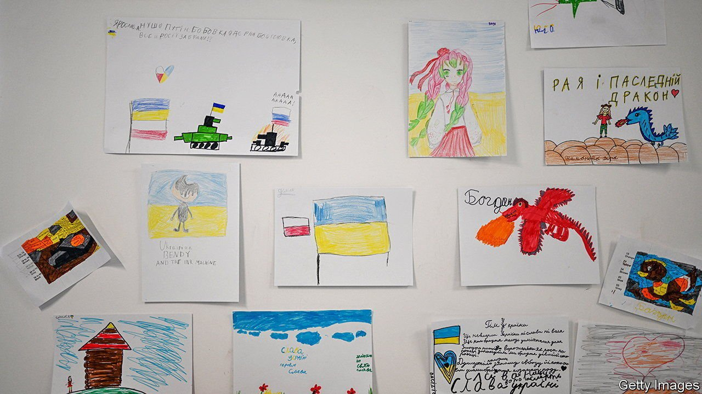

###### From battleground to playground

# How Polish schools are coping with an influx of Ukrainian children 

##### It’s hard, but the young refugees are better off than those fleeing other conflicts 

 

> Apr 9th 2022 

YULIA BODAR’S classroom was once the back bedroom of a large Warsaw apartment. Now it boasts a blackboard, a bright carpet decorated with cartoon animals, and desks at which a dozen small children are learning to write. Her pupils are  who have arrived in Poland since Russia invaded their country on February 24th. She is a newcomer herself, having fled western Ukraine with her own two children not long after the bombs began to fall.

Ms Bodar is a teacher at Materynka, a school that teaches the Ukrainian curriculum from several makeshift locations in Poland’s capital. Before the war began it had about 200 pupils, largely children of migrants who had come to Warsaw to work. Now it has around 1,000. Larysa Vychivska, one of its founders, points to a tall stack of forms filled out by newcomers. She says her school is taking in about 20 new pupils each day.


At least a quarter of Ukraine’s 7.5m children have  started in February. They need not only food and shelter but brain food, too. Providing classes is a particular challenge for Poland, over whose border more than half of  have fled. So far more than 160,000 have registered to attend local schools. Przemyslaw Czarnek, the education minister, has warned that Poland could eventually have to find room for 700,000 new pupils. That would mean expanding its school system by 14%.

At Janusz Korczak Primary, a school in the Warsaw district of Mokotow (pictured), almost every class has new pupils. Some have as many as six. Poland’s government has raised caps that usually limit the size of classes. Staff are pleased to be helping. But no one thinks it is ideal to be plonking the new arrivals straight into normal lessons, when few speak much Polish. Some teachers have been asking Ukrainian children who were already enrolled before the crisis to help them communicate with newcomers. Others use Google Translate.

The latest hope is that newcomers can be schooled separately in mixed-age “preparatory classes”, where they can receive lessons that better match their needs. Magdalena Berucka runs one of the few primary schools in Warsaw that was offering such classes to migrant children before the conflict started. The number of children at her school has swelled by 10% since February; she has added two new preparatory classes, but says she is now short of staff and space. Schools that have never experimented with these classes will have an even harder time setting them up in a hurry.

In theory online learning could take some of the strain. Teenagers coming to the end of their school years do not see much value in joining foreign schools. Those coming from parts of Ukraine that are least affected by the conflict can sometimes access remote classes being provided by their old teachers. The Ukrainian government is promoting a library of online lessons. But many pupils feel conflicted, says Tetiana Ouerghi, a teacher in Warsaw. By day they study in Polish classrooms. By night they find ways to keep up with the Ukrainian curriculum, in the hope that they will soon be going home.

If all this is messy, Ukraine’s  are getting more help than is commonly offered elsewhere in the world. Last year the UN guessed that only about half of all children who had fled across an international border were getting lessons of any kind. Among children old enough to attend secondary school, only one-third were attending classes (in Pakistan, which hosts 1.4m Afghan refugees, the figure is 5%). Lost years of schooling damage youngsters’ prospects long after the turmoil they fled from has ended.

Countries that receive lots of refugees are most often poor ones that struggle to provide good lessons even to their own children. And refugees do not themselves always think that schooling is a priority. During the first months of a crisis many assume that their return journey is just around the corner. That is rarely true: half the world’s refugees have been in exile five years or longer, according to the World Bank.

Setting up new systems for schooling is best done right at the start of a crisis, before global attention and funding has started to wane. But in recent years only about 3% of humanitarian aid has gone towards education. Yasmine Sherif of Education Cannot Wait, a un fund that supports schooling in emergencies, hopes that the . She says many more schoolchildren should benefit from the “boldness and speed” with which some governments and donors have set about helping Ukraine.

No one can say how long Poland’s new pupils will stay. Before the war Valentyna Mundur was a school teacher in , a Ukrainian city under Russian siege. Now she is working in Warsaw for Poland’s largest teachers’ union, helping to identify other newcomers with experience in schools. She says a Ukrainian victory is not the only thing needed before she and her son can go home. Her city will need rebuilding. She worries that all the guns and explosives now circulating in Ukraine will make it less safe than it was before.

Poland’s teachers hope things will get easier after the summer break, by which time more Ukrainians will probably be working in classrooms as assistants. So far, Polish parents have been supportive of the new arrivals. Visitors to Materynka must swerve around stacks of printer paper donated by well-wishers. Ms Vychivska, its co-founder, says she used to spend much of her time seeking out such gifts. “Now people call up and ask me, ‘What do you need?’”■

Read more of our recent coverage of the 

