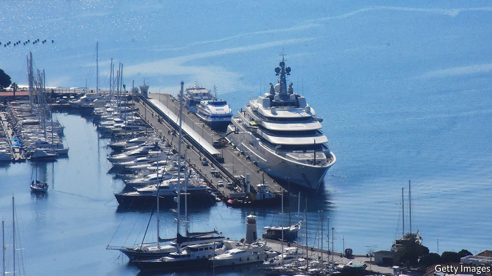

###### Having it both ways

# How Turkey is courting Russia’s oligarchs 

##### It sells arms to Ukraine while welcoming Russian cash 

 

> Apr 7th 2022 

WEEKS AFTER Russia invaded Ukraine, a couple of superyachts belonging to Roman Abramovich, a Russian oligarch sanctioned by Britain, docked in Turkish ports. Boats linked to two other oligarchs, Andrey Molchanov and Maxim Shubarev, and to Dmitry Medvedev, a former Russian president, have also been sighted. On March 29th Mr Abramovich himself surfaced in Turkey, joining Russian and Ukrainian negotiators at peace talks in Istanbul.

Turkey is playing more than one role in the war. A NATO member, it backs Ukraine and continues to sell it armed drones, which have turned scores of Russian tanks into scrap. Yet President Recep Tayyip Erdogan’s criticism of Russian atrocities has been mild. And, more worrying, there are signs that Turkey may be circumventing sanctions against Russia.


On March 26th Mevlut Cavusoglu, Turkey’s foreign minister, said Russian oligarchs’ business was welcome in Turkey as long as they respected inter national law. Mr Erdogan said he would “keep the doors open”. In a phone conversation with Vladimir Putin, he suggested Turkey and Russia conduct their trade using roubles, the Chinese yuan or gold. Turkey, which already faced American sanctions for buying a Russian air-defence system, has refused to rule out new arms deals with Russia.

Most Turks sympathise with Ukraine. But Mr Erdogan’s habit of provoking the West and placating Russia has taken a toll. A recent poll found 73% of Turks want their country to stay neutral over Ukraine. Only 34% say Russia is responsible for the war: 48% blame America and NATO. Mr Erdogan seems determined to allow nothing, including war crimes, to upset his relationship with Mr Putin. “Our relations with Turkey are excellent,” Dmitry Peskov, the Russian dictator’s spokesman, crowed on April 2nd.

Mr Erdogan’s offer to mediate between Russia and Ukraine has earned him praise. Ukraine’s president, Volodymyr Zelensky, who has dinged other leaders for going soft on Russia, has had only kind words for the Turkish leader. The role of Turkish drones may be tempering Ukrainian criticism, says Yevgeniya Gaber of Carleton University’s Centre of Modern Turkish Studies.

That Turkey refuses to join sanctions against Russia is no surprise. The country has traditionally opposed sanctions as a foreign-policy tool. But frustration with Mr Erdogan’s opportunism is mounting in Western capitals. Many feel Turkey is using the fruitless peace talks as an excuse. “Nobody here believes in the success of the negotiations,” says a European official. “Russia is determined to destroy Ukraine, and it should be in Turkey’s interest to prevent this.”

