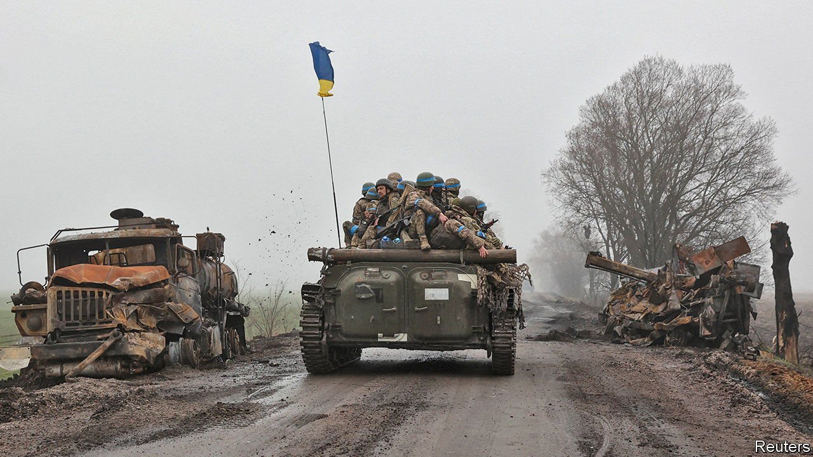

###### The turning tide

# Ukraine sees a window of opportunity to push Russia back 

##### But a long struggle looms in the east 

 

> Apr 9th 2022 

ON MARCH 28TH Ukraine’s general staff warned that the Russian army, within striking distance of , still wanted to take the capital. A week later that army had largely evaporated from both sides of the Dnieper river north of the city. As Russian troops retreated to Belarus and Russia, pursued by Ukrainians, Kyiv began returning to normal. No shots, shells or missiles have been heard since March 30th. Non-essential shops are re-opening. Vitaly Klitschko, the mayor, has urged civilians to wait until the end of the week to return; not all are heeding his advice. But although the battle is won, the war is not.

Russia says its war aim is now to “liberate” Donbas in eastern Ukraine; some think that , Russia’s president, wants to do so by Victory Day on May 9th, the date that commemorates Nazi Germany’s surrender in 1945. Before the war began in February Russia controlled a third of the territory; since February 24th it has taken a lot more, including some of , a port city.


Whether it has enough manpower to take it all remains open to question. By focusing its efforts in fewer places, Russia hopes to muster superior numbers. It has accordingly pulled back forces that were heading towards Kyiv from Sumy in north-eastern Ukraine. Units that were in Belarus are also being moved into western Russia, according to railway-tracking websites.


The problem for Mr Putin is that these forces are spent. A quarter of his initial invasion force may have been wounded or killed. Out of 125 battalion tactical groups (BTGs) gathered for the invasion, 29 have been “rendered non-combat effective”, says a Western official, meaning they have had to be taken out of action or amalgamated with others. Fixing them and moving them east could take around a month.

Beyond that, there is not much left in reserve: Russia committed three-quarters of its BTGs to the war. Since then it has scraped together additional forces from wherever it can find them, including the exclave of Kaliningrad, wedged between hostile NATO states, and its garrisons in Georgia, which it invaded in 2008.

Then there are conscripts. On April 1st Russia announced its annual draft of men aged 18 to 27, with the aim of conscripting 134,500 for a year. Conscripts cannot legally be sent to war without four months of training. In reality, some of last year’s batch were sent in regardless. But Russia could not send them on a large scale—nor properly mobilise its pool of reservists with previous experience—unless Mr Putin formally acknowledged that his “special military operation” was, in fact, a war. And even if he did that, national mobilisation would take until the summer.

So this is a good time for Ukraine to press its counter-attack: on every day during the final week of March, it gained more territory than it lost. But as long as Russian troops remain in Belarus, Ukraine cannot shift all its forces to Donbas. It has to protect Kyiv and defend its supply lines from the west. Nonetheless, it should be able to shift some units to the east and south, and to do so faster than Russia can.

Ukraine, which mobilised fully on February 24th, probably has adequate manpower—it is currently drafting another 10,000 to 20,000 men. Western arms continue to pour in. The Czech Republic is providing Soviet-made T-72 tanks. More important, it says that, with Slovakia, it may allow Ukraine to use its facilities to repair equipment. Australia is sending armoured fighting vehicles. On April 5th America said it would send another $100m of anti-tank systems. But Ukraine will also need less eye-catching things like Soviet-era artillery ammunition to feed its guns in a long war of attrition.

That is the sort of war that may be developing. Russia’s original aim was to envelop Ukrainian forces in Donbas by striking their rear, converging on the city of Dnipro. Were it to try that now, having abandoned Kyiv and Sumy, its own flanks would be vulnerable to Ukrainian attacks from the north—it would risk being encircled itself.

So Russia is shifting to a more “brutish” approach, says Michael Kofman of CNA, a think-tank: “It looks as though they’re going to frontally assault Ukrainian forces to steadily squeeze them out of Donbas.” That would involve advancing south from Izyum, north from Mariupol and pressing in areas like Severodonetsk, where Ukrainian forces are trapped in a salient.

In Donbas, Russia enjoys the advantage that its air force is stronger than it was around Kyiv, and Ukrainian air defences patchier. A frontal assault would also mean shorter supply lines, while the passage of time will mean less mud to contend with. Even so, Russia still seems to be repeating elementary mistakes it made in the first days of the war. “Even as late as [April 6th], we’re still seeing single files of Russian armour attempting to advance down roads, and then coming into problems when it’s met by Ukrainian resistance,” says the Western official.

Mr Putin’s gamble is that he can wear down Ukraine’s army before his soldiers lose the will to fight. Some think, however, that a  may come first. Mark Cancian of CSIS, another think-tank, reckons that as casualties mount, supplies run out and morale dwindles, Russia’s generals will eventually have to come together and force Mr Putin to face facts. But there seems likely to be a lot more fighting before that. “This has similarities to major set-piece battles from prior world wars,” says Mr Kofman. “And now it’s going to come down not just to manpower and materiel, but also intangible factors—skill, force, employment and morale.” ■

Read more of our recent coverage of the .

