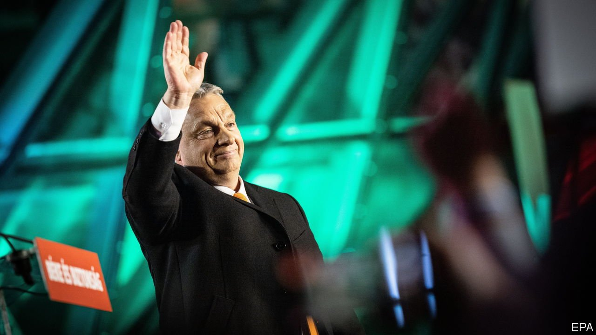
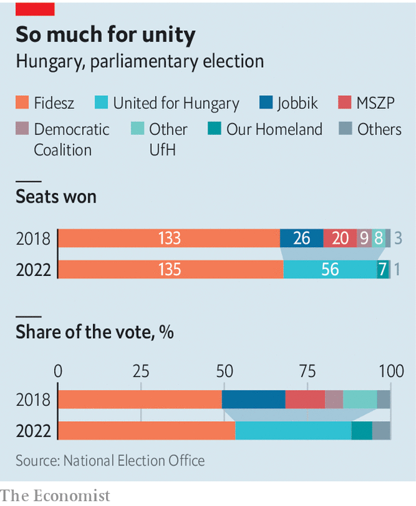

###### Hungary likes the wolf

# Viktor Orban’s victory is a triumph for illiberal nationalism 

##### After an unfair fight, the opposition parties start to blame each other 

 

> Apr 9th 2022 

AS ELECTION DAY dawned on April 3rd, the coalition of parties trying to unseat Viktor Orban, Hungary’s reactionary prime minister, hoped that the polls showing them trailing by six percentage points were wrong. It turned out they were, but in the other direction. Mr Orban’s governing Fidesz party won 53% of the vote, while the opposition United for Hungary alliance took just 35%. Fidesz increased its margin in parliament and retained the two-thirds supermajority needed to alter the constitution. The opposition’s candidate, Peter Marki-Zay, was plucked from obscurity a few months ago, and will most likely return to it. Mr Orban, the European Union’s longest-serving leader, won a fourth consecutive term and looks stronger than ever.

The prime minister claimed the win as a vindication of his ideology of illiberal nationalism. Since taking office in 2010 he has changed the constitution to benefit his party, nobbled the courts and seized control over most of the media. The EU has chided his government for violating the rule of law, misusing its funds and fostering corruption. Mr Orban casts himself as an underdog defending his people against EU bureaucrats, the international left and George Soros, a Hungarian-born Jewish philanthropist whom he accuses of plotting to flood Hungary with Muslim immigrants. “We have such a victory it can be seen from the moon, but it's sure that it can be seen from Brussels,” Mr Orban crowed after the results were in.


Also on his list of enemies is Volodymyr Zelensky, Ukraine’s president. Mr Orban has long had friendly relations with Vladimir Putin, and claimed to be getting a discount on Russian gas. He has been the most reluctant member of the NATO and EU coalition in the war in Ukraine, fiercely arguing against sanctions on Russian energy exports. In recent weeks Mr Zelensky has demanded that Mr Orban decide which side he is on. Mr Orban retorted that the opposition would drag Hungary into the war; they denied this, but many voters believed it. Government figures released after the election showed Hungary is actually paying Russia market rates for its gas.

 


The opposition’s defeat leaves in ruins its effort to build a coalition to stop the hollowing-out of Hungarian democracy. Because most MPs in Hungary are elected from single-member districts, smaller parties struggle to win seats. After years of defeats, in 2020 six parties, ranging from the nationalist right to the metropolitan left, joined forces in the United for Hungary umbrella grouping. They ran primaries to select candidates for parliament and for prime minister. Party leaders set aside their own ambitions to back Mr Marki-Zay, a conservative mayor who unexpectedly won the prime-ministerial primary.

Now that coalition looks dead. Ferenc Gyurcsany, a former prime minister who leads the centrist Democratic Coalition party, seemed to question whether holding a primary had been a good idea. Peter Jakab, the leader of the hard-right Jobbik party, reproached Mr Marki-Zay for lacking a clear focus. Joining the centrist coalition was devastating for Jobbik, which lost most of its voters to Fidesz or to Our Homeland, a new nationalist party.

A report from the ODIHR, a European election watchdog, said the election lacked a level playing field. The main problem was not tampering, though there was some of that. There were reports across the country of “chain voting”, in which voters smuggle their ballots out of polling stations so that they can be filled in by party organisers and then given to other voters to submit, in exchange for payment. But the more important issues were media bias and government support for Fidesz. Mr Orban uses Hungary’s state media as a propaganda megaphone, and most private outlets are controlled by oligarchs friendly to Fidesz. The opposition received little airtime, and what it got was overwhelmingly negative. It could spread its message only via a few independent news websites which most voters outside Budapest rarely read.

Under Mr Orban, the billions of euros in aid which the EU sends to Hungary each year have flowed largely to supporters of Fidesz. Hungary has the worst record of fraudulent use of EU funds of any country in the union, according to OLAF, the EU’s fraud-investigation agency. Mr Orban’s friends and relatives have grown rich. The EU has blocked Hungary from accessing its covid-recovery fund, and on April 5th it triggered a procedure that could cut off the rest of the aid it sends to Hungary until the country stops violating the rule of law.

Mr Orban’s win reinforces his increasingly autocratic government. His next move may be to complete the takeover of the judiciary, according to an analysis by Political Capital, an independent think-tank in Budapest. Despite the unfair electoral system, members of the opposition took most of the blame upon themselves. A Socialist MEP apologised on Facebook for failing to understand most of the country. Many opposition members were at a loss how to proceed. Asked how he expected to take up the fight in four years, an organiser of a liberal NGO had no answer: “I’m hoping to leave the country.” ■

