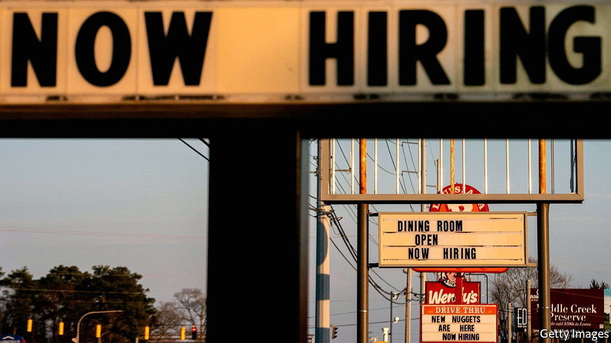
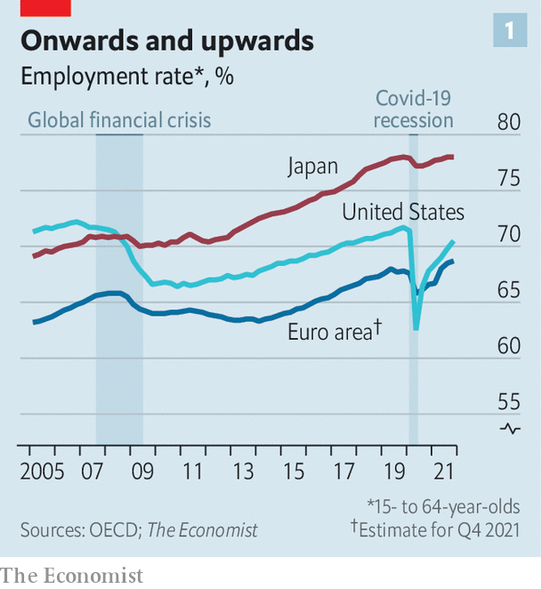
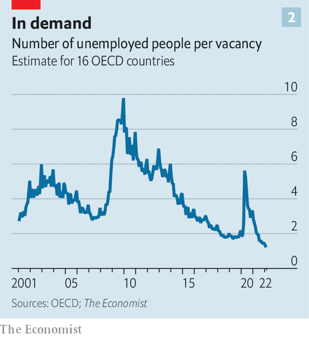
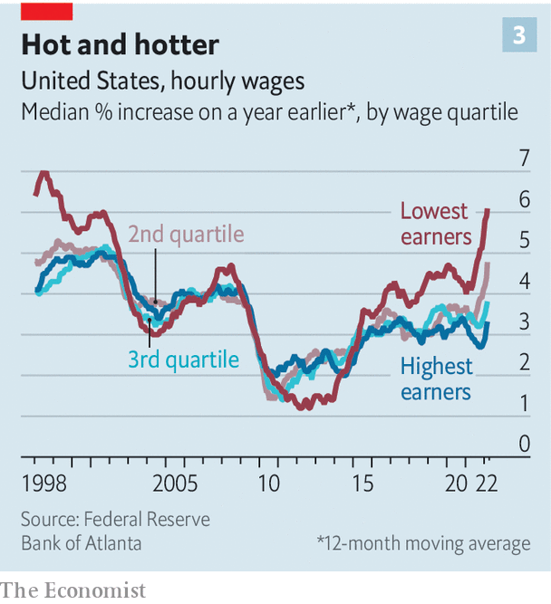

###### Too much of a good thing

# Are labour markets in the rich world too tight? 

##### Certainly in America, and probably elsewhere 

 

> Apr 5th 2022 

LAST MONTH Jerome Powell, the chairman of the Federal Reserve, identified the most uncomfortable trade-off in economics. “Today’s labour market”, he said at a press conference, is “tight to an unhealthy level”. In most places and at most times a fall in unemployment, or a rise in the number of people in work, is welcome. But labour markets can become too strained, creating worker shortages that stop production and cause wages to spiral, which can feed into overall inflation.

Mr Powell fears that America has crossed the threshold from good-tight to bad-tight, one reason why the Fed is signalling that higher interest rates are on the way. Increasingly, though, labour markets elsewhere in the rich world are also straining at the seams.


Almost nobody saw this coming. When the pandemic struck in 2020, most economists believed that the rich world was in for a long spell of high unemployment, similar to what happened after the financial crisis of 2007-09. In April 2020 America’s unemployment rate hit 14.7%. Had joblessness declined at its post-financial-crisis pace, the unemployment rate in March this year would have been over 13%.

 


In fact, it is 3.6%. And America, by many standards, is a laggard. A rise in the number of Americans who have decided they do not want to work at all, and who therefore do not count as unemployed, means that the share of 15-to-64-year-olds with a job is slightly below its level at the end of 2019 (see chart 1). In one-third of rich countries, however, this share is at an all-time high. Even among the other two-thirds, which includes America, the median shortfall in the employment rate is just one percentage point. It adds up to the quickest and broadest-based jobs boom in history.

 


Canada and Germany are among the countries with record employment rates. The same is true of France, known for its high joblessness. The working-age employment rate in Greece is three percentage points above its level in 2019. Across the OECD group of mostly rich countries there are about 20m more jobs than had been forecast in June 2020. The number of unemployed people chasing unfilled vacancies is the lowest it has been in decades (see chart 2). Even as pricey energy and rising interest rates provoke concern about the economy, there is little sign from “real-time” indicators that demand for labour is dropping.

Why is the jobs recovery so fast? One reason is the nature of the shock that hit the economy in 2020. History shows that financial crunches—tight monetary policy, banking disasters and so on—cause prolonged pain. But economies usually recover speedily from “real” disruptions such as natural disasters, wars and, in this case, a pandemic. In 2005 Louisiana’s unemployment rate soared after Hurricane Katrina but quickly fell back (though part of the adjustment came from people moving away). After the second world war European labour markets rapidly absorbed soldiers returning from the front lines.

Government policy has also boosted jobs. In 2020 countries including Australia, Britain, France and Germany launched or expanded job-protection or furlough schemes. At the peak over a fifth of European workers remained technically employed even as they twiddled their thumbs. When lockdowns lifted, they could quickly return to their roles—rather than having to search and apply for work, which takes time and thus keeps unemployment elevated. America launched a modest job-protection scheme, but its efforts were largely targeted at maintaining peoples’ incomes via stimulus cheques and topped-up unemployment benefits.

Stimulus schemes shored up families’ finances. Many households also reined in spending in 2020, allowing them to accumulate huge savings. The stockpile is now being spent on everything from consumer goods to housing, raising demand for workers in areas such as online retail and property services (including an extra 200,000 estate agents in America).

Nice workers if you can get them

With labour demand so strong, employers are having not only to increase the number of jobs but also to improve their quality. Amazon exaggerated when, last year, it said it would try to be “Earth’s best employer”, but many other companies are promising similar things, whether by offering employees better in-office benefits (such as tastier cafeteria food) or better compensation packages (free college tuition). In 2021 venture investors put more than $12bn into global HR tech startups, roughly 3.6 times the capital invested in them in 2020, according to PitchBook, a data provider.

Bad employers are having a tough time. The share of Americans worried about poor job security is near a historical low. In Britain the share of full-time workers on a “zero-hours contract”, where there are no guaranteed hours, soared after the financial crisis but is now falling. Many of the gig-economy firms that grew in the early 2010s by relying on an army of underemployed workers are struggling to find staff. Whether in London, Paris or San Francisco, hailing a ride is harder than it used to be.

The best measure of labour-market tightness is pay, which distils the relative bargaining power of workers and firms into a single number. In some places the situation is clearly getting out of hand. Wheeler County, Nebraska, is a heavily agricultural place a long way from anywhere. In December unemployment fell to around 0.5%. Jobs at a nearby Chipotle Mexican Grill pay $15-16.50 an hour, at least twice the federal minimum. Some firms claim to be raising wages by 30% or more.

Some countries still look decidedly un-Nebraskan. Japanese wage growth is easing, not accelerating. In December the “special wage”, which includes winter bonuses and typically makes up about half of total cash wages in that month, fell by 1% year on year. German wage growth is doing nothing special. Canada’s is respectable but it is hard to make the case that things are out of control.

 


On average, however, labour markets across the rich world are clearly getting tighter. America’s is plainly overheating. In March average hourly earnings were 5.6% higher than a year earlier, on the headline measure. Another gauge suggests that the lowest-paid are seeing bigger rises (see chart 3). Goldman Sachs, a bank, produces a wage tracker that corrects for various pandemic-related distortions. It is more than 5% higher than a year ago, the fastest rate of increase since the data began in the 1980s. Almost all wage measures in America show unusually rapid growth (by comparison, manufacturing wages rose by an annual average of 4.1% in 1960-2019).

Before the pandemic, underlying French wage growth was in the region of 1-2% a year. Now it is close to 3%. Italy looks similar. On March 23rd Norway’s central bank noted that “wage inflation has been higher than projected, and wage expectations have risen.” Britain is particularly striking. On Goldman’s measure, underlying pay there is rising at an annual rate of about 5%. Surveys of businesses suggest that even faster growth over the coming year cannot be ruled out. Across the G10 large economies as a whole wages are rising by at least 4% a year.

Is this sustainable? To most people wage growth of 4% hardly sounds malign. But the arithmetic is inescapable. At 4% wage growth, labour productivity (ie, the value of what workers produce per hour) must grow by at least 2% a year in order to be consistent with an inflation target of 2%. Businesses would pass on half their extra hourly wage costs to customers in the form of higher prices, but would absorb the other half since they would be selling more goods and services, or producing them more efficiently.

Productivity growth of 2% a year is not unachievable, but it would be a lot stronger than it was before the pandemic. Although productivity growth does seem faster than normal, our analysis of data from OECD countries suggests that it falls short of 2%. It may yet rise as companies reap the gains from their large investments in remote-working technologies and digitisation. Hopes of higher productivity, however, must be weighed against fears of still-higher wage growth.

If heady wage growth cannot be sustained, how might it fall? One long-floated possibility in those countries with lagging overall employment rates is that people who have left the workforce return, boosting the supply of labour. Fear of covid-19 might eventually fade and child care might become easier to find, easing worker shortages and causing wage growth to fall.

This hope is receding, however. Although many Americans have returned to the workforce over the past six months, wage growth has not slowed—in fact, it has accelerated. The Economist calculates that in September there were nearly 1.9m “missing” workers aged 25 to 54, based on participation rates in January 2020 and adjusting for population growth. By March 2022 this had fallen by more than half to about 750,000—or less than two months’ worth of job growth at the recent pace. There are another 1.3m missing older workers, but most are over 65 and likely to have retired permanently (and the number of missing over-65s has been growing).

It is likely, therefore, that in America and elsewhere labour markets will have to be cooled the old-fashioned way: by central banks raising interest rates, making it a little more attractive to save than spend and choking off demand for labour. The Fed has already increased rates by 0.25 percentage points, and is expected to do so by a total of 2.5 points this year. America may prove an example of what happens when policymakers respond to a labour market that has become dangerously hot. ■

For more expert analysis of the biggest stories in economics, business and markets, , our weekly newsletter.

