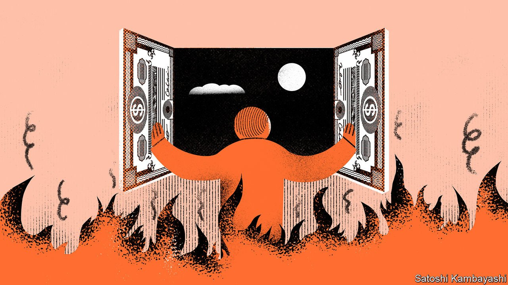

###### Buttonwood

# Bonds signal recession. Stocks have been buoyant. What gives? 

##### Stocks may have been ahead of bonds on inflation risk 

 

> Apr 9th 2022 

WAR! FAMINE! Death! AIDS! This is how Bill Hicks, a revered comedian who died in 1994, aged 32, riffed on the disorienting effect of watching cable news. Homelessness! Recession! Depression! The shocking headlines come at you relentlessly. But look out of the window and everything seems calm. The only sound is the chirping of crickets. You start to wonder, said Hicks: where is all this bad stuff happening?

A lot of bad stuff is happening just now, most notably a war in Europe. There is also inflation and growing fears of recession. Government bonds have just had their worst quarter for returns in ages. The Treasury yield-curve has inverted: the gap between yields on ten- and two-year bonds recently turned negative, an early warning of a downturn. The Federal Reserve is growing more hawkish. Yet stocks are surprisingly buoyant. Even after a few days fairly deep in red ink this week, the S&amp;P 500 index of stocks is only 7% below its all-time high. This might look like a foolish stockmarket failing to take its cue from a more realistic bond market. But the truth is more complicated.


There are lots of plausible explanations for the resilience of stocks. An evergreen one is that there is no good alternative to owning them. Investors need to put money to work and American stocks are the least-worst option. Bonds are a snare. As long as inflation is expected to exceed interest rates, they are a sure-fire way to lose purchasing power. The yield on ten-year inflation-protected bonds is still negative even after the big repricing in bond markets. The earnings yield on equities is comfortably higher than this real bond yield. And stocks offer some protection against inflation in as much as corporate revenues are indexed to rising consumer prices.

In any event, the risk of recession in America is not immediate. The Fed has barely started to tighten monetary policy. Even a rapid series of interest-rate increases will take time to slow the economy. The negative spread between ten- and two-year yields is an early-warning signal, not a blaring alarm. On average, recession hits more than a year after this part of the yield curve inverts. In the meantime, the equity market typically goes up. Looked at in this light, the message to take is to hold stocks for now.

Underlying all these rationalisations is a sense that equity investors do not quite believe the Fed will follow through on all the interest-rate increases the bond market is pricing in. (Perhaps that is why the Fed’s rate-setters are sounding more and more hawkish in public.) One strain of this belief gives the Fed too much credit: it says it can easily conquer inflation without crashing the economy. Another strain gives it too little credit: this school doubts the Fed’s stomach to engineer a recession for the sake of price stability. If the result of such qualms is that inflation lingers above the Fed’s 2% target for longer, then so be it. That would be a bigger problem for bond returns than for equities.

It is possible to pick holes in all these arguments. But it is not quite right to conclude that the stockmarket has failed to adjust to new and harsher realities. The best-performing industries in the S&amp;P 500 in the first quarter were those likely to be resilient to stagflation: energy, utilities and consumer staples. Meanwhile, technology stocks—flag-bearers of the “secular stagnation” era of low inflation and low interest rates—have had a brutal few months. The violence of this sector rotation away from tech has caused remarkably few ripples in the overall stockmarket. Nevertheless, equity investors were mindful of the world outside their window. The Bank of America’s global fund-manager survey suggests that investors reduced the weighting of technology stocks in their portfolios as far back as November, notes Kevin Russell of UBS O’Connor, the hedge-fund unit of the Swiss asset manager. The stockmarket has been ahead of the bond market on the risks of inflation, not behind it, he argues.

A big question is how far all financial markets are running behind the reality of inflation. The phase during which asset prices adjust to the prospects of tighter Fed policy does not seem to have quite run its course. And the pattern of the past two years is for one market phase to give way quickly to another. Everything is moving faster these days. But the relentlessness of scary financial headlines is not a confection of the 24-hour news cycle. Instead it is a reflection of a super-charged business cycle, which looks set—much like Bill Hicks—to burn brightly and die young.

Read more from Buttonwood, our columnist on financial markets:

 (Apr 2nd)

 (Mar 26th)

 (Mar 19th)


