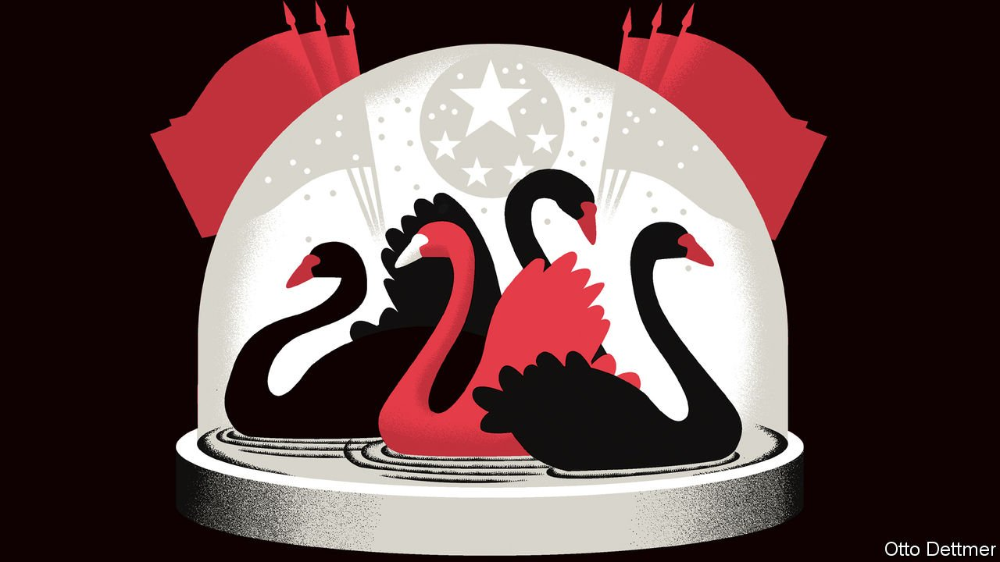
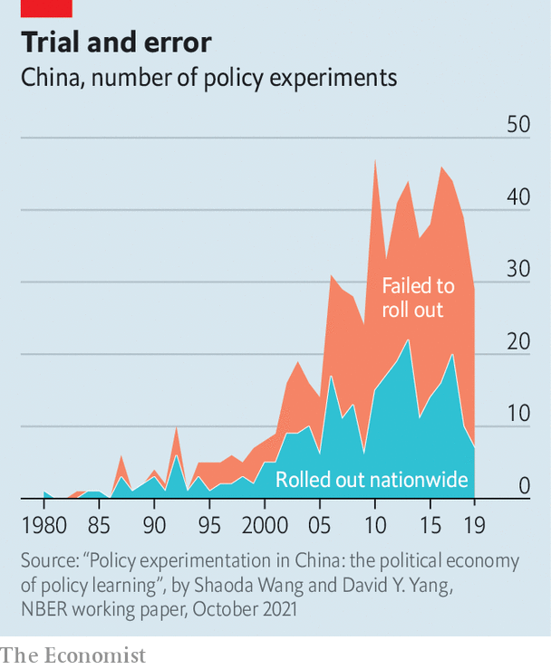

###### Free exchange

# China has a celebrated history of policy experiments 

##### Still, researchers find it could improve how it does them 

 

> Apr 9th 2022 

IN MAY 1919 John Dewey, an American philosopher, embarked on a lecture tour of China. “We are going to see more of the dangerous daring side of life here,” he predicted. His celebration of learning by doing and social experimentation was enthusiastically received by the country’s daring reformers and dangerous revolutionaries. At least one of his lectures was attended by a young schoolteacher called Mao Zedong. “Everything through experimentation,” Dewey declared on his tour. Chairman Mao would later repeat the line as China’s ruler.

In the scattered bases occupied by China’s communists before 1949, experimentation was unavoidable, points out Sebastian Heilmann in his book, “Red Swan: How Unorthodox Policymaking Facilitated China's Rise”. The communists lacked the manpower or administrative reach to impose uniform policies. Instead they introduced new measures, such as land reform, in model villages or “experimental points”, before spreading them across the “surface” of their territory. The aim was to learn by doing, without doing anything uncontainably calamitous. These “model experiences”, Mao wrote, were “much closer to reality and richer than the decisions and directives issued by our leadership organs”.


A similar “point-to-surface” approach was embraced by China’s leaders after Mao. Indeed, the central government has initiated over 630 such experiments since 1980, according to a recent paper by Shaoda Wang of the University of Chicago and David Yang of Harvard University. It has experimented with carbon trading, fisheries insurance, business licensing and fiscal devolution. A report last month by China’s planning agency referred to pilot schemes covering everything from cross-border e-commerce and housing provident funds to green electricity and recyclable packaging.

 


These trials are not mere formalities. The results can go either way. About 46% of experimental policies are never rolled out nationwide, according to Messrs Wang and Yang. An unsuccessful trial can nonetheless yield useful lessons for future reforms. Failure, as Mao once put it, is the mother of success: “a fall into the pit” can yield “a gain in your wit”.

China has indeed gained a lot from using this method. It is a “huge improvement” on a “counterfactual world” in which all central policies are implemented without any experimentation, Mr Wang argues. The point-to-surface technique is one reason why communist China has survived and advanced even as other socialist regimes have stagnated or collapsed, according to Mr Heilmann. Such unexpected outcomes are sometimes described as “black swans”. In China’s case, he argues, red seems the more appropriate colour.

This long and celebrated history notwithstanding, China is surprisingly bad at policy experiments. Its trials are not as clean as they could be, skewing the conclusions its leaders draw. One problem is their location. According to China’s planning agency, “sites should be fairly representative.” But contrary to this sound advice, 80% of experiments since the 1980s have taken place in localities that are richer than average, according to Messrs Wang and Yang. Another bias is fiscal. When local authorities experiment with an area of policy, such as education or agriculture, they tend to spend 5% more money on that area than otherwise similar counties that are not taking part in the experiment.

Experiments can also be skewed by less measurable factors. Some local officials, for example, simply put more effort into these pilot exercises than others. This is particularly true of ambitious young cadres who have more scope for promotion, because they are still far from retirement age. To measure this extra effort, Messrs Wang and Yang devise an ingenious proxy. They compare the language employed by local governments in describing the experiment. Leaders with more room for promotion differentiate their language from the boilerplate used by their upwardly immobile counterparts elsewhere.

Extra effort, more spending and atypical prosperity can all skew the results of a policy experiment. Some of these biases may be well known to seasoned policymakers in Beijing. But if so, national leaders do not act as if they are aware of them. They tend to favour successful trials regardless of the true source of that success. The more prosperous an experimental site, the better the chance the policy will be adopted nationwide. Such backing is also more likely if the host county just happens to enjoy a fiscal windfall during the trial period, say because a fortuitous cut in interest rates raises land values. The central government does not seem to disentangle the merits of an innovative policy from the idiosyncrasies of the places that pilot it.

A duck dressed up as a swan

This has national consequences. When new policies are spread across the surface of the country, the localities that most closely resemble the experimental “points” benefit the most, judged by their subsequent economic growth. Since experimental sites tend to be richer than average, the policies that emerge from experimentation may “systematically favour” the richer parts of China, Messrs Wang and Yang argue. That is not an outcome that Mao or Dewey would have welcomed: inequity through experimentation.

How can China reform this engine of reform, moving its experiments closer to reality? Another striking calculation by the researchers suggests one useful place to start. They point out that local officials are 22% more likely to be promoted if they take part in a successful experiment. To improve this technique, therefore, China’s leaders will have to fix the politics that attend it. In recent years, under Xi Jinping, experimentation has become “forced and feigned”, according to Mr Heilmann. Local administrators enjoy little “leeway and they are fearful of making policy and ideological mistakes along the way”. There will be no gain in wit if local policymakers fear a fall into the pit. ■

Read more from Free Exchange, our column on economics: (Apr 2nd)

 (Mar 26th (Mar 19th)


