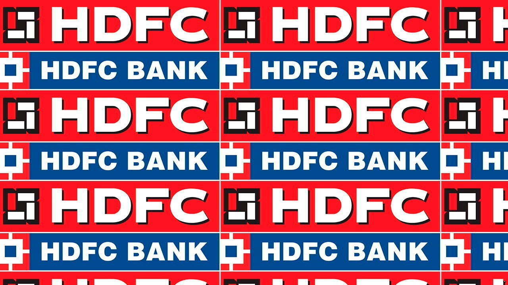

###### A house united

# HDFC Bank’s merger marks a milestone for India 

##### The new entity will be one of the world’s biggest banks by market valuation 

 

> Apr 9th 2022 

OUTSIDE INDIA, the union of two entities that share a banal acronym in their name might seem an exercise in bureaucracy. But in the case of the acquisition of Housing Development Finance Corporation (HDFC) by HDFC Bank, announced on April 4th, that appearance would be deceptive. The size of the deal, at $60bn, is by far the biggest in India—triple the value of the next largest acquisition (Walmart’s purchase of Flipkart for $17bn in 2018). It is also the fourth-biggest banking transaction in the world ever, according to Refinitiv, a data provider. The resulting entity is estimated to have a market capitalisation of as much as $185bn, which would make it one of the world’s largest banks, after JPMorgan Chase, Bank of America and three Chinese lenders—and well above Citigroup, HSBC and Standard Chartered, the three global banks that once stood at the pinnacle of Indian private-sector finance.

As important as the scale of the deal is what it says about the evolution of finance in India. Both institutions are among the most successful private-sector financial firms in a country where state-owned banks still loom large (local lenders were nationalised by Indira Gandhi, then India’s prime minister, in 1969). HDFC was founded in 1977 to provide basic housing finance. In the ensuing 45 years it has financed the purchase of 9m homes.


As restrictions on private-sector enterprise were gradually eased, HDFC’s chairman, Deepak Parekh, adeptly launched other financial institutions. Insurance came in 2000, and asset management in 1999. But none was as important as HDFC Bank, which was created in 1994 when private banking licences began to be granted. HDFC kept a 26% stake in the new entity and required the bank to work through it when providing mortgages.

For years there were advantages in maintaining separate institutions. Banks had access to cheap funding through deposits, but paid for the privilege through onerous capital requirements and rules that made them devote 40% of credit to “priority” areas, such as farming. Non-bank finance firms were easier to create—thousands sprang up—and faced less-stringent lending or capital requirements, but lacked cheap overnight deposits.

It proved a messy, even dangerous development, as many went on a lending and borrowing binge. In 2018-19 several prominent non-banks, including IL&amp;FS and two housing-finance firms, collapsed. There were fears of more failures to come, and funding dried up for many finance companies. That in turn led to a credit crunch.

Since then, regulatory changes have been quietly instituted, making life harder for the non-banks. The complex capital requirements imposed on them have been raised, for instance, to bring them largely in line with banks. That has made the operating restraints on finance companies somewhat bank-like, but without the benefits of cheap deposits. Jefferies, an investment bank, estimates HDFC pays 6% for its funding, compared with 3.7% for HDFC Bank. The spread for other finance companies is probably wider.

With the merger, that distinction will disappear, providing a meaningful cost saving and competitive advantage. Meanwhile, HDFC Bank, which has a sprawling network of 6,500 branches, ten times as many as its housing-finance cousin, will be able to offer mortgages to its customers directly—something that might have doubled its size had it been able to do so all along, said Sashidhar Jagdishan, the bank’s chief executive, on April 4th. Investors were unsurprisingly giddy at the prospect, with the share prices of both firms rising sharply. The mood in Mumbai’s stately Taj Hotel, where the merger was announced, was equally ebullient, as the city’s leading dealmakers speculated about what other changes might, once again, follow in HDFC’s wake. ■

For more expert analysis of the biggest stories in economics, business and markets, , our weekly newsletter.

