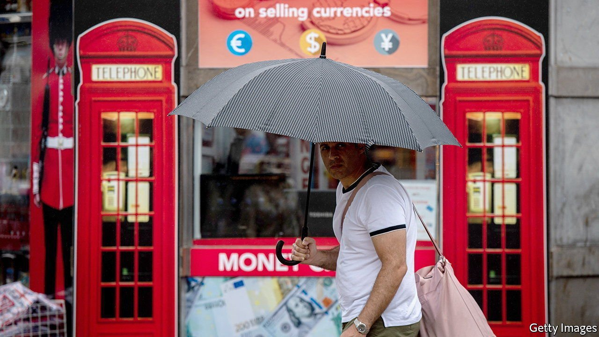
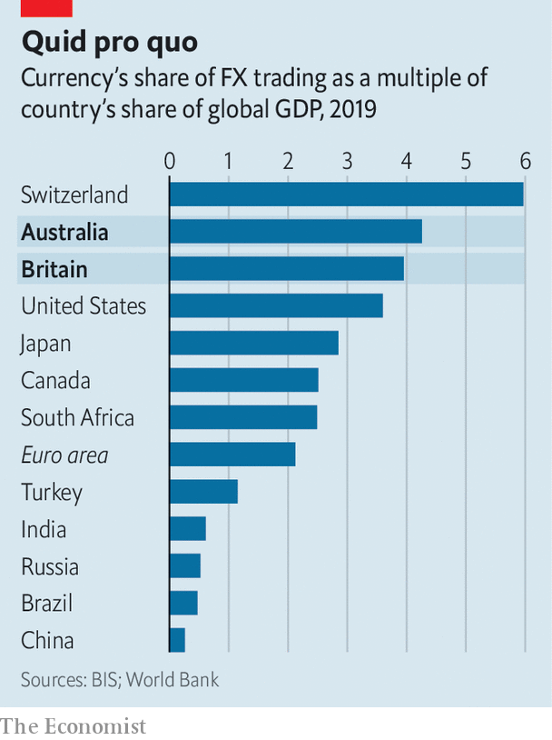

###### Not so sterling

# Has the pound become emerging-market money? 

##### Why the British currency has become more vulnerable to crises—and strangely popular 

 

> Apr 9th 2022 

STERLING WAS once the world’s dominant currency. As the American dollar took its crown, it became second-tier but remained elite, and for decades was content with its lot. Yet lately the pound’s shine seems to have dulled again—so much so, says Kamal Sharma of Bank of America, that it has been “acting [like] emerging-market (EM) currencies”.

It is not that the pound has suddenly turned into the Turkish lira or the Argentine peso. It remains part of the G5 group of heavily traded currencies, alongside the dollar, the euro, the Japanese yen and the Swiss franc. Yet it has proved more vulnerable to crises than the others.


A “flash crash” in October 2016 took its value from $1.26 to $1.14 in less than a minute. As covid-induced panic gripped markets in March 2020, it dropped by 12% against the dollar in the space of a fortnight (the euro fell by just 6%). When British petrol pumps ran dry last September, it plunged again and traders’ expectations of its future volatility soared. The Bank of England’s decision to raise interest rates earlier than most has since held it steadier, but some commentators remain adamant that the pound has not just decoupled from the currencies of other developed economies, but also joined the ranks of EM ones.

 


Such claims are usually made with the speaker’s tongue planted firmly in their cheek. EM currencies’ delightful attributes include capital controls (the Chinese yuan), hyperinflation (the Argentine peso) and “unorthodox” monetary policies (the Turkish lira). Liquidity crunches during market routs can subject sterling to harsh devaluations, explaining why it is not a haven like the dollar or the Swiss franc. But in normal times, call up a bank’s foreign-exchange (FX) trading desk asking to sell half a billion pounds and they won’t struggle to do so. That they might for an EM currency is the category’s distinguishing feature.

In fact, sterling is notable for the opposite: it plays an oddly outsize role in FX markets. Britain accounts for 3% of the world’s GDP. Yet over the past 20 years its currency has consistently been involved in over a tenth of FX trades.

So why do traders like sterling, if it is so brittle? You might trade a foreign currency if you want to buy goods or services from the country that issues it. Or you might sell something in exchange for it and want to convert the proceeds back to your currency. Neither explains sterling’s popularity: in 2019 Britain accounted for 3.8% of global goods imports and 2.6% of exports. Nor is it prominent in central-bank holdings (it makes up less than 5% of global reserves). The dollar dominates global payments, many governments borrow in it and some markets—commodities—are priced in it. The pound does none of these jobs.

In fact it is a means to less grand aims: speculation and cross-border investment. People trade sterling to take a punt on its value, or because they are buying or selling British assets. In this it has more in common with another rich-world currency. Like sterling, the Australian dollar is issued by an open, developed economy that relies heavily on trade. Punters use both to bet on trends that are bigger than their issuers’ economic footprint: sterling is a proxy for risk appetite; the Aussie dollar for commodity prices. And they loom larger in FX markets than either their economies’ heft or trade volumes warrant. Australia makes up less than 2% of world GDP, yet its dollar is present in 6.8% of FX trades.

Five years after the Brexit vote, there is little sign of the Global Britain that voters were promised, and declaring sterling an EM currency suits the country’s fondness for declinism. But to understand the role of the pound today, look Down Under. ■


