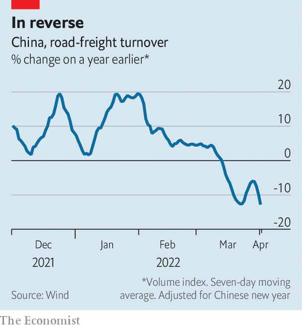

###### Looking in the side-mirror

# Omicron is dealing a big blow to China’s economy 

##### For a timely take, analysts are turning to unconventional indicators 

 

> Apr 9th 2022 

OMICRON MOVES fast. That makes it difficult to contain—even for China, which tries to stomp promptly on any outbreak. A cluster of infections in Shanghai, for example, has forced the government to impose a hurried lockdown for which it seems woefully unprepared.

The variant’s speed also makes China’s economic prospects unusually hard to track. A lot can happen in the time between a data point’s release and its reference period. The most recent hard numbers on China’s economy refer to January and February. Those (surprisingly good) figures look dated, even quaint. For most of that time, there was no war in Europe. And new covid-19 cases in mainland China averaged fewer than 200 per day, compared with the 23,107 reported on April 7th. Relying on official economic figures is like using a rear-view mirror to steer through a chicane.


For a more timely take on China’s economy, some analysts are turning to less conventional indicators. Baidu, a search engine and mapping tool, provides a daily mobility index, for instance. Over the week to April 3rd, this was more than 48% below its level a year ago. The index is best suited to tracking movement between cities, says Ting Lu of Nomura, a bank. To gauge the hustle and bustle within cities, he uses other indicators, such as subway trips. Over the week ending April 2nd, the number of metro journeys in eight big cities was nearly 34% lower than a year ago. In Shanghai, where many subway lines are now closed, the number of trips was down by 93%, a worse drop than in early 2020.

 


The two numbers that worry Mr Lu most track distribution services. In the week ending April 1st, an index of express deliveries by courier companies was nearly 27% below its level at a similar point last year. Over the same period, an index of road freight fell by 12.8%. The decline looks especially stark because the measure was rising briskly at the end of last year.

Unconventional measures are all the more valuable in China because of doubts about the official data. The strong figures for January and February, for example, are not only old but odd. They suggest that investment in “fixed” assets, like infrastructure, manufacturing facilities and property, grew by 12.2% in nominal terms, compared with a year earlier. But that is hard to square with double-digit declines in the output of steel and cement. The recovery in property investment also looks peculiar alongside the fall in housing sales, starts and land purchases. When some local governments said that they were double-checking their figures at the behest of the National Bureau of Statistics (NBS) it became clear that the official statistics look odd even to the official statisticians.

China’s high-frequency indicators proved their worth in spring 2020. Economists were timid at first in cutting their growth forecasts. No one knew exactly how the economy would react or what the NBS would be prepared to report. Armed with evidence from high-frequency data, forecasters were eventually brave enough to predict a GDP decline in the first quarter of 2020. Indeed, it shrank by 6.8%, according to even the official figures.

The timeliness of unconventional indicators makes them valuable in periods of flux. Still, “there are many traps,” says Mr Lu. Any short period can be distorted, say by bad weather, or holidays. And annual growth rates can be skewed by past idiosyncrasies. Moreover, what does a dramatic weekly decline in road freight mean for quarterly GDP growth? It is impossible to say with any precision. Many indicators also have only a short history. As a PhD student, Mr Lu was trained in econometrics. “But with only one or two years of data, if I used the kind of techniques I learned at school, people would laugh at me.”

To help avoid some of the traps, Mr Lu and his team watch “a bunch of numbers”. “If seven or eight out of ten indicators are worsening, then we can be confident that GDP growth is getting worse,” he says. Right now, he thinks, “something must be going very wrong.” ■

For more expert analysis of the biggest stories in economics, business and markets, , our weekly newsletter.

Dig deeper

All our stories relating to the pandemic can be found on our .

