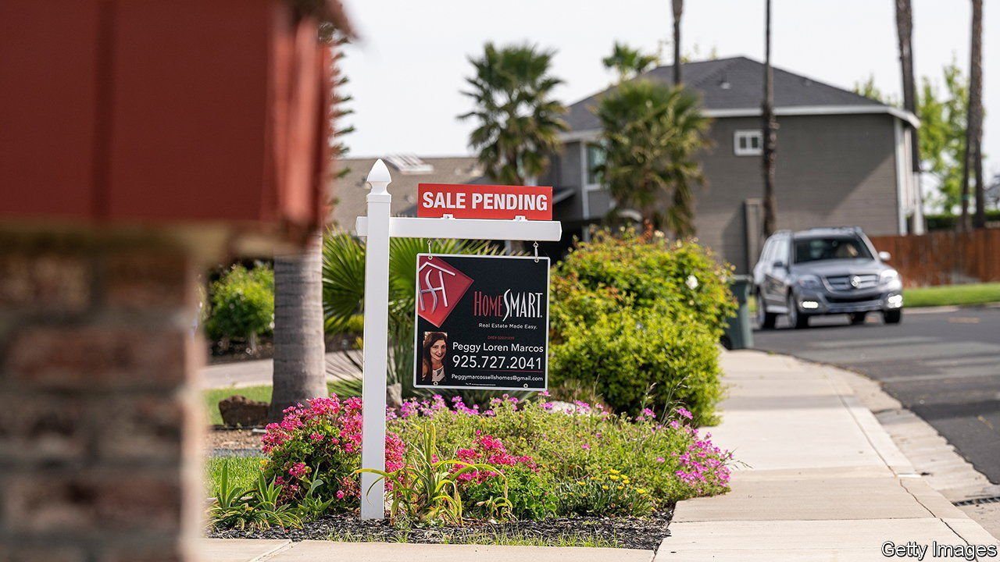
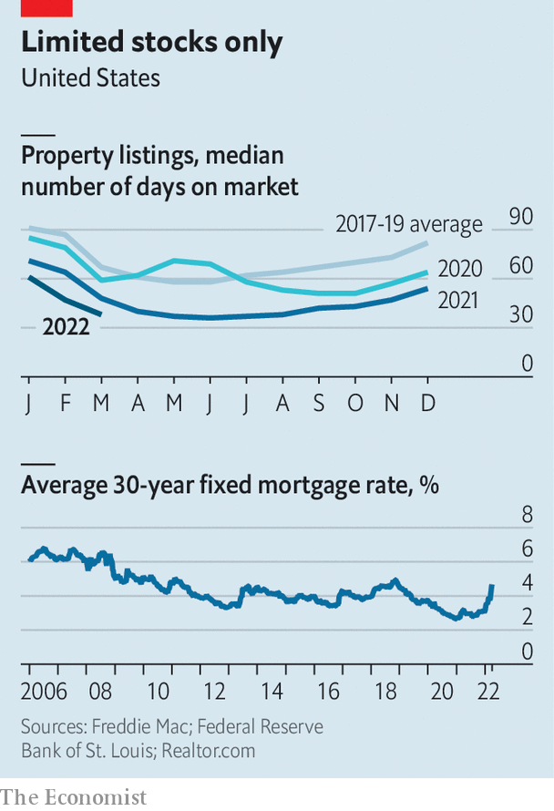

###### FOMO froth

# The American property market is once again looking bubbly 

##### Soaring mortgage rates have yet to cool exuberant demand 

 

> Apr 9th 2022 

IVY ZELMAN knows a thing or two about the American housing market. She was rare among mainstream analysts in warning of trouble in 2005, a year before the bubble started to burst. In 2012, when many investors were reluctant to get back into property, she declared the sector had hit rock-bottom; prices have more than doubled since then. So it is worth paying attention to her latest pronouncements. “It’s euphoric right now,” she says. “There are definite signs of excess.”

But Ms Zelman, who has gone from investment banks to running an analysis firm, also knows the current rally is different from past ones, which suggests the downside may be less severe. Start with the evidence of potential danger. Prices have surged in America since early in the pandemic, much as they have throughout the rich world. In recent months they have risen by nearly 20% year on year, eclipsing their heady pace before the global financial crisis of 2007-09.


Far from deterring buyers, the rally has only fuelled FOMO—a fear of missing out. The typical home sold in March was on the market for just 38 days, down from a pre-pandemic norm of 67 for that time of year, according to Realtor.com, a listings website (see chart). And supply seems constrained. At the end of 2021 America had 726,000 vacant homes for sale; in the two decades before the pandemic that had never fallen below 1m.

 


One critical variable is now changing, and rapidly at that, owing to the monetary-policy decisions of the Federal Reserve. Although the Fed has raised short-term interest rates by only a quarter of a percentage point so far this year, mortgage rates have soared by more than 1.5 points as investors price in more tightening to come. Normally, such a steep increase would cool the housing market, making monthly payments increasingly unaffordable.

Yet thus far the red-hot market has remained resistant to rising mortgage rates. Partly that is because so many Americans took advantage of the extremely low rates available during the pandemic to take out new financing. About 70% of homeowners now have mortgages with rates of less than 4%, according to Ms Zelman. In 2018 just about 40% enjoyed such low borrowing costs. Another explanation is the wealth, at least on paper, that Americans have accumulated thanks to rising asset prices over the past two years. About a quarter of existing-home sales are all-cash transactions now, compared with a fifth before the pandemic, according to the National Association of Realtors.

Resistant to rising rates, though, does not mean impervious. At some point high borrowing costs will crimp demand. Moreover, the fundamentals underpinning the property rally—the limited supply of new homes—may prove to be, in part, an artefact of the pandemic. Nearly 1.6m homes are under construction nationwide, the most since the early 1970s. The problem is that the housing sector is, like other parts of the economy, suffering from labour shortages and gummed-up supply chains. It is taking longer than normal to complete construction. A resolution of these constraints could move America from a property shortage to a glut.

Ms Zelman is far from alone this time in her warnings. On March 29th a group of researchers with the Dallas Fed noted that their “exuberance indicator”, a gauge to detect housing bubbles, was flashing red. “Our evidence points to abnormal US housing-market behaviour for the first time since the boom of the early 2000s,” they wrote. Few expect a repeat of the collapse that followed that boom. Homeowners have healthier balance-sheets than they did 15 years ago, and borrowing standards are stricter. Nevertheless, the housing market today provides just another illustration of the rocky path that the Fed must navigate, with rampant inflation on one side and a bust on the other. ■


