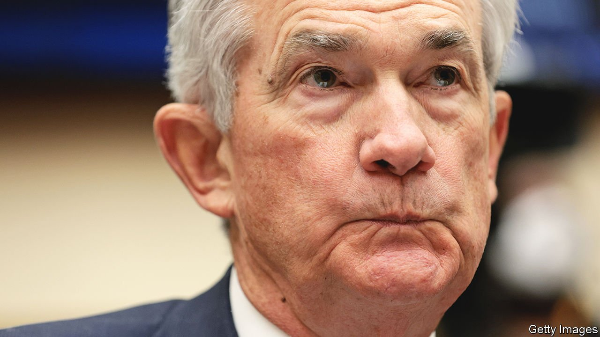

###### Balance-sheet manoeuvres

# The Federal Reserve prepares for quantitative tightening 

##### Goodbye, QE. Hello, QT 

 

> Apr 9th 2022 

QUANTITATIVE EASING, or QE, once an unconventional tool of monetary policy, has become commonplace over the past decade. During the pandemic alone the Federal Reserve bought a staggering $3.3trn in Treasuries and $1.3trn in mortgage-backed securities as it sought to keep borrowing costs low. The reverse process, quantitative tightening (QT), when central banks shrink their balance-sheets, has been far rarer. The Fed is the only central bank to have truly attempted it, and it had to stop abruptly in 2019 because of market ructions. So its plan for reducing its assets—trailed in the minutes of its meeting in March, published on April 6th—takes it into relatively uncharted territory.

Officials like to downplay the significance of QT. When at the Fed’s helm, Janet Yellen compared it to watching paint dry. Jerome Powell, her successor, says it will operate in the background. In truth it is akin to dismantling an auxiliary engine for the economy, with only hazy knowledge of the consequences.


As Lael Brainard, a member of the Fed’s board, noted on April 5th, this round of QT will be more aggressive than the Fed’s previous iteration. With inflation racing ahead and the labour market tight, the central bank wants to cool the economy quickly. Coupled with interest-rate rises, QT is likely to be a drag on growth.

So far the Fed has reinvested the proceeds of maturing bonds in order to maintain its stock of assets. The minutes suggest it is likely to shrink its balance-sheet not by making active sales, but by letting some maturing bonds “roll off”, without reinvestment. The roll-off may start in May. Come July, all going well, the Fed will raise the maximum roll-off to $95bn per month, split between $60bn of Treasuries and $35bn of mortgage-backed bonds. At full tilt, the Fed could shrink its balance-sheet by more than $1trn over a 12-month period, twice as fast as its first go at QT. “Even if it’s done in a predictable way, this is a big adjustment for markets,” says Brian Sack of D.E. Shaw, an investment firm.

Multiple rounds of bond-buying by central banks since the financial crisis of 2007-09 have yielded some understanding of how QE works. It signals a commitment to ultra-low interest rates. It suppresses long-term rates. And it supports liquidity, ensuring that markets operate smoothly.

QT looks like QE in reverse. Instead of creating central-bank reserves (held by the private sector) by purchasing bonds, the central bank drains reserves by refraining from reinvesting as bonds mature. The three channels through which QE works also operate in reverse. First, QT sends a signal that rate rises are coming. Notably, it was in early January, when the Fed discussed a faster approach to QT than many had expected, that market rates shot up.

The second channel— QT’s direct impact on yields—involves heroic guesstimates. Some analysts think the Fed will shrink its balance-sheet by $3trn over the next three years (taking it to about 20% of GDP, down from 36% now). Mark Cabana of Bank of America reckons this could equate to anywhere between a quarter point and 1.25 percentage points of rate increases—a remarkably wide range. Mr Powell has also noted the uncertainty about QT: “We have a much better sense, frankly, of how rate increases affect financial conditions.”

When the Fed raises interest rates, it is raising overnight borrowing rates, which then ripple along the yield curve. With QT, the main impact is on longer-term yields. For some economists, such as Kristin Forbes of the Massachusetts Institute of Technology, this means that QT could be more potent than rate rises, since it would target hot segments of the credit market, such as . The Fed has said that it will stick with rate increases—the devil it knows—as its main tool. If, however, QT does hit longer yields, it may need fewer rate rises to tame inflation.

The final channel is liquidity. As the Fed buys fewer bonds, there may be fewer transactions overall. Indeed, a Bloomberg index that measures the ease of trading Treasuries recently worsened to levels last seen at the pandemic’s start. That echoes uncomfortably with the past round of QT, which culminated in a liquidity crunch in the overnight-borrowing market. But the Fed is better prepared this time. There is much more cash in the market to begin with. And the Fed has set up an overnight-lending facility, which should let banks get funds if needed. “The risk of a spike in rates like we had in September 2019 is much, much lower,” says Bill Dudley, former president of the New York Fed.

Yet new concerns will emerge. The Fed’s mortgage bonds have long tenors, so passive roll-offs would take decades. The central bank may have to make active sales, which it wants to avoid. Another concern is the Fed’s $326bn in short-term Treasury bills. Some observers think it will roll them off, supercharging QT; others fear that would stoke volatility. But the biggest worry is whether QT will work as intended, taking heat out of the economy without causing undue harm. ■

For more expert analysis of the biggest stories in economics, business and markets, , our weekly newsletter.

