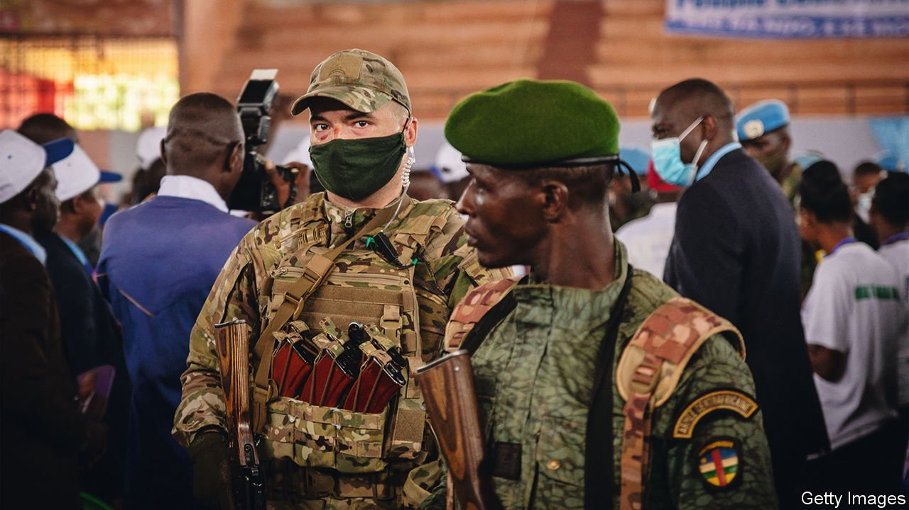
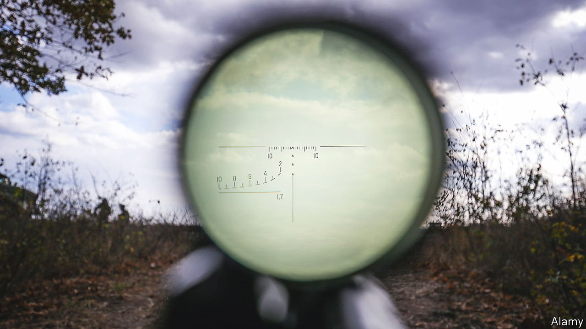

###### Vladimir’s army

# Russia’s brutal mercenaries probably won’t matter much in Ukraine 

##### But they continue to prop up strongmen elsewhere 

 

> Apr 9th 2022 

LOOK ONLY at the top of the photograph of four men posing in military garb and the mood seems light. One man smiles. Another puffs on a cigarette while staring straight into the lens. But glance down at their feet and you see a severed head on the concrete floor. Before beheading their victim, the men had made a video of themselves laughing as they smashed his hands and feet with a sledgehammer. The incident took place in Syria in 2017. The victim is reported to have deserted the Syrian army, and his killers were probably Russian. At least one has been identified as an operative from , a Russian mercenary outfit with connections to Russian military intelligence that, not for the first time, is reportedly operating in Ukraine.

The most high-profile Russian mercenary group, Wagner has ties that lead right to President Vladimir Putin. It first came to prominence in Ukraine in 2014 as Russia tried to break off the Donbas region in the east. Then, Wagner provided one of the services Mr Putin values from mercenaries: deniability. Its men could pass more plausibly than Russian soldiers as separatist fighters. Since then the group has deployed to a , including Syria, Libya, Mali and the Central African Republic (CAR), as well as dabbling in Sudan and Venezuela, always to prop up or install strongmen favoured by Mr Putin.


In Ukraine today, Mr Putin can no longer hope for deniability from Wagner, nor for much benefit from another service he prizes from mercenaries—lowered casualty counts among soldiers whose families might wonder why their loved ones were sacrificed. Since Russia already has some 190,000 troops in Ukraine, even a few thousand Wagner mercenaries have small chance of changing the outcome of the war. But they may make its conduct still more savage. For service in Ukraine, Russian recruiters have reached out to those who were turned down in the past for having too little experience or suspect backgrounds. “They’re taking anyone and everyone,” says Ilya Rozhdestvensky, a Russian journalist with long experience tracking mercenaries.

The group reportedly takes its name from Hitler’s favourite composer, Wagner, the call sign of its founder, Dmitry Utkin. Mr Utkin is a veteran of Russia’s military intelligence, the GRU, who fought in both Chechen wars and later commanded an elite Spetsnaz, or special forces, unit. Wagner’s ties to the Russian armed forces go on. Its training camp in Russia is near a GRU facility. In Libya, Syria and Venezuela, Russian military aircraft transported Wagner operatives in and out; in Libya the Russian armed forces also reportedly kept them well supplied. A shopping list of military hardware including tanks, an advanced radar system and hundreds of Kalashnikov rifles was found in a Wagner document recovered in Libya. Some of the gear could probably have been provided only by the Russian armed forces.

Wagner operatives often use passports issued by a special desk linked to the Ministry of Defence—the same desk that issued the passports of the two men who attempted in 2018 to assassinate Sergei Skripal, a former Russian spy, in Britain. In 2020, when Belarus surprisingly arrested 33 Russians who seemed to belong to the Wagner Group, Mr Putin took a personal interest and worked to secure their release. “They’re not independent at all,” summarises Kimberly Marten of Barnard College at Columbia University.

Like all mercenary outfits in Russia, the Wagner Group does not officially exist, because Russian law does not permit mercenary activities. Yet in 2018 Mr Putin acknowledged its existence, suggesting its work was fine provided it took place outside Russia’s borders. “They have every right to work and promote their business interests anywhere in the world,” he said. Small wonder that Russia’s authorities have shown little interest in holding Wagner forces accountable for their behaviour, including the torture in Syria.

Some 10,000 men are believed to have served with Wagner since its inception, most of them former Russian soldiers with combat experience. Recruiters are said to prefer those with specialised military skills and without criminal records. The work is well paid: mercenaries in Africa receive as much as $4,000 per month.

Though Wagner mercenaries have been dispatched on missions that served Russia’s geopolitical interests, the organisation has also made plenty of money along the way. In most places Wagner operates, such as Mali or CAR, it is paid by the local government. Sometimes the deal is sweetened with control of gold or diamond mines granted to Wagner or to companies linked to the group’s main backer, Yevgeny Prigozhin. In Syria Mr Prigozhin was cut into oilfields; in Mali Wagner is reportedly pocketing $10m a month.

At times, Mr Prigozhin appears to have had tensions with some Russian officials, such as the defence minister, Sergei Shoigu. In 2018 American air strikes killed about 200 Russian mercenaries who attacked an American-backed Kurdish outpost near Deir al-Zour in eastern Syria; Russia’s regular army reportedly did little to avert the slaughter. Yet Wagner seems to have recovered from such setbacks, perhaps thanks to Mr Prigozhin’s connections in the Kremlin.

Mr Prigozhin served time in a Soviet prison as a young man, and upon his release he opened a hot-dog stand in St Petersburg. From that humble start he diversified into restaurants that drew the city’s elite. After Mr Putin became president in 2000, he began bringing high-powered guests to Mr Prigozhin’s establishments; President George W. Bush reportedly dined on duck-liver pâté, black caviar and steak with morel mushrooms at New Island, a Prigozhin-owned restaurant floating in the Neva river. Juicier contracts for Mr Prigozhin to feed the armed forces soon followed. He was later entrusted with more serious missions, including the mercenary group that became Wagner and the internet “troll farm”, the Internet Research Agency, that was indicted by Robert Mueller, a special prosecutor, for spreading disinformation online to interfere with the American presidential election in 2016.

For all its lucrative business, Wagner’s record is mixed. It served Mr Putin’s purposes in the Donbas in 2014 and after. And in Syria, Wagner mercenaries are believed to have played a key role in recapturing the city of Palmyra from Islamic State and in helping Russia’s armed forces to keep Bashar al-Assad in power. But in 2019, when Wagner was hired to fight jihadists in northern Mozambique, its fighters beat a rapid retreat after at least seven of them were killed. In Libya about 1,000 Russian mercenaries have fought for Khalifa Haftar, a rebel general, against the unrecognised government. They have not overthrown the government and have been accused of war crimes, including murdering civilians. In CAR, about 2,000 Wagner mercenaries are propping up President Faustin-Archange Touadéra, but are far from vanquishing the rebels out to topple him.

In the past six months about 1,000 Wagner operatives have arrived in Mali. They have already been accused, in a UN report, of taking part with Malian soldiers in trussing up about 30 people, dousing them in petrol and burning them alive. Human Rights Watch, a pressure group, says Russian mercenaries with Malian forces summarily executed some 300 suspected Islamist fighters, an incident it calls “the worst single atrocity reported in Mali’s decade-long armed conflict.” Meanwhile, jihadists continue to advance.

Mission creeps

Reports of Wagner’s arrival in Ukraine appeared just days after the invasion. Ukraine’s security services announced that mercenaries had been dispatched to assassinate Volodymyr Zelensky, the president, and other officials. Yet there has been no independent confirmation of that, and analysts and journalists who track the group reckon their use for such a sensitive mission is improbable. Mercenaries do not appear to be fighting beside the Russian soldiers who invaded from Russia, Belarus and Crimea. Ukraine has released information about only two fighters with Wagner connections among the many Russians taken prisoner; those men said they fought with the group in the past, but came to Ukraine with the regular Russian army.

 


Instead, mercenaries are reportedly moving into the parts of Donetsk and Luhansk that were already occupied, to reinforce separatists trying to break through Ukrainian lines. On March 28th the British Ministry of Defence said it expected Wagner to deploy more than 1,000 mercenaries in eastern Ukraine, including senior leaders. So far, those heading to Ukraine do not appear to be from the core group. “They’re using the old Wagner infrastructure—the base, the recruiting channels,” says Ilya Barabanov, a Russian journalist who has reported extensively on the group. “But it’s not what we’re used to calling ‘Wagner’.” Ukraine’s military intelligence says the mercenaries are a new incarnation of Wagner called “Liga”, Russian for “league”. They are being offered more than 200,000 roubles ($2,367) per month, several times more than regular soldiers typically get.

Russia may also be turning to Syrians and others who once fought beside Wagner. Mr Shoigu, the Russian defence minister, claimed to Mr Putin that 16,000 “volunteers” from the Middle East were ready to fight in Ukraine. Videos from CAR also show armed African men declaring they want to fight for Russia. Though there is little evidence of more than a trickle to Ukraine so far, foreign fighters might add more bulk than mercenaries alone. Yet they may not prove particularly motivated. Many would probably be “press-ganged” into it, as they were when Russia sent Syrians to back Mr Haftar’s failed push in Libya, argues Ms Marten. During a decade of civil conflict, Syrian soldiers showed more aptitude for stealing household appliances and selling drugs than fighting.

Western intelligence suggests some Wagner mercenaries may be leaving Libya for Ukraine. Perhaps even a few are departing from CAR. But for now the signs of redeployments are limited. “No one cancelled the other commercial contracts,” Mr Barabanov notes. Indeed, well after the war in Ukraine began, Wagner sent more mercenaries to Mali, says a French military official. “We think that there will be no major impact to deployments in Mali and CAR,” he adds. Even if more Russian mercenaries do arrive in Ukraine, their record suggests they may contribute less to the momentum of the conflict than to the lengthening list of war crimes. ■

Read more of our recent coverage of the .

