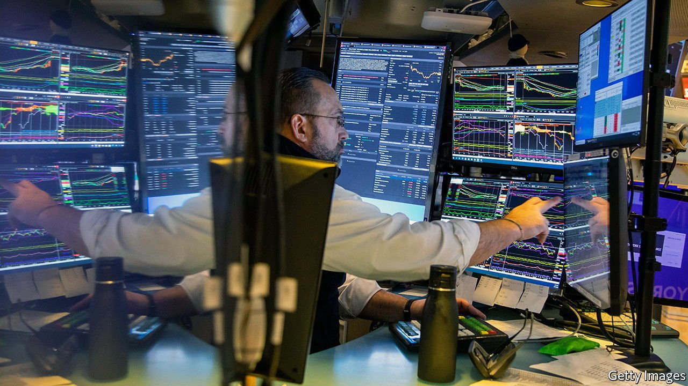
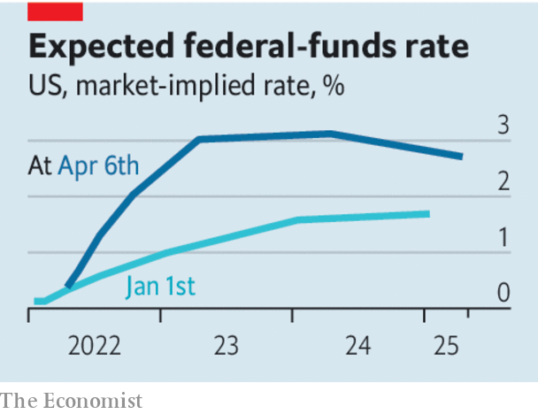

###### Recession roulette

# A toxic mix of recession risks hangs over the world economy 

##### American inflation, Europe’s energy crisis and China’s Omicron outbreak threaten the world economy with a downturn 

 

> Apr 9th 2022 

JUST A YEAR ago the world’s economists were celebrating a rapid rebound from recession. Now they are worrying that the next downturn could be looming. In America the Federal Reserve is preparing to do battle with high inflation by  sharply and shrinking its balance-sheet. In Europe expensive energy is sapping consumers of spending power and making factories costlier to run. And in China an outbreak of the Omicron variant of the coronavirus has led the authorities to impose the strictest lockdowns since the start of the pandemic.

It is a gloomy combination for global growth, and the outlook is darkening. Several economies could even suffer recessions, though at different times depending on the obstacles they face.


The economy in the United States is overheating. The annual rate of consumer-price inflation is 7.9% and hourly wages are 5.6% higher than they were a year ago. America has nearly twice as many job openings as it does unemployed workers—the highest ratio in 70 years. For much of 2021 central bankers hoped that Americans who left the labour force after the pandemic struck would return, helping cool the labour market. In the past six months their prayers have been answered: more than half the missing workers of prime working age . Yet wage growth has risen anyway, perhaps because workers are negotiating hard as rising prices erode living standards.

 


The Fed needs both wage and price growth to cool if it is to hit its 2% inflation target. It is expected to raise short-term interest rates, which started the year below 0.25%, to over 2.5% by December, and to continue to raise rates above 3% in 2023. This week the central bank trailed a plan to shrink its $8.5trn bond holdings, starting in May, at a much faster pace than during the last period of “”.

Hitting the monetary brakes, though necessary, endangers growth. History suggests that the Fed finds it difficult to cool the jobs market without eventually tipping the economy into recession. It has pulled off a “soft landing” only three times since 1945. And it has never done so while battling high inflation. Bond investors are betting that in two years’ time the Fed will have to cut rates again as the economy weakens. Given the record, a recession in the next two years looks likely.

Europe has an inflation problem, too, but it is so far caused by expensive imported energy and food more than by overheating. Russia’s invasion of Ukraine and Western sanctions threaten the continent’s energy supply. Gas prices for next winter are five times higher than in America, and spending on household energy is almost twice as high as a share of GDP (partly because Europe is poorer). As energy prices have surged, consumer confidence has slumped. Firms are struggling, too: French industrial production fell in February.

The euro area’s economy will probably still grow in 2022 as a whole. But it looks fragile. Should Europe stop importing Russian gas—whether because it chooses to or the Kremlin decides to cut off the supply—the danger of a recession will rise.

The threat to global growth from  is the most severe and immediate. China reported over . Because the government is committed to eliminating covid-19, Shanghai’s 26m residents, and those of other big cities with outbreaks, are under lockdown. If the past relationship between lockdowns and GDP holds, China’s real-time output will be 7.1% lower than in a world with no restrictions, according to Goldman Sachs. Lockdowns will also disrupt global trade, which is still struggling with a hangover from earlier in the pandemic. Shanghai is the latest global port to see hundreds of ships back up offshore, waiting to load or unload.

Xi Jinping, China’s president, has urged officials to cut the costs of its restrictions. But if it opens up too soon, mainland China will see a wave of infection and deaths like that which recently plagued Hong Kong. That would scare consumers and become a source of economic disruption in its own right. Until China vaccinates its elderly in sufficient numbers using the most effective jabs, lockdowns will be an enduring feature of its economy and a source of global volatility.

The blame for the world economy’s many troubles lies squarely with policymakers. The Fed’s job is supposed to be to take away the punchbowl just as the party gets going; it has instead presided over a blowout. Europe’s governments let the continent become dependent on Russian natural gas. And China’s difficulty in suppressing Omicron was predictable, and widely predicted. Economic trouble often strikes as a bolt from the blue. Today’s recession scare was avoidable. ■

For more expert analysis of the biggest stories in economics, business and markets, , our weekly newsletter.

