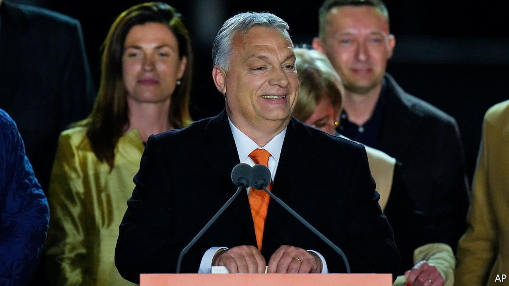

###### Imaginary hobgoblins

# Fearmongering works. Fans of the truth should fear it 

##### In Hungary, Russia, Pakistan and France, leaders lie to scare people into supporting them 

 

> Apr 9th 2022 

HUNGARY’S WAY of life is under attack, if you believe the ruling party. A Jewish billionaire plots to flood the country with a million Muslims. Perverts want to teach its children sexual deviance. The opposition are spoiling for war with Russia. The only way to stay safe is to back Viktor Orban, the prime minister. On April 3rd his party,  and, thanks to gerrymandering, two-thirds of seats in parliament. Mr Orban called it a triumph for “our brand of Christian democratic, conservative, patriotic politics”. It was actually a victory for the paranoid style.

The threats the regime describes are largely imaginary. Hungarians are free to follow their traditions if they choose. George Soros has no power over their borders. There is no global conspiracy to corrupt Hungarian children. And the fact that the opposition do not share Mr Orban’s admiration for Vladimir Putin does not mean they are warmongers. No matter. Since Mr Orban took office in 2010 he has won control of nearly every significant media outlet. The opposition leader, Peter Marki-Zay, had only five minutes on public television during the campaign—barely enough to introduce himself, let alone dam a river of lies.


Mr Orban’s victory entrenches a corrupt and semi-authoritarian regime in the heart of the European Union, the world’s premier club of liberal democracies. Every year he is in office, he erodes more democratic checks and balances. Most of the opposition united against him during this election, worrying that if they did not stop him now, it would be too late. They failed.

Hungary has shown once again how well fearmongering works. Voters are never more attentive than when hearing about threats, even phoney ones. Because of social media, unscrupulous politicians can easily spread vivid, viral footage that appears to support their scare stories. If such types win power, they are likely to abuse it. Even in a liberal democracy, as Hungary once was, a determined would-be strongman can chip away at independent institutions, such as the media or the courts, until his voice drowns out every other.

Mr Putin’s regime is very different from Mr Orban’s, which does not kill people. Yet their styles overlap. The Kremlin also lies to scare voters into seeking the big man’s protection. Its mouthpieces tell Russians that they are about to be attacked by the West, which has been developing bioweapons in Ukraine, a country run by Nazis. None of this is true, but viewers of Russian TV hear little else. Many therefore rally around their president. Many believe the fresh lies with which their ruler reinforces his old ones, for example that the photos of Ukrainian civilians tied up and murdered in Bucha are a “staged provocation by the Kiev regime”. The Economist sent a reporter to check; he came back with his clothes stinking of death.

Thousands of kilometres away, in another very different country, a third leader is inventing threats as a way to cling to power. A , the prime minister of Pakistan, was scheduled for April 3rd. The deputy speaker of parliament, an ally of the former cricket star, declared it a plot by the United States and cancelled it. Political chaos ensued. Mr Khan is said to have lost the support of Pakistan’s army, which often meddles in politics. He no doubt calculates that in a fresh election, which he has called, it will do him no harm if voters believe he stood up to a wicked American conspiracy. There is no evidence of one.

Starting on April 10th, under a political system unlike Hungary’s, Russia’s or Pakistan’s, . Marine Le Pen relies on exaggeration rather than lies, and tries to put a respectable face on fearmongering. She frets about France’s “submersion” by a flood of immigrants. She proposes to ban public wearing of the hijab and give French people priority over foreigners, even EU citizens, in jobs, housing and welfare. That would violate the principles of the EU. If she were a marginal figure it would not matter, but she may conceivably be the next president of France.

 like Mr Putin are rarer today than during the cold war. More common are leaders who win power by sowing fear and division. For all their many differences, such leaders all pose a threat to tolerance and decency. To defeat them, liberals must neither underestimate them, as they did Donald Trump in 2016, nor copy their tactics. In the long run, lies must be fought with truth, painstakingly researched and patiently expressed. It will be a long struggle. ■

