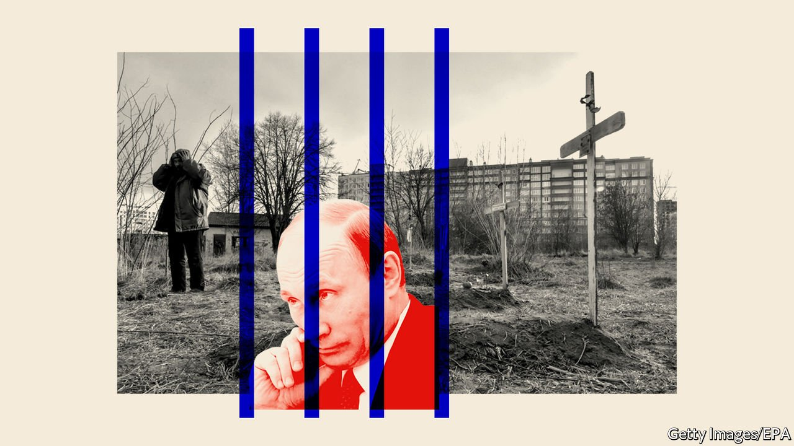

###### Atrocities in Ukraine

# Russian war criminals may never be brought to justice 

##### It’s worth doing, even if they are never brought to justice 

 

> Apr 9th 2022 

EVIDENCE OF RUSSIAN  litters Ukraine, but however much Ukrainians and some Russians wish differently, no one—least of all , Russia’s president—is likely to spend a single day in prison for them. Nonetheless, it is important that the atrocities are investigated. This is partly to commemorate those who were tortured, raped and murdered. It is also to expose the Kremlin’s lies to a world too inclined to let them pass. And public indictments of Russian troops would serve as a warning that may help deter the next round of killing.

Ukraine’s prosecutor-general said on April 3rd that 410 civilians had been . Many more bodies will be found. The Economist saw the corpse of the mayor of Motyzhyn, a suburb, blindfolded and shot, apparently by Russian forces, along with her family. We heard details of the murder of Ukrainian men in Bucha, ordered by a Russian commander. Human Rights Watch, a charity, reports that Russian soldiers threw a smoke grenade into a basement in Vorzel, near Irpin, then shot a woman and her child as they emerged.


Evidence like this has rightly caused a worldwide outcry.  and Poland’s prime minister have accused Russia of genocide. Joe Biden, America’s president, has called the enormities in Bucha a war crime. And the UN secretary general asked for an investigation into the killings, alongside the several already under way.

Investigators are likely to find that Russian forces should be indicted, even if they have not killed on such a systematic scale as to have committed genocide. The Geneva Conventions, which Russia has signed, outlaw war crimes, including wilful killing, causing great suffering and targeting civilians. The murders in Bucha would count. So would the bombing of the  theatre on which the Russian word for children was written large enough for targeters to see from the sky. Russia’s invasion was itself a crime of aggression, as defined by the International Criminal Court (ICC), which tries individuals for actions under international law. And Russia’s vast and indiscriminate shelling of Ukrainian cities is a crime against humanity, defined by the ICC as participation in and knowledge of “a widespread or systematic attack directed against any civilian population”.

Unfortunately, indictments are unlikely to bring Russian war criminals to justice. Having been thrown out of the Council of Europe on March 16th after the invasion, Russia has started ignoring the European Court of Human Rights. Neither since 2016 has it recognised the ICC. That does not stop the ICC bringing a case or issuing arrest warrants against Russians, but enforcement needs the UN Security Council (UNSC) to refer Russia to the court—and, as a permanent member of the council, Russia could veto any such move. Russia does recognise the International Court of Justice, which hears disputes between governments, but that court also enforces its rulings in the UNSC.

One response is to send Ukraine more arms and impose more sanctions on Russia. America will ban new investment there. The European Union has proposed blocking its ships and lorries and banning imports of coal. The EU should do more, and limit purchases of oil and gas, too.

The other response is for the courts to press on with their investigations. Russian forces have a duty to protect Ukrainians, but they are treating them as if they are tools of war. Because the West, like Ukraine, rejects the Russian view that people are a means to an end, it should back the courts’ efforts to show that every life matters. The legal process will also shed light on Russia’s lies, to the shame of Mr Putin’s international backers. Even now the Kremlin has said the atrocities were faked, then used the UN to blame the Ukrainians and accuse them of being Nazis. And should those who wish Mr Putin’s regime to fall be satisfied, indictments may help ensure that war criminals lose power with him. Who knows, they may even end up in a jail cell. ■

Read more of our recent coverage of the .

