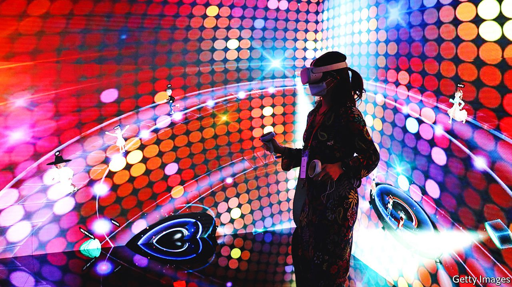

###### After the smartphone

# Silicon Valley’s search for the next big tech platform 

##### The smartphone era is fading. What next? 

 

> Apr 9th 2022 

FIFTEEN YEARS ago Steve Jobs announced three new products: a music player, a mobile phone and an internet communicator. As Apple’s then-boss gave his presentation, his audience slowly realised that the three products were in fact a single gadget: the iPhone. Cue applause, cue Apple’s renaissance, and cue a new era in technology as the smartphone overtook the desktop PC as the centre of personal computing.

Today even Mr Jobs might be surprised by how many uses have been found for his versatile device. The small screen has come to handle banking, networking, map-reading, gaming and much more. Apple and other phonemakers have been enriched not only by hardware sales (worth $530bn last year) but by controlling what happens on the platform, from app stores (which raked in $135bn) to mobile ads (worth nearly $300bn).


Yet there is mounting evidence that the smartphone era is fading. Phone sales have been in gentle decline since 2016, as slower technological improvement has led to people upgrading less often. In rich countries, already saturated, the decline is especially marked. So tech innovators and investors are on the hunt for the next big thing, in hopes of winning not just a juicy hardware market but the potential to control the platform on which everything takes place.

The current big idea is virtual-reality (VR) headsets, spurred on in part by pandemic lockdowns. More promising, but further off, are glasses for experiencing augmented reality (AR), in which computer graphics are overlaid on the real world. Most of America’s big tech firms—among them Apple, Google, Meta and Microsoft—as well as Asian giants like ByteDance (TikTok’s Chinese owner) and Sony, are developing or already selling . What has so far been a niche market is about to become very crowded.

Any claim to have discovered the next big platform deserves caution. There have been plenty of false starts. Tablets were proclaimed as a rival to the smartphone, yet Apple still makes six times as much money selling iPhones as it does from iPads. Smart homes were seen as another possible mega-platform, but so far Alexa and her like serve mostly as jukeboxes and egg-timers. In-car tech is another platform that has proved useful and valuable, but hardly threatens to become the centre of anyone’s digital life. It is easy to imagine headsets, which are now used mostly for gaming, getting stuck in a similar niche.

What does seem to be under way, however, is a gradual movement by consumers towards a constellation of new wearable devices. These include voice-activated smart headphones, which can make calls, read messages and more, and smart watches, which handle scheduling, navigation and fitness. A growing array of health-tech gadgets measure everything from blood sugar to sleep patterns. In America unit sales of these “wearables” are already close to sales of smartphones.

These gadgets are more like accessories for the phone than replacements. But as computing shifts away from the pocket and towards wrists and ears, a growing share of consumers’ attention and spending is seeping away from the phone, too. As VR and AR glasses become lighter and cheaper, they could form the most powerful part of the wearable cluster.

People are not about to ditch their phones, any more than they threw out their laptops a decade ago. But as they interact more often with earphones or, soon, glasses, more of them will come to use their phone as a kind of back office, primarily there to provide processing muscle for other gadgets. As chips get even smaller, phones may not be needed even for that.

Don’t expect any of this to happen right away. Internet-enabled phones were launched in the late 1990s and failed to catch on outside offices. AR headsets—bulky, pricey and so far used only in industry—are at a similar stage. Yet when technological tipping-points are crossed, things can change fast. Four years after Mr Jobs introduced his iPhone, smartphones outsold all laptop and desktop computers worldwide. Silicon Valley’s latest great hope is still a work in progress. But if and when the right product appears, the future may arrive very quickly. ■

