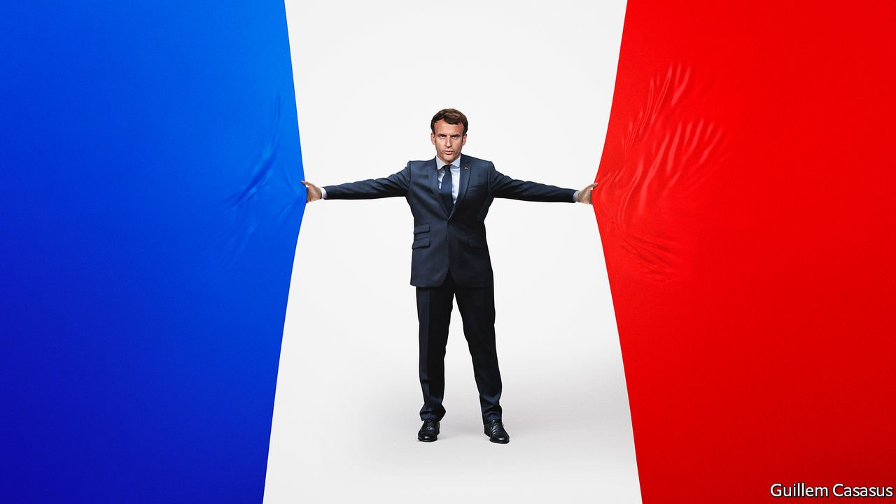

###### France votes

# Why Macron matters 

##### France’s president presents a cautionary tale for centrists everywhere 

 

> Apr 9th 2022 

WHEN HE WAS first elected president of France in 2017, Emmanuel Macron immediately became a standard-bearer for radical centrism. He was young, clever and eminently reasonable. Also, it was a time of panic for liberals.

Britain had voted the previous year to leave the European Union. America had just elected Donald Trump. Across Europe populists were climbing in the polls, even in sober places like Sweden, Denmark and Germany. The far left were in power in Greece. Italy’s Northern League would soon enter government as half of an all-populist coalition that flirted with leaving the euro and rebuffed migrants rescued in the Mediterranean. All around the rich world politicians who promised to raise walls, ignore experts and turn back the clock to an imaginary golden age were in the ascendant. No wonder Mr Macron’s triumph in one of Europe’s most pivotal countries brought sighs of relief.


On April 10th Mr Macron will face voters once again. This time he is running not so much on his aspirations for the radical centre, but on his record as a nuts-and-bolts reformer, on his vision for world affairs, and as a leader who has reinvigorated French politics. In one sense, Mr Macron looks as if he will soon be able to say his record has been vindicated.  gives him a 98% chance of making the second round on April 24th and a 78% chance of  (albeit a number that has recently been shrinking). Victory would be a remarkable achievement. Not since Charles de Gaulle in 1965 have the French re-elected a president who has a majority in the assembly. However, the closer you look, the more liberals around the world should see Mr Macron as a cautionary tale.

It is in economic policy that his centrism has been most successful. Before taking office in 2017, he argued that France should be open to globalisation, but try harder to equip its citizens with the skills they needed to adapt to change. His pro-market labour and regulatory reforms embodied this philosophy and they have led to an impressive rebound in employment and new-business creation. Rather than trying to preserve redundant jobs, he has boosted training and early education. At the European level, he was a driving force behind the establishment of the NGEU, a €750bn ($818bn) jointly guaranteed fund to help Europe’s weaker economies dig themselves out of the hole into which covid-19 had cast them.

He has, however, left plenty to do in a second term. Mr Macron has been too eager to reach for the levers of state control, whether capping electricity prices or meddling in the management of hypermarkets. For all his ENA-honed competence, he has failed to restore hope to France’s left-behind. Though his supporters would be quick to point out that covid got in the way, he has failed to overhaul the labyrinthine pensions system.

As an international statesman, Mr Macron correctly identified the threat to the Western order from a rising China and an irascible Russia. His solution was to attempt to boost the European Union—a forum where France’s voice counts—even if that undercut the institutions that bind the West together. Rather than confront Vladimir Putin, Russia’s president, he argued for building bridges. He wanted to downplay NATO, which he accused of suffering “brain death”, by building up a European counterpart. Yet, as the war in Ukraine has shown, America’s role in defending Europe is indispensable. Although his efforts to defeat jihadists in the Sahel were courageous and laudable, they have yielded few results and are now unravelling. His dealings with a puerile post-Brexit Britain were petulant—and just what Britain’s unserious prime minister wanted.

It is in reinvigorating French politics that Mr Macron has most fallen short. In the election in 2017 he trounced Marine Le Pen, a nostalgic nationalist, by 66% to 34%. If she makes it to the second round, which is likely, the polls today say Mr Macron would win only narrowly, by 53% to 47%. The proportion of French who tell pollsters that they will vote for a candidate of the nationalist right or the anti-capitalist left in the first round is 51%, slightly more than voted that way in 2017.

In other words, five years of government by the world’s centrist standard-bearer has eroded support for the centre. There are many reasons for this. War and the pandemic have polarised politics, and not only in France. Mr Macron also sometimes repels voters with his aloof Jupiterian manner. Critics dub him “le président des riches”. The label sticks, partly because he cut France’s unworkable wealth tax, but mostly because his manner is that of the high-flying banker he once was. Mr Macron also faces a problem that responsible politicians always face when running against . He offers policies boringly grounded in reality. They say whatever will stir up voters, whether or not it is true.

The last reason is that Mr Macron has shown an illiberal neglect of institutions. Although the old politics had too many time-serving deputies, the parties of the centre-left and centre-right have become sideshows in presidential politics. True, responsibility for renewal lay with them, but he made their job harder by poaching their best talent. What is left is a contest between Mr Macron and a cacophony of extremists on the left and the right. As a result, the nearest thing France has to an opposition leader is Ms Le Pen—a historic admirer of Mr Putin who would flout EU rules by favouring French citizens for everything from housing to jobs. Her 21% chance of becoming president is alarmingly high.

In 2016 Mr Macron wrote: “If we don’t pull ourselves together in five years or ten years, [Ms Le Pen] will be in power.” What should centrists make of the worrying fact that, despite all he has done, his words are as true today as they were then?

One lesson is that complex trade-offs struggle to defeat slogans. Politics is so much about tribes and identity that material gains in terms of jobs and economic growth are necessary but not sufficient for re-election. Another is that one person cannot sustain the radical centre. That is not only because too much is riding on each re-election and on a successor turning up, but also because, as centrists know, individuals are flawed. French centrism and its Anglo-American liberal cousins are systems. They require constant renewal, through argument and competition. Mr Macron still has our vote, but he needs company. ■

For subscribers only: to see how we design each week’s cover, sign up to our weekly 

For more coverage of the French election, visit our dedicated 

