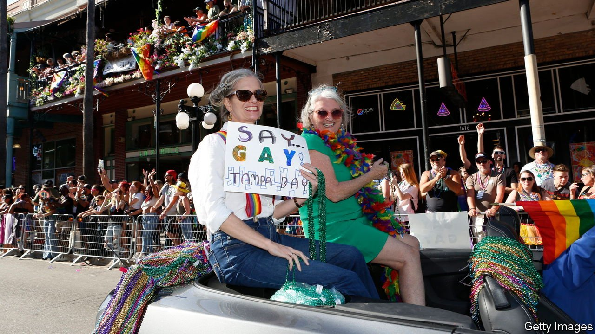
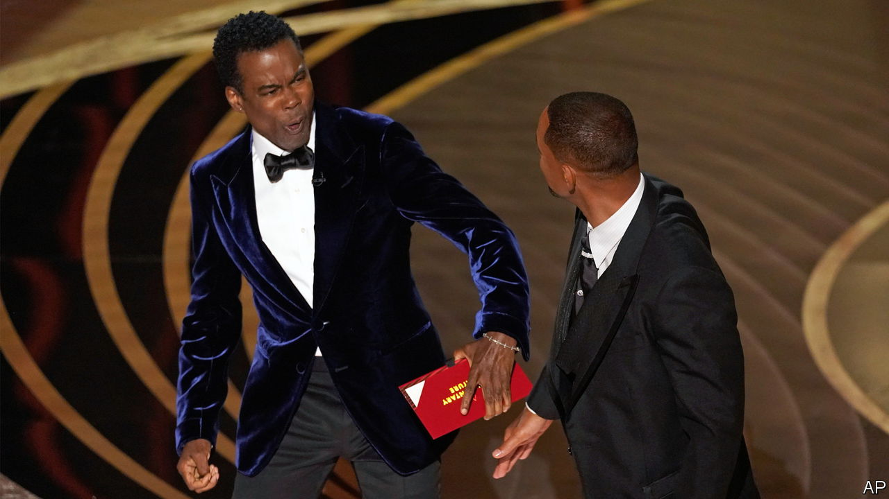
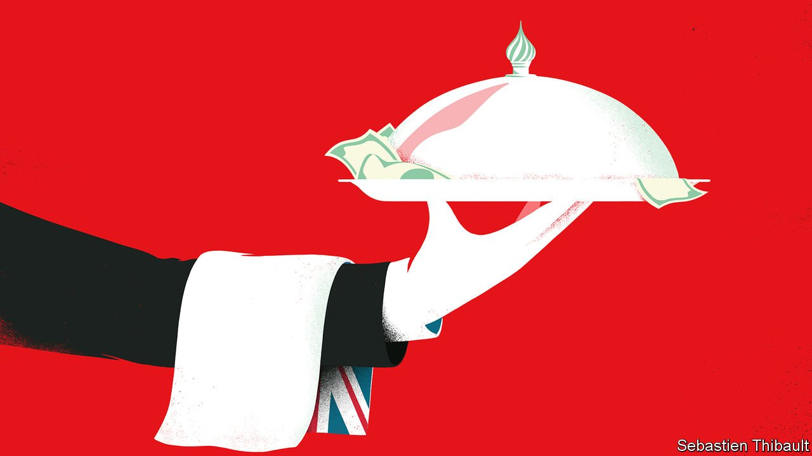
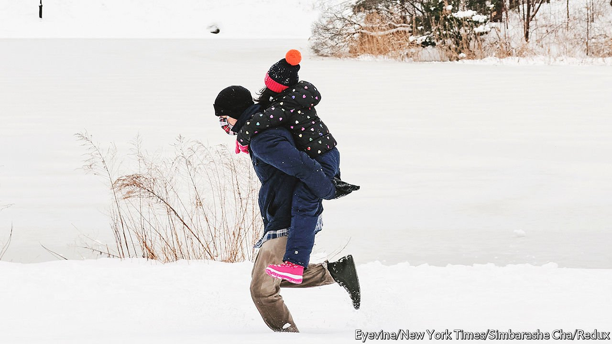
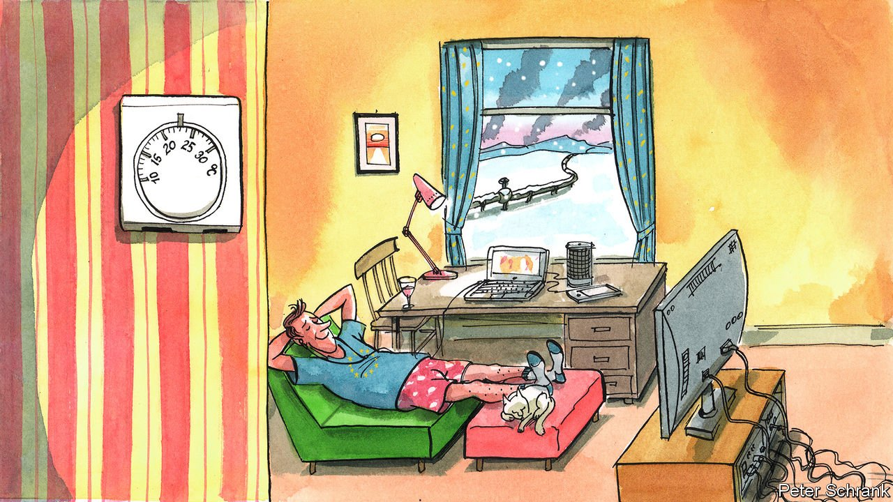

###### On gay people in Florida, Hollywood, oligarchs, the Falklands war, school closures, exchange rates, Europe

# Letters to the editor 

##### A selection of correspondence 

 

> Apr 9th 2022 


The Floridian inquisition

The Economist’s explainer on “” (March 30th) neglected to mention Florida’s history of removing queer people from classrooms. Between 1956 and 1965, Charley Johns, a member of the Florida state Senate and a former governor, oversaw an investigation “to understand and effectively deal with the growing problem of homosexuality” in Florida’s schools. The resulting and definitely not-safe-for-work report was chillingly titled “Homosexuality and Citizenship in Florida”.


The Johns Committee, as it was colloquially known, worked with local police to forcibly remove students and educators suspected of being anything but straight. Suspects were pressed to out themselves and forced out of Florida’s academic institutions. Florida’s “Don’t Say Gay” act, signed into law recently by Ron DeSantis, is just the latest attempt to scrub the existence of queer people from educational settings.

JULIAN VALDIVIA

Fort Myers, Florida

 


Hollywood loses the plot

As the Ukrainian people are bombed, driven from their homes, and forced to live without heat or food, Hollywood fusses over a beautiful woman in a ballgown, miffed at having been likened to an equally beautiful star from a movie that is 25 years old (“”, digital editions, March 28th). Said beautiful woman’s husband takes it upon himself to smack around the comedian who made the comparison, then wins the Oscar for best actor, gives a tearful speech, and basks in a standing ovation from the room. The next day he offers an apology that reads as if it has been written by a roomful of publicists and lawyers. No wonder they call it La La Land.

MARGARET MCGIRR

Greenwich, Connecticut

 


Tories love Russian money

“” (March 12th) reviewed “Butler to the World”, Oliver Bullough’s new book on Russian money in the British capital. Although it is obviously a topical tome for these blighted times, the review was nevertheless bereft of one key detail: the Conservative Party’s insatiable love of Russian oligarchs’ cash. Like a three-legged chair, the review toppled over rather spectacularly by omitting the role that the Tory party has played during its long tenure in government in courting, cuddling and suckling at the breast of hundreds of Russian oligarchs.

Boris Johnson and David Cameron do appear briefly, but the wholesale shovelling of crooked cash into Britain under the sole tutelage of the Conservatives for the past decade is somehow absent. The reviewer calls for a “change of philosophy” to rectify such embrace of criminality. But whose philosophy exactly? Yours? Mine?

NICK WEST

Bath

 


The Falklands political effect

Without the Falklands war British politics could have taken an even more dramatic turn than you describe (“”, April 2nd). Polling day for the Beaconsfield parliamentary by-election took place on May 27th 1982, as a British victory in the war came in sight. The Conservative campaign featured a personal appeal from Margaret Thatcher to “support our troops”, with its party agent pictured in second-world-war battle dress.

Unsurprisingly, the Liberal/ SDP Alliance candidate (me) only achieved a respectable second place, although relegating the Labour nominee (one Anthony Blair) to third. Had this previously very true blue seat followed the pattern of Croydon, Crosby and Hillhead with an Alliance victory, then it is a reasonable assumption that the Alliance would have out-polled Labour in the general election of 1983. Would that not have broken the mould of two-party politics?

PAUL TYLER

Stroud, Gloucestershire

 


A blizzard of school closings

The Economist’s nose for weather is as keen as ever. The recent flurry of activity that closed American schools for “snow days” is an early gust from a much larger storm brewing in primary education (“”, March 19th). Weather-related emergency school closures are becoming unbearably frequent. The best data come from California, where the number of schools that closed for weather rose 800% from 2016 to 2019. Anecdotally, school closures due to fires, floods, mud, heat, storms and snow are on the rise across the whole country (a high school was destroyed recently by a tornado in Jacksboro, Texas).

Remote learning, which many saw as a temporary pandemic measure, is the best tool available to mitigate the effects of climate change on education. Now is the time for communities to permanently adopt a remote-resilient digital curriculum and prepare for a future when a significant fraction of learning happens remotely. Under the surface, that is what New York’s snow-day plan is all about.

ISAAC VAN WESEP

President

Work on Learning

Boston

Currency precision

The Daily Chart on “” (March 31st) stated that the one-year forward exchange-rate for the Russian currency is a measure of the market’s expected exchange rate, given the interest-rate differential between Russia and America. This is not strictly incorrect, but it is slightly misleading.

The forward exchange-rate is purely a reflection of the interest-rate differential, based on the current spot rate. It is an arbitrage value and not a market prediction in itself. All expectations of the future value of a currency are priced into the spot rate.

ANDY HILL

International Capital Market Association

London

 


Europeans are doing their bit

chastised the European public for “living as if nothing were amiss” during the energy crisis and war in Ukraine, and urged us to do things like turning down the thermostat to help save fuel (March 26th). Actually in Portugal, many deaths during the winter months are related to low temperatures in homes. Charlemagne made a comparison with the energy crisis of the 1970s. But times have changed since then, even if Europeans are today living with higher fuel prices and raging inflation.

This is an era of austerity economics, coupled with a pandemic that has especially affected Europe’s young adults. We face unemployment, stagnant salaries, surging food costs and soaring rents. To suggest that we aren’t sacrificing anything is uncalled for. The behaviour of Europeans is not a cause of shame. We are doing a lot; and note the generous European response to Ukrainian refugees.

INêS VASCONCELOS

Estoril, Portugal

Regarding Britain’s dismal chilly weather and the Roman bathhouses that tried to make Roman Britain bearable (“”, March 19th). I recall from my schooldays a Latin textbook with a cover picture of a Roman legionnaire with the title, “O me Miserum”. It didn’t take a Latin scholar to work that one out.

DAVID ROSSINGTON

Lincoln

