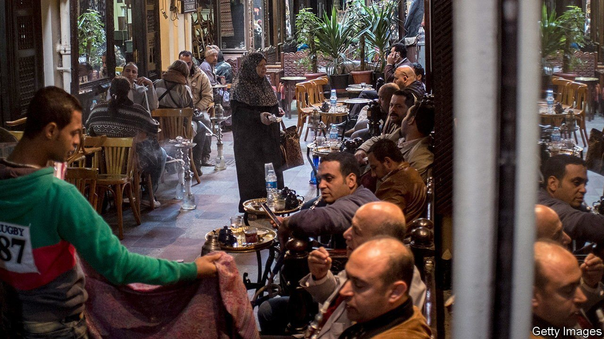
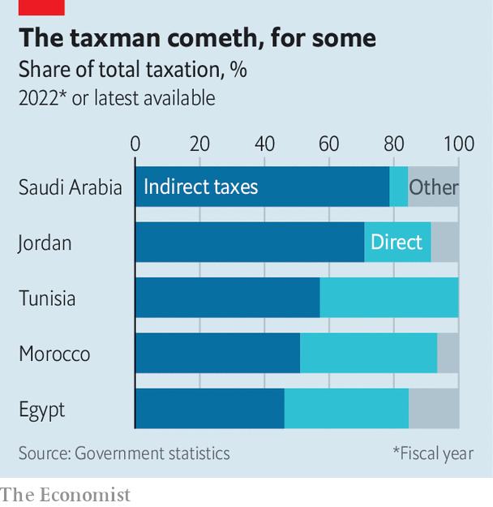

###### Squeezing the wrong people

# Arab governments are putting more taxes on the poor 

##### Some collect more than half their tax revenue from regressive levies 

 

> Apr 9th 2022 

LIFE IN EGYPT gets more expensive by the month. Sitting in a café on a shady street, Mahmoud, a software developer, runs through the new taxes and fees. A value-added tax (VAT) was introduced at 13% in 2016, then hiked to 14%. A few years ago the government added a tax of ten Egyptian pounds ($0.55) to Mahmoud’s monthly phone bill. His cigarettes go up a pound or two whenever the treasury needs a puff of extra cash. Last time he got a new driving licence, it cost 15 times more than before.

The one tax that has not soared is the one on his most valuable investment, a rental property he bought in 2016. He says it has appreciated by $100,000 or so, a 25% increase. But his annual property-tax bill has remained almost flat, at less than 1% of the apartment’s value.


Arab countries have long lagged in collecting taxes. In 2015 the IMF estimated they raised the equivalent of 13% of non-oil GDP, compared with 17% in other emerging markets. Christine Lagarde, then the fund’s director, told an audience in Abu Dhabi in 2016 that Arab states should “re-engineer their tax systems” and boost revenue.

They got the message—up to a point. Since 2016 five Arab countries have brought in VAT. Governments have imposed a spate of other levies on everything from mobile phones to cinema tickets and sought non-tax revenue by raising fees.

If they are getting better at taxing their citizens, though, they are often taxing the wrong ones, imposing a big burden on those who can least afford it. Consumption (or indirect) taxes, such as VAT, are highly efficient but generally regressive. They tax what you spend; the poor spend more of their income than the rich. In the OECD, a club of mostly rich countries, indirect taxes raise about one-third of tax revenue. In recent decades the proportion has fallen.

 


Arab states are going the opposite way (see chart). Egypt collected 46% of tax revenue from goods and services in the fiscal year 2020-21, up from 40% six years before. Indirect taxes are more than half the take in Tunisia, and three-quarters of it in Jordan, where they add up to 12-13% of GDP.

The appeal is simple. Value-added taxes raise a lot of cash without distorting economies much (which is why European welfare states love them). And outside the Gulf, most Arab countries have only a patchy picture of what their citizens do and how much they earn, which makes it hard to levy direct taxes. Some two-thirds of Egyptians work off the books in informal jobs. Less than half of Tunisians have bank accounts. The last time Lebanon conducted a census was in the 1930s. Tax inspectors are often overworked and reliant on pen and paper rather than databases. Evasion is widespread. A report in 2018 by Bank Audi, a Lebanese lender, estimated that it cost the exchequer $5bn a year (10% of GDP at the time).

Authorities often blame this, wrongly, on the informal sector. Most Egyptians labouring in the black market should pay no income tax or a top marginal rate of just 2.5%. Even if the taxman found them all, the extra revenue would be meagre. The bigger problem is a tax system skewed towards the rich. Egypt’s corporate-tax rate of 22.5% is five points below the African average, while its top income-tax bracket of 25% ranks as one of the continent’s lowest. It also has no inheritance tax.

Many rich and middle-class Arabs prefer buying property to shares, seeing it as safer and more lucrative. Yet governments collect little property tax. Jordan’s finance ministry estimates that it brought in just 115m dinars ($162m) from property last year, just 1% of tax revenue.

Some countries assess property tax on rental rates rather than the value of the building, which leads to puny bills. Egypt calculates these only once every five years, with increases capped at 30% per assessment, even though property values in some parts of Cairo rise by as much as 25% a year. Rich Egyptians who play the stockmarket are subject to a 10% capital-gains tax. But if they invest that money in property, the tax rate can drop below 1%.

Oil-exporting Gulf states do not levy income tax, fearing it would upset citizens and make their countries less attractive to migrants. Corporate-tax rates are low, ranging from zero to 15%. Instead they, too, lean on consumption taxes. Saudi Arabia introduced a 5% VAT in 2018, then tripled it in 2020 (a move the IMF advised against). It will account for 79% of tax revenue this year. Poorer Saudis will be hit hardest. Rich ones tend to do their big-ticket spending outside the kingdom.

Instead of making tax systems more progressive, Arab states are seeking ever more desperate ways to raise revenue. Last year a parliamentary committee in Egypt approved a 3% tax on purchases in duty-free stores (which may need a new name). Tunisia now charges people 100 millimes (3 cents) for paper receipts in shops. This is the fiscal equivalent of looking under the sofa cushions for spare change.

Such measures will not make much of a dent in deficits, but may anger citizens. In 2019 the Lebanese government tried to put a 20-cents-a-day tax on WhatsApp calls. It became a trigger for mass protests that brought the government down. ■

