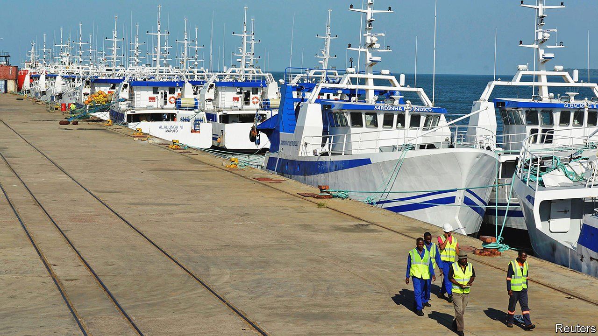

###### Wine and punishment

# Lawyers debate the secret debts that bankrupted Mozambique 

##### A mega-scandal sparks court cases on three continents 

 

> Apr 9th 2022 

IN 2013 A Lebanese businessman sent an email to Ndambi Guebuza, the son of Armando Guebuza, who was then president of Mozambique. It promised that a chartered flight would soon leave France for Maputo, the Mozambican capital, carrying an unusual cargo: 7,427 bottles of wine. What did the email mean? When the public prosecutor asked about it at an ongoing trial, the younger Mr Guebuza shot back. “Do you, madam, want some wine?” he fumed, before alleging that the whole process is a political stitch-up.

Ndambi Guebuza is one of 19 high-profile defendants on trial in Maputo on charges including bribery, embezzlement and money-laundering (which they deny). The accusations relate to a series of deals in 2013 and 2014 which saw state-backed firms borrow more than $2bn, mostly in secret. Although the money was earmarked for fishing boats (pictured) and maritime security, American regulators say that at least $200m was pocketed by Mozambican officials and bankers from Credit Suisse, which helped arrange the deals. The revelation of the hidden debts in 2016 pushed the country into default and sparked court cases on three continents.


One of those cases is the trial in Maputo, held in a marquee at a maximum-security prison and broadcast on national television. The hearing wrapped up last month, with a verdict expected in August. Between legal minutiae, it offered a lurid glimpse into the lives of Mozambique’s super-rich, and allegations of how they splurged ill-gotten gains on posh flats and fleets of sports cars.

In February the former president, Mr Guebuza, took the stand—as a witness, not a defendant—and used the opportunity to make a subtle dig at his successor, Filipe Nyusi. It was “strange”, he said, that Mr Nyusi claimed to know nothing about how the corrupt deals were made, despite having been defence minister at the time. That is a sign of how politicised the issue has become, as rival factions jostle for influence within Frelimo, the ruling party. “Those groups are fighting to control the party to be able to control the state and take advantage of it,” says Edson Cortez, the director of the Centre for Public Integrity (CIP), a Mozambican NGO.

Despite its internal ructions, Frelimo retains a strong grip on power and does not want its dirty laundry aired in public. Mozambique and America are still tussling over who can extradite Manuel Chang, the former finance minister who signed off the deals and currently sits in a South African jail. Activists say he would be more likely to spill the beans in an American courtroom than in his home country.

It would not be the first American intervention. Three former Credit Suisse bankers who cooked up the loans have pleaded guilty to related charges in a New York courtroom. Last October the bank itself agreed to pay $475m to regulators in America and Britain for misleading investors and violating anti-corruption laws. The ruling said that the bank had ignored warning signs, including a due-diligence report which described the contractor who received the money as “an expert in kickbacks, bribery and corruption”. VTB, a Russian bank which was also involved in the deals, agreed to pay $6m to regulators.

None of that money has gone to the people of Mozambique, although Credit Suisse has said it will waive $200m of the unpaid debt that it is trying to recover. That would be scant compensation for the crisis that the scandal caused. When the debts were revealed in 2016, donors halted aid to the government, the IMF packed its bags, the currency collapsed and growth slowed. A study by CIP and Chr. Michelsen Institute, a Norwegian research outfit, estimated that if these indirect effects are included, then the cumulative costs of the loans add up to nearly $11bn, almost as much as Mozambique’s GDP in 2016.

The debt itself is still outstanding. Some of it is now in the hands of investors who were not involved in corruption. Fiona Huntriss of Pallas Partners, a lawyer for some of them, says that “innocent lenders” should be paid “what is long overdue to them”. The government of Mozambique counters that it should not have to pay because the state guarantees for the debts were issued illegally. That question will be settled in yet another court case, due to start in London next year, in which virtually every party to the matter is suing everyone else. The legal proceedings may rumble on, but justice remains elusive. ■

