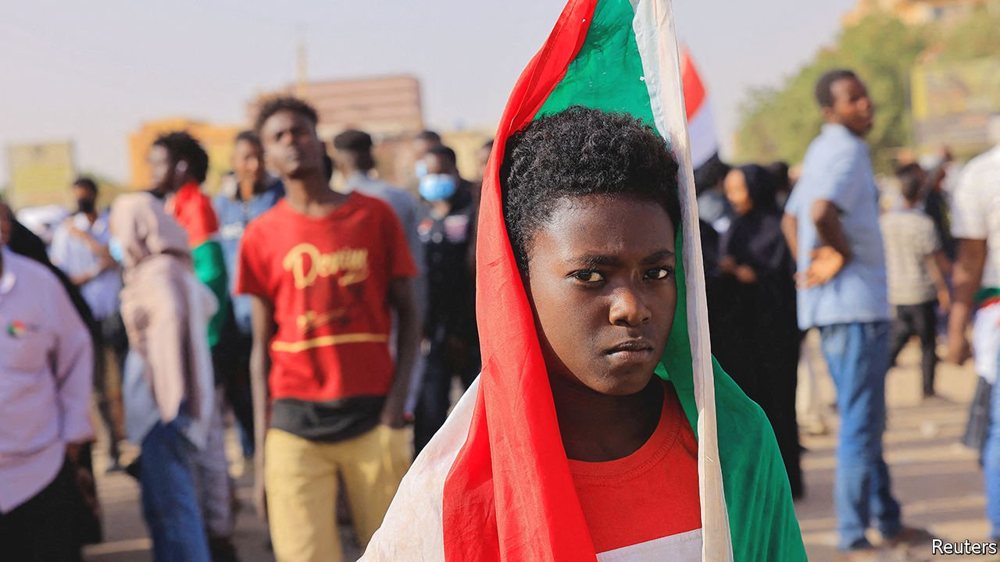
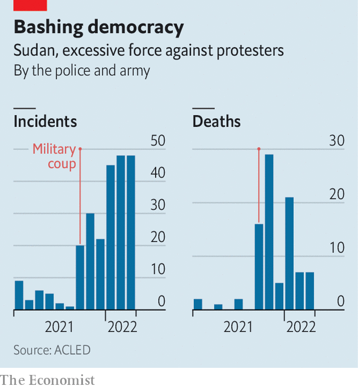

###### After the tyrant

# Sudan faces collapse three years after the fall of its dictator 

##### Two coups have left the country broke and its people furious 

 

> Apr 9th 2022 

BREAKING FAST at sundown during Ramadan, which started on April 2nd, will not be the usual joyful family occasion for many Sudanese this year. The communal iftar will be blighted by the shortage, and spiralling cost, of wheat and other basics. Some expect this year’s Ramadan to explode into a confrontation between a frustrated, immiserated people and the country’s brutal military regime.

Few Sudanese can remember a time when their country was in such a bleak state. The currency is in free fall, having plunged by more than a quarter since October. Inflation is officially 260%, but probably even higher. Some 9m people (out of a population of about 44m) face “acute hunger”, says the UN’s World Food Programme, and this number could double by September. Khartoum, the capital, is rocked by daily anti-regime protests and the often-violent response of the security forces, who have killed about 90 people over the past five months (see chart).


Blame this mess on a military coup led by General Abdel Fattah al-Burhan in October, which reversed Sudan’s fragile transition to democracy. This had started three years ago after protesters took to the streets to eject Omar al-Bashir, a ruthless Islamist despot who had ruled the country for 30 years. As he was about to fall in April 2019, the army seized power, hoping to keep its grip on politics and the economy. But demonstrations and international pressure pushed the generals into a pact with the leaders of the protests, whereby they promised to hand control to civilians by 2021 ahead of elections that were due to take place this year.

 


Western donors and multilateral banks pledged tens of billions of dollars in assistance and debt relief to support the democratic transition. But the second coup in October has stopped much of that help from reaching Sudan, or delayed it. America, the World Bank and the IMF have halted the flow of at least $1.4bn in aid and assistance. The junta, running short of funds, has cut the once generous subsidies it lavished on wheat and fuel. But it is doing so without the Western aid-funded safety nets that were meant to cushion the blow to the country’s poor. They are furious; more protests are likely.

All these woes have been compounded by Vladimir Putin’s war. More than 80% of Sudan’s wheat imports come from Russia and Ukraine, and the conflict has already interrupted supplies. Last month the local price of wheat rose above $550 a tonne, an increase of 180% compared with a year ago.

The generals running the country, meanwhile, are desperate for cash to keep the government functioning. To plug holes in the budget they are increasing taxes on businesses. This looks like wishful thinking, since few businesses pay much tax at all, says Kholood Khair, an analyst in Khartoum; many are struggling to survive. More notably and more opaquely, the generals have gone begging for funds from countries that used to back the old regime. They may be hawking Sudan’s few remaining assets in exchange.

General Burhan recently visited the United Arab Emirates (UAE) to get pledges of support for Sudan’s banks and currency, as well as investment in unspecified “development projects”. One of these may involve DP World, the UAE’s port operator, which for years has had its eye on Sudan’s main container terminal at Port Sudan on the Red Sea. But workers at the port bitterly oppose privatisation, fearing it may lead to job losses. An earlier attempt to bring in a Philippine port operator was scuppered after workers went on strike and paralysed the port, which handles 90% of Sudan’s inter national trade.

The generals are also cosying up to Russia. It has long coveted a naval base on the Red Sea and is also a keen buyer of Sudan’s gold. Both topics were probably on the agenda when the deputy head of Sudan’s junta, Muhammad Hamdan Dagalo (better known as Hemedti), visited Russia on the eve of its invasion of Ukraine. Mr Dagalo heads the Rapid Support Forces (RSF), a vicious paramilitary outfit that controls many of Sudan’s illicit gold mines. He is thought to be the regime’s link to , a Russian mercenary outfit that Western diplomats accuse of involvement in the illicit gold mines. Sudan’s government denies it.

The timing of Mr Dagalo’s visit to Moscow cannot have been a coincidence. Russia needs more of Sudan’s gold to buttress its economy against Western sanctions. Gold accounts for about 40% of Sudan’s exports and is thought to be smuggled out of the country via the UAE and then on to Russia. This may help explain why both the UAE and Sudan abstained on the UN vote condemning Russia’s invasion of Ukraine. On his return from Moscow, Mr Dagalo said he had “no problem” with Russia opening a naval base in Sudan and that the country presents a “great opportunity for Russian investments”.

Yet such desperate dealmaking may not buy the regime stability. Mr Dagalo’s deepening ties to Russia are exacerbating tensions between him and General Burhan. And they are fuelling anger among the protesters, who believe Russia supported the coup last year.

The generals need to worry not only about protests in the capital but also about rising violence in the western region of Darfur, where government forces and the Janjaweed, a militia that is now part of the RSF, committed genocide in 2003. This week a suspected leader of the Janjaweed appeared at the International Criminal Court in The Hague to face charges of war crimes and crimes against humanity, the court’s first case relating to conflict in Darfur. Yet the prospect of justice is not bringing peace. Last month at least 48 people were killed in clashes in the area.

When Sudanese rose up three years ago to topple their genocidal dictator, they hoped to build democracy and prosperity. Instead, after two coups they face a political crisis, a shrinking economy and a rise in violence. These threaten the “very existence” of Sudan, said Volker Perthes, the UN’s special representative to the Horn of Africa. “Unless the current trajectory is corrected,” he told the UN Security Council last month, “the country will head towards an economic and security collapse, and significant humanitarian suffering.” ■

