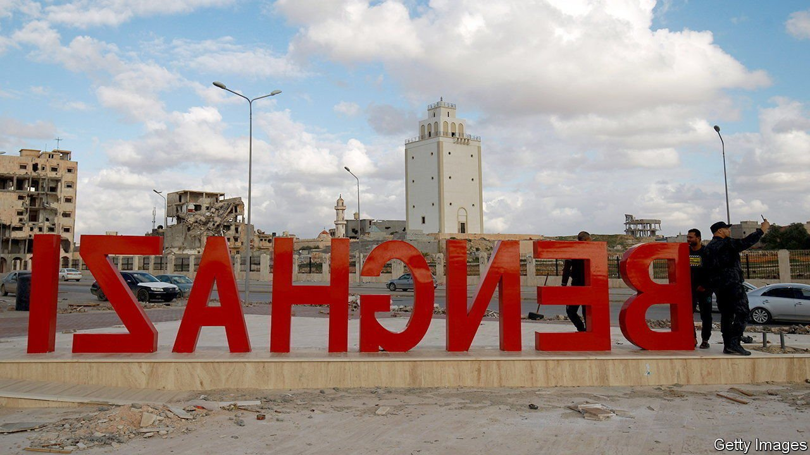

###### Smashed and forgotten

# The tragedy of Benghazi, Libya’s second city 

##### No one seems willing or able to rebuild it 

 

> Apr 9th 2022 

THE GOLD-LEAF lanterns on the railings around the tomb are modelled on those that embellish Buckingham Palace. The crenellated walls glimmer with Italy’s finest marble. A huge chandelier within hails from Egypt. The shrine to Omar al-Mukh tar, Libya’s anti-colonial scholar-cum-warrior hero, has been handsomely restored, two decades after a jealous Muammar Qaddafi dumped it in the desert.

But peer out through its arched windows and all you see is the surrounding ruin of Benghazi, Libya’s second city. Much of what was once a charming Italian city, with cafés, art-deco cinema and royal palace, is a smashed ghost town. The courthouse where Libyans rose up against Qaddafi in 2011 is awash with sewage. “Lost homeland”, reads a graffito on a chipped colonnade adorning the old Bank of Rome. Services have collapsed. Rubbish is piled up in the streets. Waste flows into the sea. Schools recently had to close after they were flooded in a storm. War profiteers and smugglers have moved in.


Like those other fine cities of the Middle East—Aleppo, Mosul and Raqqa—Benghazi was sacked in order to wrest it from Islamist rule. For three years Khalifa al-Haftar, a former general turned warlord who commands the self-styled Libyan National Army (LNA), shelled this capital of Libya’s eastern region (once called Cyrenaica) from land, sea and air, until it fell to him in late 2017. Egypt, France, Russia and the United Arab Emirates all lent him a hand, then left him to run it as his base.

The UN has proposed no recovery plan for Benghazi. On March 21st the Italian government hosted an architectural jamboree, which many participants attended by video, calling for the city’s regeneration. However, Libya’s power brokers in Tripoli, the country’s capital in the west, are preoccupied with arguing over oil revenues and who should be prime minister. “There’s no real will to rebuild our city,” laments Atif al-Hasiya, a Benghazi engineer.

Mr Haftar nonetheless promotes himself as its protector. “With one hand we build, with the other fight terror,” reads a slogan on a sheet flapping in the wind along the corniche. Locals speak only of the terror, inflicted mainly by Mr Haftar’s men, and say he squanders funds on military ventures and salaries for his fighters, who claim to number 127,000. In 2018 the UN reported that a brigade led by one of his sons had raided the city’s central bank, stealing $300m in local and foreign currency. “His sons are worse than Qaddafi’s,” says a Benghazi businessman in exile.

Journalists in the city are monitored and muzzled. Mr Haftar’s critics are liable to disappear. The Wall Street Journal reported in 2020 that he hoards a stash of gold, originally from Venezuela. Since he reopened Benghazi’s port in 2018, it has become an entrepot for captagon, an amphetamine manufactured in Syria. “Drugs is Benghazi’s main growth business,” says a local academic. Dealers are said to launder money in fancy clothes shops and restaurants along Venice Street. Jewellers catering to gangsters are thriving.

Benghazi’s people had hoped that Abdul Hamid Dbeibeh, Libya’s beleaguered prime minister based in Tripoli, would set about rebuilding Benghazi. Last May he unveiled a reconstruction package that included the city. He was likened by optimists to Rafiq al-Hariri, the Lebanese tycoon who used his own company to rebuild Beirut after its civil war (before he was assassinated). Various unfinished projects, such as an Olympic stadium that Mr Dbeibeh had overseen under Qaddafi, might possibly be completed. But Mr Haftar’s gunmen barred Mr Dbeibeh from visiting their stronghold, and the funds never materialised. A general election scheduled for December raised hopes of breaking the deadlock but has been repeatedly put off. Meanwhile Benghazi moulders away. ■

