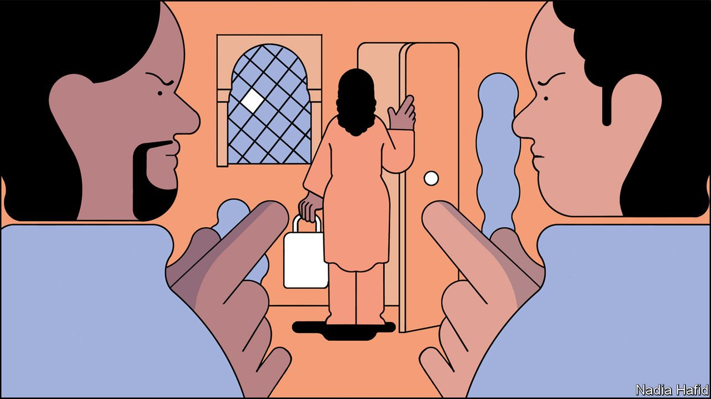

###### Of keys and patriarchy

# Why single women in Egypt find it hard to rent a flat 

##### Scandalised landlords ask intrusive questions 

 

> Apr 9th 2022 

WHEN LAYLA (not her real name), an Egyptian woman, got divorced in her mid-30s, her parents assumed she would move back home. But she wanted to share with female flatmates. “What are we, Americans?” her mother wailed. No woman in her family had ever lived on her own, widows included, or with independent female friends. For an unmarried woman in Egypt, fleeing the nest can be tricky. It helps if she is wily, or rich, or lives in a neighbourhood that caters to foreigners.

Persuading the family is usually the first hurdle. Arguing simply for freedom would be valiant but often unwise. Better to cite the bad traffic as your reason. That helped convince Layla’s mother, because they both tend to be car sick. Having her own flat would shorten her commute.


Finding an amenable landlord can be awkward, too. Few let to single women, since that may damage the building’s reputation or ruffle its other residents’ moral feathers. Some let on condition that a lone woman must have no visitors.

Once an unmarried woman clinches a rental deal, she must often fend off nosy neighbours and doormen, says Basmalah, another singleton, who also spoke under a false name. Boyfriends sometimes have to sneak in when the doorman is on a coffee break. Hers took the stairs, since the lift would give away the floor he was stopping at. Luckily one of her doormen mistook her for a foreigner: she did not disabuse him. They tend to wink at those loose-living Westerners.

Some women simply fork out for freedom. Landlords in affluent neighbourhoods are often more liberal. Bribing the doorman may be the way to keep him out of your hair. Paying for your own furniture can help, too. Egyptian police routinely question people living in rented flats in big cities. They keep a closer eye on furnished ones, says Layla, since journalists, political activists, foreigners and people selling sex are too transient to have their own furniture. Layla lugs around a futon: it buys a bit of privacy.

Single Egyptian women often help each other navigate their country’s mores. They have been known to have money sent to a stranger through social-media groups if she gets kicked out of her place and needs a hotel room. When a woman leaves a flat that permits singles, she may make sure that a friend is next in line. Basmalah knows the names of all the women who lived in her flat for the previous ten years. She and her best friend made a pact always to live in separate flats. If one gets chucked out, she will have a place to go to.

