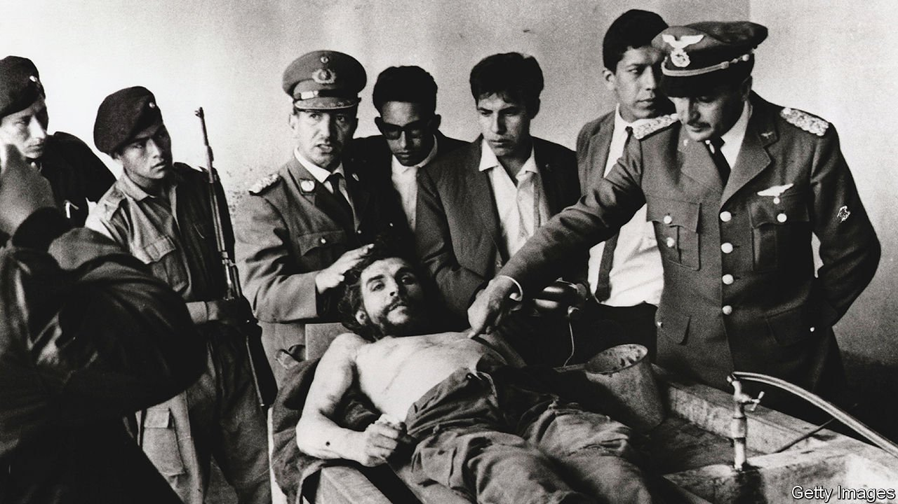

###### Man and myth

# Mario Terán was the man sent to kill Che Guevara 

##### The Bolivian soldier died on March 10th, aged 80 

 

> Apr 9th 2022 

THEY HAD SPENT the night celebrating the arrest of their extraordinary prisoner, but in the bleary morning of October 9th 1967 a wake-up order came for A and B Company of the Bolivian Manchego Regiment. The words were “Saluden a Papá”, sent by President René Barrientos himself. They meant “Say hello to Dad”, and kill him. The original idea, backed by the United States, had been to send Che Guevara for court-martial; but Barrientos wanted this poisonous influence stamped out right away. Someone had to kill both Che and Willy, a guerrilla arrested with him; and when seven men were asked, and all volunteered, Colonel Zenteno’s finger had pointed at Mario Terán. “Usted al Che,” he said; you do Che.

For 40 minutes he had hung about, hoping the order would be annulled. This only infuriated his superiors. So from their camp at La Higuera, a village of no more than 20 dwellings in the dry broken hills of southern Bolivia, he was now climbing up to the schoolhouse. It was a humble place, built of mud and thatch, and silent now the children were away. But inside it was a legend, the most famous guerrilla leader anywhere, whose revolutionary socialist ideas had spread from Cuba all over Latin America and then beyond. He had been absent for years, fomenting trouble on Fidel Castro’s orders in Congo, Tanzania, Vietnam and even Europe. Now he had turned up in Bolivia with a ragtag band of guerrillas, and the day before A and B Company had run into them.


The fight had been fierce. Terán, a 26-year-old non-commissioned officer in Company A, saw two good friends killed in front of him. But Che had lost more, and was wounded and his carbine-barrel shattered, so he surrendered. He looked almost ordinary then, like some tramp, unkempt and rasping with asthma in a filthy uniform. But when he was given some tobacco for his pipe, and cheekily asked whether anyone had any Astoria, the old charm came out again.

To the man who now had to kill him, the task was dreadful. He needed a stiff drink, but could find only beer, so he shouldered his M2 automatic and struggled on with a slopping bottle in each hand. He had tried to find a better rifle, too, but had no luck. No luck with anything that day.

Why he had been picked remained a mystery. He was a good soldier, his superiors said, efficient and calm, did his duties well. His father was in commerce, but he had chosen the army in his teens, gone to the Sergeants’ School in his home town of Cochabamba, and had made enough progress to become an instructor there. He was nothing special, though, and no more eager than anyone else to volunteer. Or perhaps a bit more, with his friends just killed and his wife Julia about to give birth back at home. Whatever had drawn him to the colonel’s notice, it led him now to the schoolhouse door.

If he had known then how his life was about to change, he would never have raised his hand. Almost all the rest of his existence was spent in hiding and denial. In December that year he let Michelle Rey from Paris Match take his picture and label him as Che’s killer. It remained the only clear photo of him until his pensioner’s ID decades later. In between, in effect, he disappeared. He gave no hint of his story either publicly or even privately, to his six children or their children. There was said to be a “curse of Che”, by which people involved in his death met sudden or violent ends. He did not need to believe in that to feel he was a marked man.

Until he retired from the army in 1997 with the rank of senior warrant officer, both the army and the government protected him. He also stayed in Santa Cruz de la Sierra, Bolivia’s biggest city, but moved about in its labyrinth of streets, giving out no address except to claim his old-age benefit. Sometimes he went by the name “Pedro Salazar”. When two reporters from Spain’s El Mundo newspaper tracked him down in 2014, they found him in a middle-class street in a house behind high green railings, with a frisky Rottweiler patrolling but no door-knocker or bell.

To those reporters he gave the story he had told himself for decades. He was not the killer of Che, not for sure. Yes, he was the man in the Paris Match photograph, who bore a strong resemblance to the officer at Che’s laying-out (above) who stood behind his dead head, seeming to explain. He also had the same name as the man who had written a long-secret report on the killing to his superiors, and had been given Che’s handmade pipe by an embedded CIA agent. But there were two other Mario Teráns in the Bolivian army, distinguished only by their maternal surnames: Mario Terán Ortuño and Mario Terán Reque. As he told the reporters without blinking, it could well have been one of them.

It was therefore not him for certain who, according to the secret report, entered the schoolhouse in La Higuera to find Che sitting on a bench. He said, “You’ve come to kill me.” To this his killer could only bow his head and make no answer. He was unable to fire. The figure of Che seemed suddenly gigantic. Those eyes shone so intensely that he felt dizzy, overwhelmed. He thought his M2 might be wrenched away by one movement of Che’s hand. (The guards said later that he rushed from the building, soaked in sweat, and that he did so more than once.) At last Che said: “Calm down and aim well! You are going to kill a man.”

The man who was not him for certain aimed his carbine at Che’s legs, recalling the order that he should do so to spread the official story that he had died of battle wounds. With the first burst he made him topple writhing to the ground, his legs destroyed and blood streaming across the floor. His killer regained his spirits then, and unleashed a second burst that found Che’s arm, his shoulder and his heart. Then the giant was dead, and he left.

Death in such a fashion, and especially the laying-out afterwards, mightily magnified the myth of Che. La Higuera became a shrine and a tourist-trap, with the guerrillero heroico its patron saint. As for the soldier who was not his killer, not for certain, he went back down the hill believing he would never forget, and proceeded to work on his forgetting for 55 years. ■

