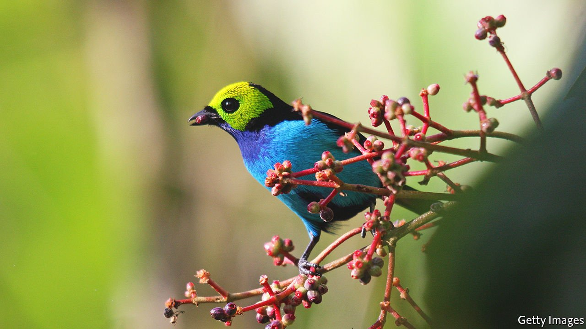
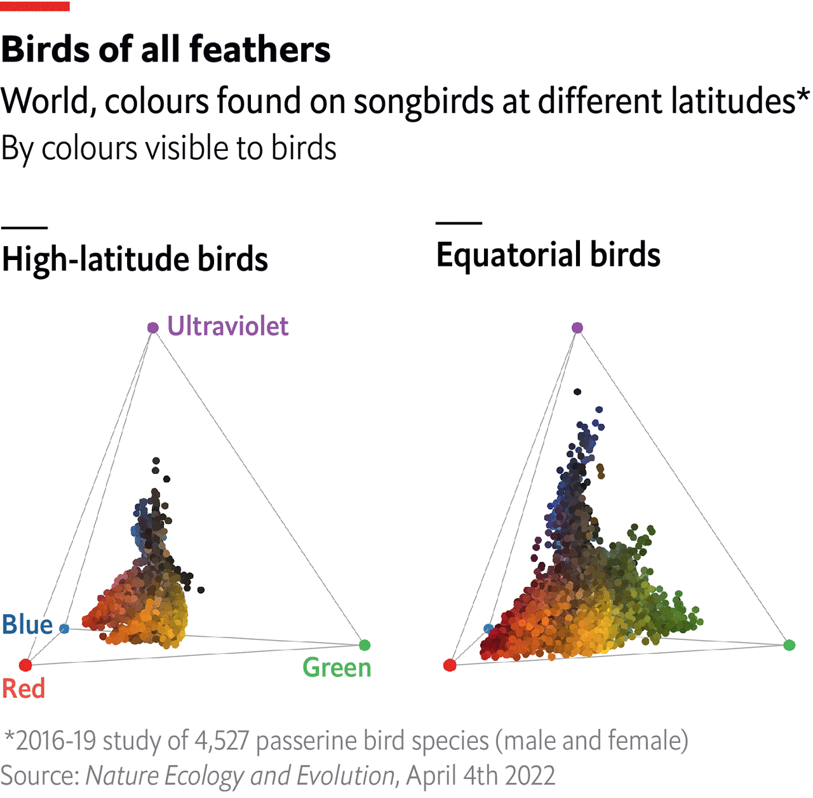

###### Bird-swatching

# Songbirds get more colourful the closer they live to the equator 

##### A 19th-century hypothesis confirmed at last 

 

> Apr 9th 2022 

WHEN THE Prussian naturalist  arrived in South America in 1799, the colours astonished him. “Look at the blossoms, the birds,” he wrote. “Even the crayfish are blue and yellow.”

In the intervening centuries, Humboldt’s musings have morphed into an informal, if controversial, hypothesis about the world’s living things: that organisms in equatorial climes are more colourful than those nearer the poles.


In a new paper in Nature Ecology &amp; Evolution, Chris Cooney, an evolutionary biologist at the University of Sheffield, and colleagues at Britain’s  collection in Tring, offer what they call the most comprehensive examination of this hypothesis to date, demonstrating that it does indeed apply for an order of birds known as passerines, a family of songbirds which includes the blue tit and the robin.

Over several years, Dr Cooney’s team photographed 4,527 birds from the museum’s archives—representing roughly half the total bird diversity on Earth. As passerine birds are sensitive to ultraviolet (UV) light as well as visible, they see more colours than humans. The researchers therefore took pictures under UV light, to get true bird’s-eye views.

A machine-learning algorithm was then let loose on the images, to identify the colours of the plumage (in values of red, green, blue and ultraviolet) at hundreds of points on each specimen. The total number of colours found on each bird was then subsequently mapped onto the geographic distribution of their parent species.

 


The researchers used this data to derive a measure for how colourful different regions of the world were. The key factor here was the diversity of colours on individual birds. The paradise tanager (Tangara chilensis - pictured above), for example, which struts through the Amazon rainforest in a green domino mask, an azure bib fading into a sky-blue apron and a black cape splashed with all the colours of a sunset, is a sign of a colourful region. The monochromatic dunnock (Prunella modulari), meanwhile, which flies across Europe with its brown wings streaked with darker brown, modulated by brown dots scattered across a dark grey face, was surefire evidence of a less colourful region.

Equatorial birds, the researchers concluded, were indeed more colourful than their cousins in temperate regions, with colourfulness declining with latitude. The birds sampled at the equator had, on average, between 90 and 100 different colours, while birds at 60 degrees latitude had closer to 70 colours. Such trends related to latitude are not uncommon in ecology, with species diversity also having been shown to peak at the equator.

Over the decades, numerous explanations have been tendered for tropical colourfulness. Some have speculated that warmer climates make more resources available to their inhabitants, allowing them to spend energy on developing adornments. Others have suggested that the bright colours may arise from chemical compounds in their diet, or else allow for breeding pairs to spot one another in the darker environment of a tropical forest floor.

The authors of the latest study do not make any definitive conclusions on the matter, but their analysis shows that colourfulness is strongly associated with the resources available to birds in an environment, as well as its diversity. Whether such results can be extrapolated to other families of birds—or, indeed, other classes of animal—remains to be seen. After years spent photographing avian specimens from a variety of angles, Dr Cooney has high hopes that a similar study can be performed on butterflies. Crucially, they can be made to lie flat.

To enjoy more of our mind-expanding science coverage, , our weekly newsletter.

