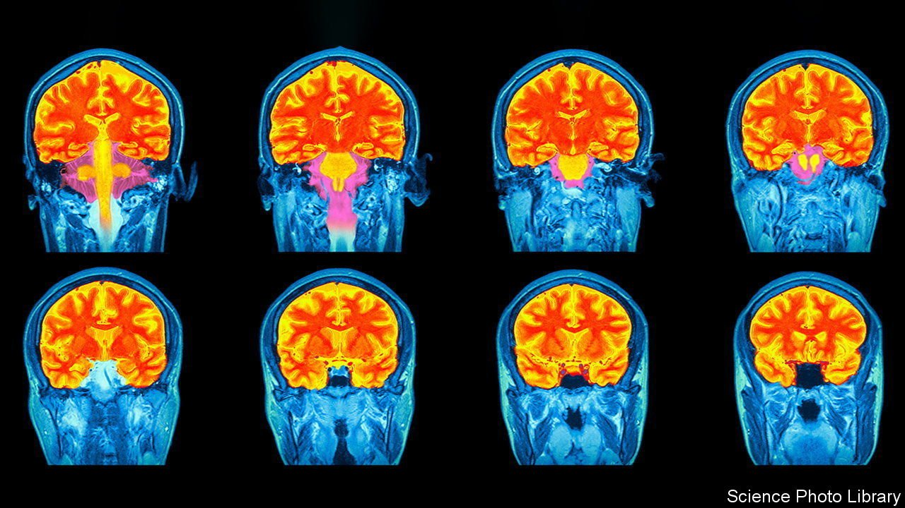

###### Frames of mind

# The first reference charts for the human brain have been completed 

##### They could become a useful tool in tracking healthy (and unhealthy) ageing 

 

> Apr 9th 2022 

IF A DOCTOR wants to know how well a child is growing, she can turn to clinically validated charts that lay out precisely how that child compares to the norm for their age and sex. Not only can the doctor look up, say, how many centimetres shorter or taller the child is than the average for their age, but exactly what height percentile they fall into. Medical diagnoses can then be made based on an absolute comparison with the statistical norm.

Reference charts are an important tool in modern primary medicine, covering many aspects of a person’s healthy development. There is, however, a big gap in their coverage: the human brain. Richard Bethlehem and Simon White from the University of Cambridge and Jakob Seidlitz from the University of Pennsylvania want to fix that. Writing in Nature, the neuroscientists describe the most comprehensive effort yet to create a standard against which someone’s brain development can be measured through their lifetime.


Their brain charts were compiled from more than 120,000 three-dimensional brain scans belonging to more than 100,000 patients who took part in more than 100 different research studies. The data set included people of all ages, ranging from babies still developing in the womb, just over 100 days after conception, to adults more than 100 years old.

With that data, the scientists catalogued how the average human brain evolved from cradle to grave, focusing on three types of brain tissue: grey matter (made up of neuron cell bodies), white matter (the filaments connecting neurons) and tissue conveying cerebrospinal fluid (the brain’s plumbing system). The scientists paid particular attention to the cerebral cortex, the outermost layer of the brain, responsible for higher-order brain functions. They observed grey matter in the cortex peaking in volume at 5.9 years, 2 to 3 years later than previously thought.

Having characterised the development and ageing of the average human brain, the scientists modelled the distribution around it, charting the percentile-by-percentile variation in the structure of human brain tissue. This allowed them to investigate how the brains of patients with various developmental or degenerative disorders compare to more typical brains. “Our investigation confirmed that Alzheimer’s disease, mild cognitive impairment and schizophrenia show marked restructuring of brain tissue relative to a more typical brain of the same age and sex,” says Dr Seidlitz.

The catalogue turned up some surprises too. , for example, is generally thought to present differently in male and female patients, but there is little sign of that difference in their brain tissue. In contrast, attention deficit hyperactivity disorder (ADHD)—which presents similarly by sex—displays the largest average difference in brain structure between male and female patients of any diagnosis they analysed. Over the course of a lifetime, the brains of male ADHD patients appear to be skewed towards below-average volumes of grey matter, white matter and cerebrospinal fluid. The brains of female ADHD patients, on the other hand, were ever-so-slightly skewed towards higher volumes of the same tissues.

What these differences in brain size mean is not yet clear. And the authors caution that their brain charts are not yet ready for clinical use, not least because the dataset they used has several limitations. “Unfortunately, the data we compiled reflect the demographic biases of neuroscience research in general, ie, most studies are from Europe or North America, and over-represent patients of European ancestry,” says Dr Bethlehem.

To reflect the full diversity of normative human brain development, a more representative dataset will be required. Once that is accomplished, the utility of brain charts can begin to be tested in a clinical setting. One day, hopefully, these charts could become a useful tool in tracking a person’s brain health or spotting the earliest physical signs of brain disorders such as Alzheimer’s disease. ■

To enjoy more of our mind-expanding science coverage, , our weekly newsletter.

