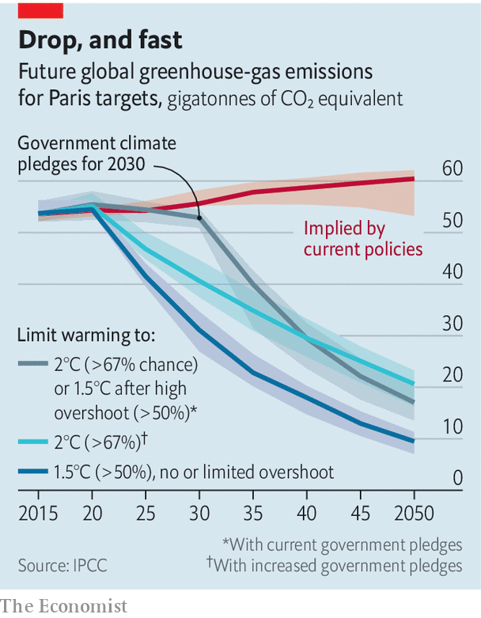
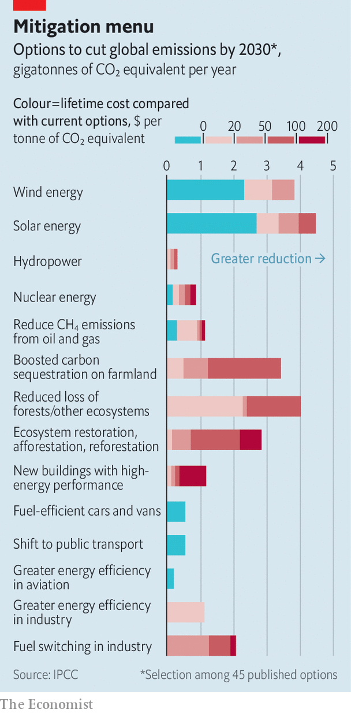

###### Tick, tick, tick

# The latest IPCC report argues that stabilising the climate will require fast action 

##### Emissions must peak by 2025 for the world to have a chance of meeting the Paris goals 

 

> Apr 7th 2022 

THE WINDOW to prevent global temperatures from rising by more than 1.5°C above pre-industrial averages is rapidly closing. Decisions made this year could determine whether that target is met or whether the world overshoots it by the middle of this century and has to deal with severe climate extremes before attempting to turn the thermostat back down in the second half of the century.

These are the warnings delivered by the Intergovernmental Panel on Climate Change (IPCC) in the third volume of its latest assessment report, published on April 4th. It follows earlier tomes, published in recent months, that first laid out the current state of knowledge on the physical science of climate change and then examined the impacts of warming on the human and natural worlds.


The third report offers a comprehensive menu of possibilities for how humans could stabilise the climate and avoid catastrophic global warming while fulfilling the commitments made in the 2015 Paris agreement. The aim of that pact was to keep average global warming to between 1.5°C and 2°C above pre-industrial levels.

The IPCC’s menu includes options for power generation and energy efficiency, transport, buildings, urbanisation, agriculture and food security, forestry, consumer choices and much more besides. Its 278 authors have gone to great pains to offer a smorgasbord of opportunities to reduce emissions and stabilise the climate, and to point out that not all are eye-wateringly expensive.

There is just one catch. In order to meet the Paris goals, humanity must order just about everything on the menu, and fast.

“We need to get on with this now or [the goal of] 1.5°C will slip beyond reach,” declared the report’s co-chair, Jim Skea of Imperial College London, when it was published. “If there is no advance in the kind of pledges that countries are making before we get to COP27 in Egypt,” he added, referring to the next UN climate summit, scheduled for November, “we may well have to conclude that 1.5°C has indeed gone.”

Climate scientists are typically reluctant to admit defeat when it comes to this target, in part because research collated in another IPCC report in 2018 showed that the consequences of 2°C of global warming were considerably worse than 1.5°C, particularly for the poorest parts of the world and low-lying regions that are vulnerable to rising seas and destructive storm surges. But the measures they show to be necessary in order to meet the target are so stringent that overshooting 1.5°C of warming now seems all but certain.

Now or never

The physics of the global climate system, however, leaves little room for prevarication, and Dr Skea’s stark warning comes directly as a result of the numbers in the latest report. The “carbon budget” represents the total amount of carbon dioxide that can still be pumped into the atmosphere before a certain amount of warming is likely. For example, the IPCC says that for a 50% chance of limiting warming to 1.5°C by 2100, no more than 500bn tonnes of CO can be emitted beyond 2020, equivalent to little more than a decade of emissions at current rates.

The report says that to avoid more than 2°C of warming, global emissions must peak before 2025 and then fall by 43% before 2030, compared with 2019 levels. Yet human societies emit more greenhouse gases with every passing decade, and the last one saw the largest rise in emissions in human history. While the report’s socioeconomic simulations of the coming decades show that it is theoretically possible to cut emissions by the amounts needed, the political realities and inherent inertia of economies that are largely structured around fossil fuels make the transition challenging, particularly at the speed that is now required.

 


Achieving the 1.5°C Paris goal means that global use of coal must decline by 95% by 2050, relative to 2019. Oil use must drop by 60% and gas by 45% in that period. The decreases needed to limit warming to below 2°C are not much lower. Under all scenarios, there is no room for new unabated fossil-fuel projects (such as power plants), and most existing ones will have to be wound down faster than they would have otherwise. “Estimated emissions from the current [fossil-fuel] infrastructure over planned lifetimes are roughly what we can emit for a 2°C scenario,” said Michael Grubb of University College London, one of the IPCC report’s authors.

Keeping warming to less than 2°C would therefore mean shortening the lifespans of existing fossil-fuel power stations and refineries. These could be retrofitted with installations that capture warming gases before they escape into the atmosphere in order to store them underground or beneath the oceans. But, as the report’s authors note, governments and business have promised to develop such an industry (dubbed “carbon capture and storage”) for decades, but failed to do so.

Among the darker warnings, there are some shafts of light. The cost of solar energy dropped by 85% during the 2010s, and wind power by 55%. During the same period, the market for electric vehicles grew a hundredfold. The IPCC report notes that at least 24 countries have consistently cut emissions for at least a decade. Despite worrying trends in the Brazilian Amazon, there is more forest cover and less deforestation today than in 2010. In 2020 more than 20% of global emissions were covered by carbon taxes or trading schemes. And also in 2020, more than 50 countries, accounting for more than half of global emissions, had enacted climate laws intended to reduce emissions.

The energy intensity of the global economy (a measure of the amount of energy expended to generate one unit of GDP) decreased by 2% per year between 2010 and 2019. At the same time, the amount of carbon dioxide emitted for each unit of energy produced (known as “carbon intensity”) decreased—an indication that, globally, energy is becoming greener.

But these gains are nowhere near what models say will be needed to stabilise the climate before it is too late. Carbon intensity, for instance, declined by 0.3% per year in the 2010s, a fraction of the 3.5% per year that the models say is needed to give a good chance of limiting warming to 2°C. For a 1.5°C goal, the annual improvement would have to be 7.7%.

One common thread running through the Paris-compliant scenarios presented by the IPCC is the inclusion of options for removing greenhouse gases from the atmosphere. That is because all scenarios assume that there will be residual emissions from some economic sectors come mid-century, even under the most optimistic assumptions. Viable options for eliminating fossil fuels from aviation and heavy industry are currently lacking, and few envisage a sufficient change in this over the coming decades.

 


Options for removing these residual emissions broadly come in two types: the ecological (reforestation, ecosystem restoration, schemes to increase the amount of carbon sequestered in agricultural soils) and the chemical (using minerals or reagents that selectively bind to atmospheric CO and allow it to be stored underground, underwater or in solid form).

The former appears easy and cheap but is potentially unreliable. Forests burn and release greenhouse gases as they do; in a warmer, drier world, they will burn more. To be long-term stores of carbon, trees must be managed and protected, something that humans in general do not always do well. Ecological solutions can also compete for land with agriculture, particularly at the kinds of scales required by the climate models.

Suck it up

On the other hand, technological solutions for removing carbon dioxide from the atmosphere are in their infancy and extremely expensive. The two companies that have commercial operations offer to remove one tonne of carbon dioxide for between $300 and $1,000. For comparison, a single economy seat on a return flight from London to San Francisco is responsible for just under one tonne of emissions.

These carbon-removal technologies may see a rapid drop in costs. Proponents point to the recent successes of solar- and wind-energy projects—all three technologies involve small modular components, making them relatively easy to scale up, and fans of the “direct air capture” industry have used the similarities to suggest that their technology will also take off quickly. Still, it is worth noting that even solar energy, a modern-day darling of the green-energy world, took several decades to get where it is today.

To some, the calls to end the age of fossil fuels or face the consequences of letting the world burn may seem divorced from immediate reality, particularly as European countries desperately seek gas to replace Russian supplies and stave off fuel shortages and crippling prices during the next winter.

But there are some synergies between the two crises. In the long list of options for reducing emissions, improving energy efficiency in transport, buildings and industry is low-hanging fruit, as are behavioural changes such as switching from private vehicles to public transport. Encouraging consumers to decrease energy demand in this way would also increase energy security. And every fraction of a degree shaved off future warming reduces climate risks, even if the 1.5°C target is missed.

The covid-19 pandemic presented an opportunity to use the resulting economic turmoil to stimulate green growth. The response of governments was patchy at best. Today, as the West comes to grips with a deepening energy crisis, it faces a similar challenge, but with added urgency in light of the latest climate warnings from the IPCC’s scientists. ■

To enjoy more of our mind-expanding science coverage, , our weekly newsletter. And for more coverage of climate change, register for , our fortnightly newsletter, or visit our 

