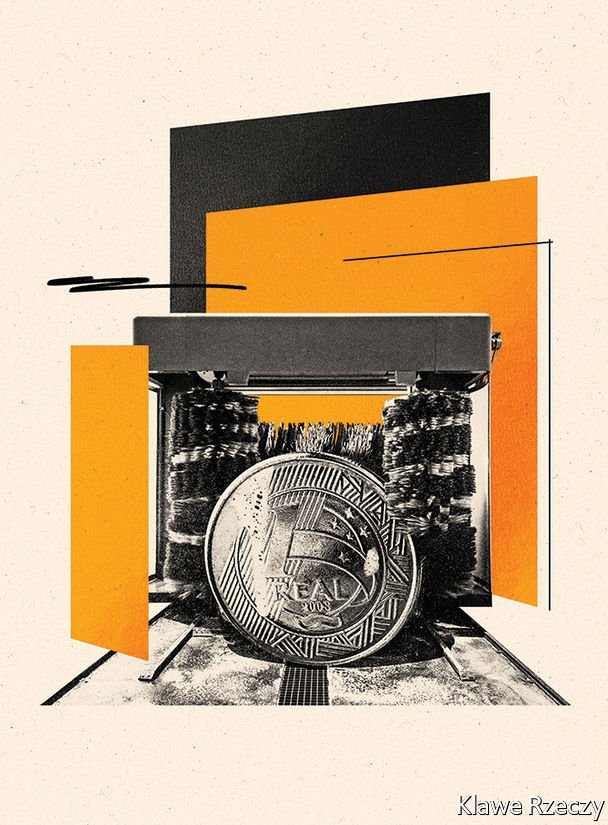

###### Villain or victim?

# Hailed as a saviour, derided as a thief, Lula is back 

##### Brazil’s election may turn on whether voters trust their former president 

 

> Apr 9th 2022 

ON APRIL 9TH, Luiz Inácio Lula da Silva, commonly known as Lula, is expected to announce he is running for the presidency of Brazil. For many Brazilians, it will be a moment to savour. The last time Lula held office, from 2003 to 2010, his welfare programmes lifted millions out of poverty. His gruff charisma charmed Barack Obama, then the president of the United States, who called Lula “the most popular politician on Earth”. When he left the presidential palace, with 11 trucks packed with gifts from well-wishers, his approval rating was 80%. As Brazilians reel from a poorly handled pandemic and stubborn inflation, it is not surprising that Lula leads Jair Bolsonaro, the populist incumbent, by double digits in most polls.

Yet opponents prefer another superlative for the ex-president. He is “the biggest corruptor in Brazilian history”, Ciro Gomes, a centre-left foe, said last year. Mr Bolsonaro and his son Flávio, a senator, who are themselves mired in allegations of graft, refer to him as “the nine-fingered thief” (as a young man, Lula lost a finger in a factory accident). Rivals will not want voters to forget that Lula was handed a 12-year sentence on charges of money-laundering and corruption, and watched the previous election from prison.


Ahead of elections in October, these two narratives jostle for supremacy. Most supporters of his Workers’ Party, the PT, believe him when he says he was the innocent victim of a conspiracy to prevent his return to politics. Many in the business elite believe he is a crook. The truth is murkier and, like corruption in Brazil more generally, maddeningly complex.

Start with the process that brought Lula down: the “car wash” scandal, or Lava Jato. What began in 2014 as an operation to catch small-time currency dealers above a petrol station soon reached further than anyone could have imagined. It revealed that companies had been bribing politicians in exchange for huge contracts, exposing systemic corruption.

The public were furious. The probe entangled hundreds of businessmen and politicians. It extended to 11 countries and touched a dozen current or former Latin American heads of state, including Lula. He was convicted of accepting bribes in the form of a beachfront apartment and renovations on a country house, neither of which he owned. In an investigation which recouped over $5bn in stolen money, there were far more “vulgar” and “flagrant” crimes, notes one Lava Jato prosecutor. But Lula was its biggest fish.

Then the net ripped. A series of blunders had already undermined Lava Jato, which had long stretched beyond its capacities. Leaked messages released by the Intercept, an investigative website, revealed that Sergio Moro, the judge, had been collaborating with Deltan Dallagnol, the prosecutor, against Lula. Mr Moro’s impartiality had already been thrown into question when he became Mr Bolsonaro’s justice minister. “The ex-president was a victim of a manhunt,” says Cristiano Zanin Martins, Lula’s lawyer.

The Supreme Court agreed. Last year it ruled that Mr Moro had been biased, weeks after a justice had annulled Lula’s convictions. All in all, two dozen cases against Lula and his family have been archived, suspended or closed—because of tainted evidence, procedural errors or technicalities. Lula, who has always denied all charges, seems vindicated. “I was wronged. I've already proved my innocence,” he told The Economist last year.

Not all are convinced. A survey in February found that 51% of all of those asked, and 22% of those who had voted for the PT, did not believe that the archiving of one of the cases against Lula proved his innocence. His lawyers say this is because of a “trial by media”. Critics say that he has not been absolved. “Everything archived, nothing cleared up”, read a recent headline in one Brazilian weekly.

The rags and machines humming

Consider the case of the Swedish planes. One of Lula’s sons received 2.5m reais ($740,000) from a lobbyist, ostensibly to promote American football. That lobbyist was at the same time working for a Swedish plane-maker which went on to win a controversial tender for new fighter jets. Prosecutors accused Lula, who had left office at this point, of influencing his protégée and successor Dilma Rousseff to agree to the deal. On March 2nd it became the last case against Lula to be shelved, because of tainted evidence.

Another case involved a country house in Atibaia owned by business partners of another one of Lula’s sons. Odebrecht, a construction company, claimed it paid to renovate it. Testimonies and court documents placed Lula and his belongings at the site. Someone at the institute which bears Lula’s name received updates by email about maintenance issues, skunk-traps and peacock chicks. Yet despite what was presented in the trial, Mr Moro had not received enough evidence to justify opening the case in the first place, said the Supreme Court justice who refused to reopen proceedings. Other cases could be revived by the federal court, but that would take years. Final judgment will probably come from a historical study, not a court ruling.

Critics have a second, graver complaint about Lula: that he presided over systemic corruption. During his first term in office the PT illegally used public money to pay politicians a mensalão, or monthly stipend, in return for support of its programme. The policies they enacted helped many Brazilians, but at a high moral cost.

Lava Jato also showed that under the PT state-owned companies routinely awarded padded contracts to corrupt firms, mostly Odebrecht. Malu Gaspar, a journalist who has written a book about the firm, describes how Marcelo Odebrecht, its CEO, asked the department of “Structured Operations” (or the specialist bribery team) to tot up its PT “donations”. In the final two years of Lula’s government, these payments amounted to 200m reais (around $115m in 2010).

Lula has always maintained that he did not know about either the policy of mensalão or the Odebrecht payments. But two of his chiefs of staff, Antonio Palocci and José Dirceu, were at the heart of both scandals. In public, Lula decried Odebrecht as a “criminal organisation”. However on the company’s spreadsheet of colourful code names, their accountants called him “Amigo”; after he left office he toured Africa and Latin America on their dime.

 


But it would be “very inaccurate” to say that only the PT behaved in this way, says Caio Rodriguez, Odebrecht’s lead counsel during Lava Jato. The investigation mainly focused on them because they were in the federal government. But he notes that, in terms of quantity, the bribes Odebrecht gave at a state level to the main opposition group, the Party of Brazilian Social Democracy, were roughly the same. In terms of the numbers of legislators investigated, the grubbiest was one of Mr Bolsonaro’s old parties, the Progressive Party, not the PT. Historically, too, “there is no difference” between the PT and previous governments, says Fernando Limongi, a sociologist. It was “business as usual”.

If Lula wins, will it be different this time? A lot will depend on how much Lava Jato has disrupted the usual state of affairs. One significant change is that firms that bribe politicians now face crippling legal and financial punishments if they are caught. That may deter future wrongdoing.

Yet despite the headlines, Lava Jato did not end impunity in Brazil. It investigated and prosecuted individuals, partly by using similar methods to American anti-corruption task-forces, such as plea bargaining. But it was unable to root out a culture of corruption. The powerful fought back. Blunders and lapses by prosecutors, including Mr Moro, have led to hundreds of convictions being overturned. Political meddling in the investigation has weakened trust in the justice system. Bribery and embezzlement continue, and the public no longer care as much as they did. Corruption was for years the number one issue for voters; surveys now rank it fifth or sixth. With inflation at 11%, they have other problems to worry about.

And although Mr Bolsonaro came to power promising to vanquish graft, he has quietly capitalised on the backlash against Lava Jato. The president has hobbled key institutions which fight against corruption, replacing their leaders and reducing their powers. He fired the head of the federal police. Mr Moro says this was to stop an investigation into his sons. Mr Bolsonaro denies it. Mr Moro quit as justice minister in protest. Finally, by creating a “secret budget”, Mr Bolsonaro has served up millions of dollars in pork to some of the dirtiest members of Congress. In 2020 he announced the end of Lava Jato for good.

At the car wash

Anti-corruption efforts are now weaker than they have been for years, says Bruno Brandão of Transparency International Brazil, a watchdog that championed Lava Jato. Lula may try to reverse this decline, reckons Silvana Batini, who was on the Lava Jato task force in Rio de Janeiro. As president—and unlike Mr Bolsonaro—Lula appointed a prosecutor-general from a non-partisan shortlist. He strengthened the federal police. After huge protests in 2013 Ms Rousseff introduced the law which laid the foundations for Lava Jato. Despite the corruption within its own ranks, the PT bolstered the institutions that eventually brought them down.

Lula is unlikely to give a nuanced explanation of all this to voters, let alone a mea culpa. Instead he is suing people. On March 22nd he won damages from Mr Dallagnol, the prosecutor in the leaked memos, for a defamatory PowerPoint the latter had presented before any case had been opened. Lula’s lawyers called the compensation “a symbol of the historical reparation that is due”. Their client called his accusers “messianic brats”. Three other cases against detractors are pending.

On March 31st Mr Moro, who pitched himself as a “third way” candidate for the presidency, announced he would suspend his campaign. A few days later, he seemed to change his mind. Such indecision increases the likelihood of a showdown between Lula and Mr Bolsonaro, and also of a tighter race. It is a contest which will make strange bedfellows. Before Mr Bolsonaro became president, Geraldo Alckmin, the former governor of São Paulo, said that Lula returning to power would mean going back “to the scene of the crime”. Now Mr Alckmin is expected to be Lula’s running mate. His volte-face may smack of opportunism. But in October many Brazilians may end up making a similar choice. ■

 In the original version of this article we incorrectly stated that one of Lula's sons received 25m reais from a lobbyist. It should be 2.5m.

