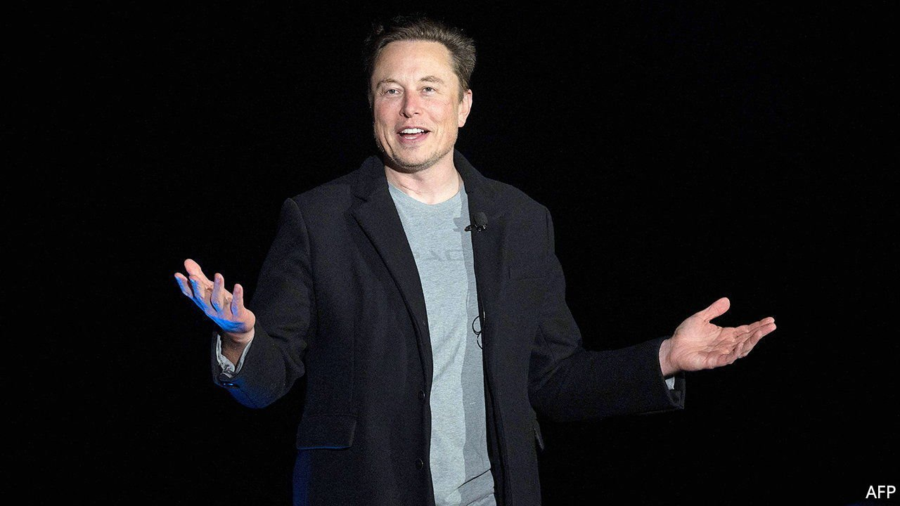
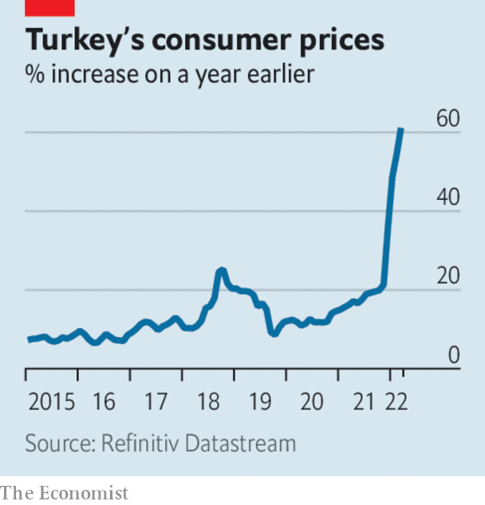

###### The world this week

# Business 

#####  

 

> Apr 9th 2022 

 said he looked forward to making “significant improvements to Twitter” following his appointment to the board. This came after Mr Musk revealed that he had built a 9.2% stake in the company, becoming its largest individual shareholder. Known for his mischief-making, Mr Musk polled his followers this week to ask if they wanted an edit button that could fix errors in tweets (they of course said yes). Twitter is already working on an edit feature, but one that won’t alter tweeted conversations.

Workers at an Amazon warehouse on Staten Island voted by a wide margin to , the first time that employees of the giant retailer have decided to unionise in America. Amazon, which has vigorously fought attempts to organise labour at its premises, said it was disappointed. Celebrations by activists were tempered by news that a similar vote at a warehouse in Alabama, the second at that facility, looked like it was heading for defeat.


As it grapples with unions on Earth, Amazon is looking to the skies for its next big adventure. It has secured deals with three space-rocket firms, including , to provide heavy-lift launch services for Project Kuiper, Amazon’s scheme to put a constellation of satellites in low orbit that will deliver broadband. It is planning 83 launches over a five-year period.

The crisis over the future of  deepened when its second-biggest shareholder wrote an open letter calling on the Japanese conglomerate to consider selling itself to a private buyer (Bain Capital is expected to submit a proposal soon). The letter described Toshiba as a once iconic company that is now a “corporate-governance embarrassment”.

The minutes from the ’s latest meeting showed that it is preparing to reduce the balance-sheet that it has accrued over the pandemic from as early as May, and at a pace considerably faster than had been expected. The yield on the ten-year US Treasury note, which rises when bond prices fall, climbed to a three-year high.

The British government outlined its strategy for providing up to 95% of electricity from low-carbon sources by 2030. It gave a firm commitment to increase offshore-wind capacity to 50GW, from 10GW today, and offered vaguer pledges on other renewables. More controversially, it hopes to increase nuclear-power capacity to around a quarter of energy demand by 2050.

Germany’s government took control of Gazprom Germania, the division of Russia’s Gazprom that operates natural-gas storage hubs in the country, after it was suddenly acquired by two firms. The legal and commercial standing of the acquiring firms is unclear, said the government, and seizing Gazprom Germania was necessary to safeguard gas supplies.

The Russian  rouble has rebounded from its dramatic fall at the start of the war in Ukraine and is trading at the same exchange rate against the dollar as just before the invasion. This is in part because of the money Russia still receives from energy exports and also because of capital controls imposed by the central bank.

 


Turkey’s annual inflation rate hit 61% in March. Food prices were up by 70% year on year, energy costs by 103% and transport by 99%. . The political opposition blames Recep Tayyip Erdogan, the president, for suppressing interest rates because he wants to prioritise economic growth. Despite surging inflation the central bank cut its main rate by five percentage points over the final months of 2021.

JetBlue tried to bump a rival takeover offer for Spirit Airlines by offering $3.6bn for the business. In February Frontier, another low-cost carrier, agreed to pay $2.9bn for Spirit (the companies value that deal at $6.6bn once the assumption of net debt and operating leases is included). Spirit will consider JetBlue’s proposal.

The first quarter of the year was the worst for stockmarkets since the start of the pandemic. With investors fretting over war, surging prices, inverted yield curves and sagging tech shares, the S&amp;P 500 was down by 4.9% over the three months, the NASDAQ by 9.1%, Hong Kong’s Hang Seng by 6% and the German DAX by 9.3%. Russia’s main index, the MOEX, fell by 28.6%.

The war in Ukraine and stockmarket volatility are two big reasons why there are fewer billionaires this year. Forbes compiled its annual tally using share prices and exchange rates on March 11th. Russia has 34 fewer of them (there are still more than 80 in the country, though their total net worth has fallen by almost half). China lost 87 because of the government’s crackdown on big tech. Globally there are 2,668 billionaires with a collective worth of $12.7trn. With a net worth of $219bn, Elon Musk overtook Jeff Bezos to top the list for the first time.

