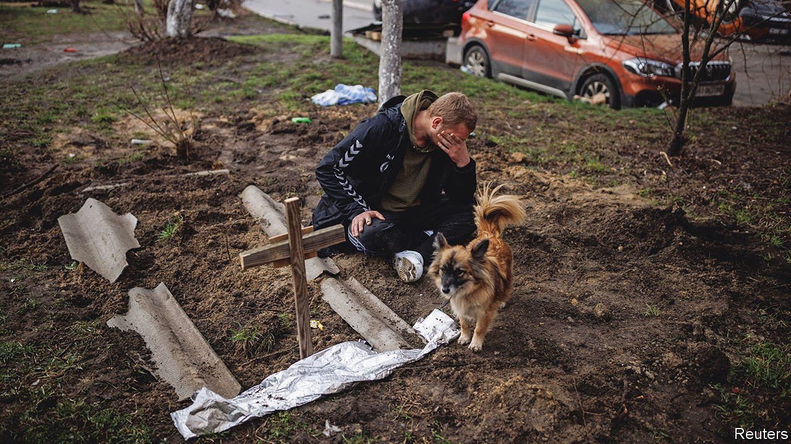
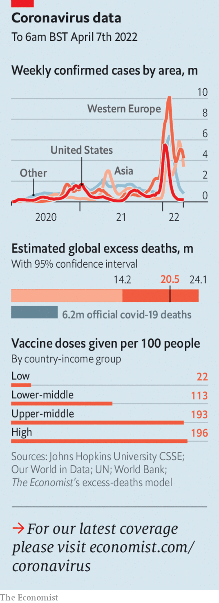

###### The world this week

# Politics 

#####  

 

> Apr 7th 2022 

Having failed to take Kyiv, Russian troops retreated, leaving behind evidence of . In one town, Bucha, dozens of corpses were found. Some had had their hands tied behind their backs before being shot. Survivors described the cold-blooded murder of Ukrainian men suspected of resisting the invasion. Ukrainian officials said that the bodies of at least 410 civilians, including children, had been found in areas around the capital. The Kremlin said the evidence of atrocities was faked by the Ukrainian government. Russian forces are now regrouping in eastern Ukraine, perhaps hoping to seize all of Donbas.

Volodymyr Zelensky, Ukraine’s president, urged the UN Security Council to remove Russia as a member. He also called for a tribunal for the Russians who gave the orders to commit atrocities. Russia has a veto on the council and can block any such move.


America, in conjunction with the European Union and G7, announced new sanctions on Russia, extending a ban on new investment to all areas of the economy and freezing the assets of Vladimir Putin’s daughters. America’s Treasury Department stopped American banks from facilitating repayment of Russian debt, in effect blocking Russia from reimbursing holders of its bonds.

Lithuania ended imports of Russian gas, the first country in the EU to do so. The Baltic nation has been weaning itself off Russian energy for years by building a terminal to import liquefied natural gas from other suppliers.

Vladimir Zhirinovsky, a Russian ultranationalist and leader of the misnamed Liberal Democratic Party, died aged 75. He once suggested that Russia seize Alaska from America and dump Ukrainians there. He never held power, but helped Mr Putin by sounding more extreme. He ran for president six times.

’s party, Fidesz, increased its supermajority in Hungary. Six opposition parties had united to try to stop Mr Orban’s erosion of democracy. Hungarian media, which are largely under Mr Orban’s thumb, painted them as deviants and warmongers. They won 35% of the vote. The European Union began moves to cut off aid to Mr Orban’s corrupt regime until it stops violating the rule of law.

Aleksandar Vucic won a second term as Serbia’s president. His government has refused to join sanctions on Russia. Dependent on Russian gas, Serbia has tried not to annoy Mr Putin while still hoping to join the EU one day.

, Pakistan’s prime minister, pulled off a last-minute trick to avoid a no-confidence vote by dissolving parliament and calling for fresh elections. The opposition took the matter to the Supreme Court, arguing that Mr Khan’s move was unconstitutional.

’s festering economic crisis spiralled into high political drama as fuel supplies dwindled, food shortages worsened and power cuts stretched on, leading to protests that demanded the resignation of Gotabaya Rajapaksa, the president. Mr Rajapaksa dismissed most of his cabinet and imposed, and then lifted, a state of emergency.

Carrie Lam decided not to seek a  as Hong Kong’s leader. Her tenure was marked by big pro-democracy protests, which led to tighter Chinese control of the territory. More recently she has been criticised for mishandling a surge in covid-19 cases. Hong Kong now has the world’s second-highest death rate from the virus.

Rodrigo Chaves won the presidential election in Costa Rica. Mr Chaves, an economist, positioned himself as an anti-establishment outsider. Both his campaign and that of his main rival were dogged by scandal.

The embattled president of Peru, Pedro Castillo, introduced a state of emergency and a curfew in Lima, to quell violent protests about rising food and fertiliser prices. The lockdown was lifted, but problems for the left-wing Mr Castillo remain. Since coming to office in July he has faced two impeachment attempts, and has appointed four different cabinets. His approval rating is just 25%.

 


In Britain it emerged that Akshata Murty, the wife of Rishi Sunak, the chancellor, is non-domiciled for tax purposes. As a result she does not pay tax in Britain on income earned abroad (Ms Murty is an Indian citizen and owns shares in Infosys, an IT services company founded in India by her father). The news came on the same day that millions of Britons on squeezed incomes started paying a higher rate of tax under a policy championed by Mr Sunak.

Three Republican senators said that they would join Democrats in backing ’s appointment to the Supreme Court, all but assuring her confirmation on the Senate floor.

Oklahoma’s legislature passed a bill that would ban abortion in all instances, except where the woman’s life is in danger. Performing the procedure would be punishable by up to ten years in prison. The governor has indicated that he will sign the bill.

A defection from the ruling coalition in Israel, possibly because of a dispute over food in hospitals during Passover, left the prime minister, Naftali Bennett, without a majority in parliament. But the opposition leader, Binyamin Netanyahu, who preceded Mr Bennett, looks unlikely in the short run to bring the government down.

The main sides in Yemen’s civil war agreed to a two-month truce starting on April 2nd, the first day of the fasting month of Ramadan, in the hope of renewing negotiations for a durable peace. Within days there were claims of breaches by both sides.

A human-rights group accused Malian troops and the Wagner Group, a mercenary firm with Kremlin ties, of rounding up and murdering 200-400 civilians in Moura, a town in central Mali.

A court in Nigeria sentenced an atheist to 24 years in prison for blasphemy. The former Muslim was arrested after he said on social media that there is no afterlife.

