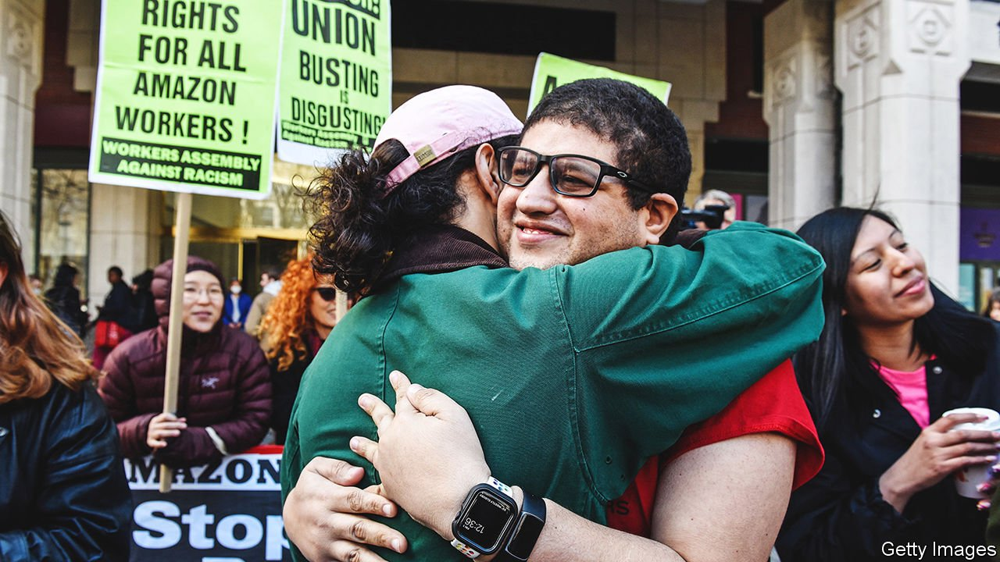

###### Trade unions in America

# Amazon has its first union, but lots more are unlikely to follow 

##### The worker-led success on Staten Island will be hard to replicate 

 

> Apr 9th 2022 

WATCHING THE votes come in, Madeline Wesley, treasurer of the Amazon Labour Union (ALU), becomes emotional. “We really had nothing,” she says between sobs. By a margin of ten percentage points, staff at JFK8, an Amazon warehouse on Staten Island, New York, opted to form the firm’s first American union. The ALU hopes it will not be the last. “I expect Amazon unions will be popping up all over now,” Ms Wesley adds, now smiling.

Plenty look set to try. Organisers say that since the result on April 1st, workers in more than 50 Amazon buildings have been in touch. The ALU is optimistic about a vote at another Staten Island warehouse later this month and the Teamsters union, one of America’s largest, has promised to try to organise other Amazon staff. Success can be contagious. A first Starbucks café in America unionised in December; now almost 200 have filed for votes. National conditions seem favourable: a pro-union president is in the White House, the labour market is tight and some 60% of Americans say that the reduction in union representation has been bad for workers.


Not so fast. The ALU gained traction as a local, worker-led movement, (unlike the less successful big-labour-led drive at an Amazon warehouse in Bessemer, Alabama). Asked why he backed the union despite being happy with his pay and breaks, one Amazon worker replied: “I know the guy.” That may be hard to replicate. It was not “a traditional union campaign where an outside organisation came in and told the workers what was best for them”, says Julian Mitchell-Israel, an ALU activist.

Amazon itself opposes unionisation, arguing that “having a direct relationship with the company is best for our employees”. At Staten Island, it made that case in mandatory meetings and in posters across the warehouse. Nationally, it spent over $4m last year on anti-union consultants.

“Amazon is going to keep fighting as hard as they possibly can,” says Adam Seth Litwin of Cornell University’s labour-relations school. One option is to draw out negotiations at JFK8: “delays around the first contract have become “ de rigueur strategy for businesses in the situation that Amazon is in now,” Mr Litwin explains. Less than half of union certifications result in a contract. Without one, firms can push for decertification, and copycat campaigns can lose their lustre.

Private-sector union membership has decreased in America for decades. Defying that trend will be hard: those nearly 200 unionisation elections at Starbucks are just a sliver of the 9,000 company-owned cafés. In his final message to shareholders Amazon’s ex-boss, Jeff Bezos, pledged to make it “Earth’s Best Employer”. It is unlikely to become its most unionised. ■

For exclusive insight and reading recommendations from our correspondents in America, , our weekly newsletter.

