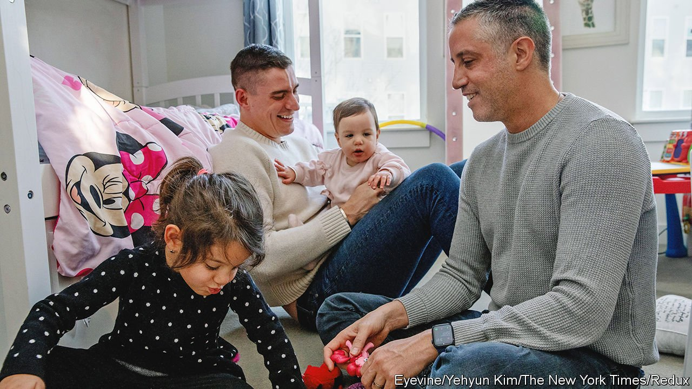

###### Surrogacy

# America’s childmaking market is a legal and ethical minefield 

##### The battlegrounds of the baby business 

 

> Apr 9th 2022 

WHEN THE man who had paid Melissa Cook to bear three embryos, created from his sperm and the egg of an anonymous donor, informed her that he had run out of money and she would have to abort at least one, she refused. Her worry that he would not be able to look after the children grew when she learned that the surrogacy broker she had used in California had not properly checked the man’s ability to be a parent. She sued, arguing that the state law authorising surrogacy contracts was unconstitutional because it treats babies “as a commodity or as chattel”. This and successive attempts to retain her parental rights failed. When the triplets were born Ms Cook was not allowed to see them.

Six years later, having exhausted all legal avenues, including an attempt to get the case before the Supreme Court, Ms Cook remains consumed by anxiety about the children, all boys, according to Harold Cassidy, her lawyer. “The last we heard he had lost his house and they were moving from motel to motel,” he says. Robert Walmsley, the man’s lawyer, says that is not true and that arguments made in court filings that the man was unfit to be a parent because he was deaf and mute are “grossly offensive and discriminatory”.


The case illustrates the legal and ethical messes that can arise in a surrogacy market that is largely unregulated. America has no federal law governing such arrangements. Most states allow paid surrogacy; some regulate it loosely. National data are scarce. The Centres for Disease Control and Prevention says 18,400 babies were born to gestational surrogates (that is, using a donor egg) between 1999 and 2013. The fee paid to a surrogate can range from $30,000 to $60,000 out of a total cost—including in vitro fertilisation and fees for brokers and lawyers—of $110,000-180,000.

Three of the six states that once prohibited the business have legalised it: New Jersey in 2018, Washington in 2019 and New York in 2021. Poorer places have shut it down: Cambodia, India, Thailand and Nepal have outlawed cross-border surrogacy. Most European countries prohibit commercial surrogacy. Ukraine, where it is legal and a lot cheaper than in America, had become a big market, before Russia’s invasion. But those who can afford it have long favoured America, with its advanced medical technology, healthy supply of egg donors and aggressive lawyering.

Demand is rising across the rich world. Surrogacy brokers say they have observed the practice becoming more socially acceptable as celebrities have talked about using surrogates. Many agencies say gay couples constitute a growing proportion of their clients (lesbian couples who want children can mostly use sperm donors). That has influenced the lobbying of fertility-rights groups, which increasingly portray access to paid surrogacy as a gay-rights issue. On the other side of the argument, a belief that no one has a right to pay a woman to carry a baby has unified some conservatives and some feminists.

Mother and child reunion

Proponents of paid surrogacy point out that the market self-regulates in important ways. Unlike the business of buying sperm, it depends on the use of assisted reproductive technology, which is regulated federally. Brokers prefer surrogates with health insurance. Risa Levine, a lawyer who campaigns for better access to fertility treatments, says that if health insurance covered the cost of surrogacy it would bring new layers of protection and transparency. Some businesses now include some costs associated with surrogacy in benefits packages. Research suggests 15-20% of surrogates are army wives.

To help avoid situations in which a surrogate, overwhelmed by maternal feeling, decides she wants to keep a baby, many agencies stipulate she must already be a mother. Opponents say that neither this, nor the use of donor eggs, which is now what most surrogacy involves, circumvents a bond between mother and child.

Parental disputes about what should happen to an unborn baby, generally amid divorce, are more common than conflicts between parent and surrogate. New York’s law allows one parent to use embryos that both once wanted, without forcing the other to pay child support. If a baby is born with a physical defect that might have prompted an abortion had it been known about earlier, the state’s law forces parents to accept custody.

Yet laws and contracts cannot fix everything. A contract may stipulate that abortion decisions are up to the paying parents, but no court would force a woman to go through with one. Health is also a concern. More than half the babies born in America to gestational surrogates are twins or triplets, which can take a dangerous toll. “My body, my choice”, a refrain used by abortion-rights activists, is often cited by proponents of surrogacy to counter that worry. “Why do we fight so hard to allow women to choose not to have a baby but assume some aren’t equipped to decide to become a surrogate?” asks Ms Levine.

The greatest fears concern children. In some states with little regulation, lawyers turn to procedures used in adoption, including background checks on prospective parents. Britain, where unpaid surrogacy is allowed but contracts cannot be enforced, is considering mandatory checks on both surrogates and parents. That is unlikely to happen in America. It could be “discriminatory”, says Mr Walmsley, the lawyer. “Do we do background checks on everyone who has a child?” ■

For exclusive insight and reading recommendations from our correspondents in America, , our weekly newsletter.

