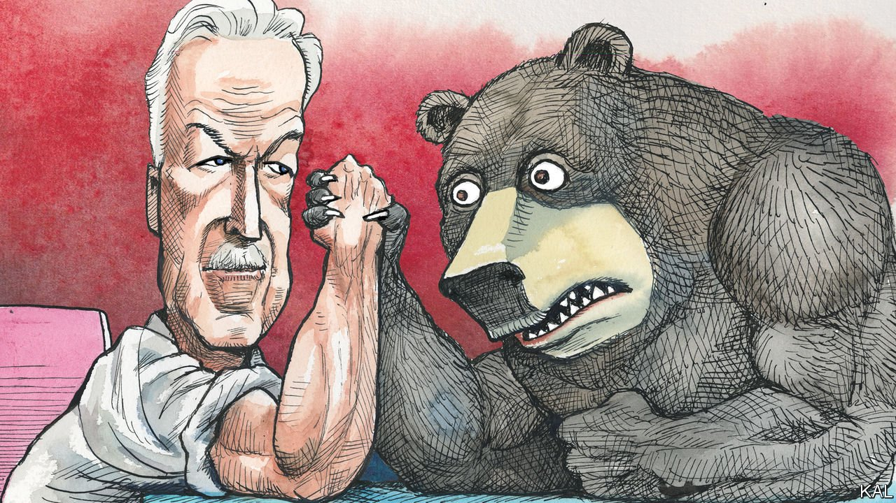

###### Lexington

# Bill Burns and the bear 

##### The CIA director is at the heart of the administration’s capable Ukraine effort 

 

> Apr 9th 2022 

EARLY LAST year Jordan’s security service uncovered a plot against the kingdom’s ruler, Abdullah, involving his half-brother, Saudi Arabia and some Bedouin tribes. William Burns, the CIA director and a former ambassador to Jordan, recognised the threat this represented to a crucial American ally. He hotfooted it to the White House to brief Joe Biden—“the first customer”, in CIA parlance—who immediately called King Abdullah to express his strong support. Once the crisis had passed, the Jordanian became the first Arab leader to visit Mr Biden.

The incident, little noticed at the time, was a foretaste of the attributes Mr Burns has brought to Langley. Decisive, discreet and experienced, the 66-year-old former career diplomat—often described as the most accomplished envoy of his generation—combines expertise with influence. Fluent in Russian and Arabic, he has served five presidents and had two postings in Moscow: the first amid the chaos of Boris Yeltsin’s leadership, the second, as ambassador, during Vladimir Putin’s early tenure, as America’s relations with Russia darkened. He knows the Russian leader well. And few advisers are as trusted by Mr Biden, whom the spy chief has briefed for almost three decades, including on the Iran nuclear deal, which he negotiated for Barack Obama in 2015.


America’s Putin-whisperer

He has duly taken a lead role in the Ukraine crisis. After American and British spies uncovered Russia’s war-planning last October, Mr Burns was dispatched to Moscow to warn Mr Putin that his intentions were clear and of the consequences they would invite. Perhaps Mr Putin, stewing in his dacha over covid-19 and his many grievances, would have spoken to no other emissary. Doubly convinced that war was likely, Mr Burns then helped lead a successful effort to convince sceptical European allies of Mr Putin’s plans by making the Anglo-American intelligence on them public. Rarely has America’s intelligence community, a scapegoat, rightly or wrongly, for many foreign-policy blunders over the decades, achieved such a clear win. It has been hailed as one of the most creative and successful uses of intelligence in many years.

Ukraine remains a disaster, of course. Yet at a time when American foreign policy is increasingly viewed through a distorting political lens—as either a great triumph or humiliating defeat—the administration’s response to the crisis is a reminder that clever diplomacy usually produces something in between. Diplomacy is an exercise, in Henry Kissinger’s careful phrase, which Mr Burns quotes admiringly, in “the patient accumulation of partial successes”. In the spy chief’s own contribution to that painstaking task, three qualities stand out.

One is the indispensability of deep subject knowledge. Most recent foreign-policy blunders—from the abrogation of the Iran deal by Donald Trump to George W. Bush’s invasion of Iraq—were made in profound ignorance of the world that America was presuming to shape. Mr Burns’s views on Russia, by contrast, are informed by a deep appreciation of it as well as understanding. As ambassador, he discussed Russian spirituality with Alexander Solzhenitsyn, was grilled by the Duma foreign-affairs committee, spoke at the funeral of a journalist murdered on Mr Putin’s birthday and travelled the Russian land mass relentlessly. A one-man repository of America’s institutional knowledge of Russia, Mr Burns represents a tradition of serious American diplomacy that has been under appreciated by American policymakers. “There is simply no one who knows Russia better,” says Jake Sullivan, the national security adviser. It is no coincidence that one of Mr Burns’s first actions at the CIA was to launch a drive to recruit more Mandarin-speakers. He recognises that America, no longer the world’s policeman, cannot hope to shape a world it does not understand.

Another Burns attribute is his institutionalism. On Mr Trump’s first day in office the president delivered an unhinged speech to America’s spies while standing by the Memorial Wall in Langley that lists the CIA members who have died in service. He also ignored the intelligence briefings the agency prepared for him. Even if his spy chiefs, Mike Pompeo and Gina Haspel, had been more competent and likeable they could not have prevented the demoralisation and attrition this caused. Mr Burns’s effort to fix the damage has involved repurposing as well as reassuring the CIA.

He has launched two new mission-centres, one covering China and the other technology and transnational threats such as climate change. The second, which is dedicated in part to keeping abreast of technological developments in the private sector, illustrates how rapid socioeconomic change is forcing intelligence agencies to expand into areas beyond espionage. The administration’s creative use of the intelligence on Ukraine is another example of that: it was informed by a desire to cut through the chaos of open-source intelligence reports as well as by fear of Russian disinformation. Agency sources point to internal contentment with that policy, notwithstanding the CIA’s customary obsession with secrecy, as proof of its confidence in Mr Burns.

The third quality is collegiality, which is a common feature of Mr Biden’s foreign-policy team. Mr Sullivan and Antony Blinken, the secretary of state, seem similarly unencumbered by the petty jealousies that usually plague the cabinet. Mr Burns’s current prominence, including in roles that Mr Blinken might have been expected to perform, appears to have ruffled no feathers among his peers. It helps that he and they have worked together for years.

They also all appear to enjoy Mr Biden’s trust. Perhaps not since William Casey, Ronald Reagan’s spy chief, has a CIA director enjoyed such easy access to the president as the current one enjoys. The only significant criticism Mr Burns faces (which his memoir suggests he shares) is that it is in his careerist nature to be too accommodating to power. No one accuses Mr Burns of being egocentric. At a bleak time, Mr Biden is lucky to have him to hand. ■

Read more from Lexington, our columnist on American politics: (Apr 2nd)

 (Mar 26th)

 (Mar 19th)

For exclusive insight and reading recommendations from our correspondents in America, , our weekly newsletter.

