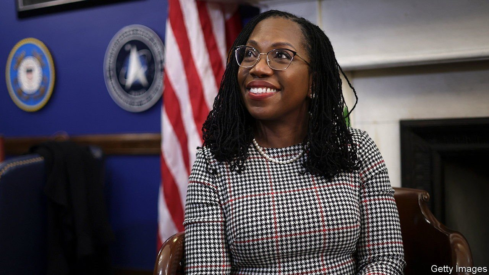

###### The 116th justice

# Ketanji Brown Jackson is confirmed to America’s Supreme Court 

##### But only three Republican senators joined the Democratic caucus in voting for the court’s first black female justice 

 

> Apr 9th 2022 

: On April 7th Ketanji Brown Jackson was confirmed as America’s 116th Supreme Court justice.

THE CONSTITUTION directs the Senate to offer presidents “advice and consent” on their . Alexander Hamilton imagined that inter-branch co-operation would be a “source of stability”. The Senate would put “an excellent check” on presidents and thwart the appointment of “unfit characters”.

, President Joe  to succeed Justice Stephen Breyer, who is retiring this summer, is on the brink of narrowly winning Senate confirmation. She will be the fourth person of colour and the first black woman to serve on the court. But Hamilton might have been puzzled had he witnessed the three-week process leading to this moment.


Few of the 47 Republicans vowing to oppose Ms Jackson’s nomination professed concerns about her character or her fitness. She won near-universal praise for her intellect and qualifications: two Harvard degrees and three judicial clerkships, including to Justice Breyer; two federal judgeships; and service as a federal public defender. Senators of both parties complimented her on her poise and charm.

For Susan Collins and Lisa Murkowski, Republicans who supported Ms Jackson’s ascent last June to the court of appeals for the District of Columbia circuit, her appearance before the Senate Judiciary Committee in March was strong enough to win their votes again. Senator Mitt Romney, who opposed Ms Jackson last year but switched his vote, called her a “well-qualified jurist and a person of honour”. Ms Murkowski lamented “the corrosive politicisation of the review process”.

Republican criticism of Ms Jackson ranged from routine to caustic. Senator Thom Tillis said he worried the nominee would “legislate from the bench”, a sentiment repeated by many Republicans despite Ms Jackson’s vow to “stay in my lane” and avoid intruding on the duties of the legislative branch. Other charges included her refusal to answer questions about whether more seats should be added to the Supreme Court (a matter that rests in the hands of Congress, not the justices).

A few Republicans aimed to paint Ms Jackson as soft on crime by focusing on sentences she gave to people convicted of child-pornography offences as a district-court judge. Several conservative commentators dismissed these claims; one called them “meritless to the point of demagoguery”. That did not stop Senator Tom Cotton contrasting Ms Jackson with her namesake, Justice Robert Jackson, who went to Nuremberg to prosecute Nazi war criminals after the second world war. “This Judge Jackson”, Mr Cotton said, “may have gone there to defend them.”

Ms Jackson deflected questions about critical race theory, how to define a woman and where, on a ten-point scale, she rates her religiosity. She recounted that when she was a freshman walking through Harvard Yard another black woman, seeing self-doubt on her face, admonished her to “persevere”. Senator Cory Booker recited a poem by Maya Angelou where “bitter, twisted lies” could not keep a woman down. Ms Jackson showed patience and command—traits she may need to draw upon as one of three liberal justices on a court with six conservatives.

The hearings, however historic, cast a pall over Hamilton’s vision of fruitful cross-branch collaboration. Lindsey Graham, a Republican who voted for Ms Jackson last year, not only flipped his vote but gave a dose of realpolitik during the Senate Judiciary Committee meeting on April 4th. If Republicans controlled the Senate (a distinct possibility after this year’s mid-terms), he said, Ms Jackson “would not have been before this committee”. ■

For exclusive insight and reading recommendations from our correspondents in America, , our weekly newsletter.

