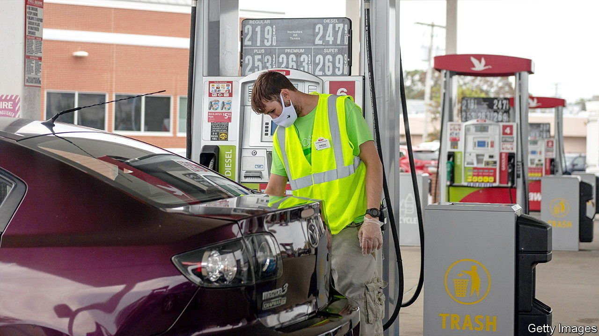

###### Not pumped up

# Self-service petrol stations hit a roadblock in New Jersey 

##### For 73 years, New Jerseyans have been banned from pumping their own petrol. They like it that way 

 

> Apr 9th 2022 

DRIVE ANYWHERE in New Jersey and you will almost certainly see a bumper sticker or a car magnet bragging that “Jersey girls don’t pump gas”. For 73 years, New Jerseyans have relied on petrol-station attendants to fill their cars and lorries, rather than do it themselves. It is a point of pride for many to say they do not know how to pump petrol, as much a part of local identity as pork rolls or salt water taffy at the Jersey shore.

Might the Garden State join the other 49 and allow drivers to serve themselves? A combination of record fuel prices and a shortage of pump attendants means that changing the 1949 law is gaining support—including from the owners of the state’s petrol stations, who have historically opposed any reform. In the past high-school and college students were happy to take on attendant jobs, which require a day’s apprenticeship. But now Ebbie Ashabi, who owns two stations and delivers petrol to more than 50 others, says, “We cannot find people.”


Some station operators are paying $17 an hour, $4 more than the state’s minimum wage, and still are short-staffed. They have no choice but to shut down pumps for hours at a time, causing long queues at the ones that remain open.

Yet most New Jerseyans like the status quo. A recent Rutgers University poll showed that 73% do not want to pump petrol themselves. Some have antiquated notions about pumping being dangerous. Declan O’Scanlon, a state lawmaker who supports the reform, points out that: “It is absolutely true, Jersey girls are hotter than girls anywhere else. It is not true that they are more flammable.”

This reform would still leave the state with the most stringent full-service requirements in America. “We are proposing giving the consumer a choice,” says Sal Risalvato, head of an association representing New Jersey petrol stations. It would save 15 cents a gallon, he notes.

Phil Murphy, the governor, has called full-service “part of our fabric” and changing it “a political third rail in New Jersey”. Nicholas Scutari, president of the state Senate, is currently blocking the measure, but has said that if public sentiment changed, or if data showed that it would dramatically reduce costs, he would reconsider. Most New Jerseyans, pragmatic and sceptical by nature, would agree, says Micah Rasmussen of the Rebovich Institute for New Jersey Politics, at Rider University. “We’re not giving away something for nothing.”

For exclusive insight and reading recommendations from our correspondents in America, , our weekly newsletter.

