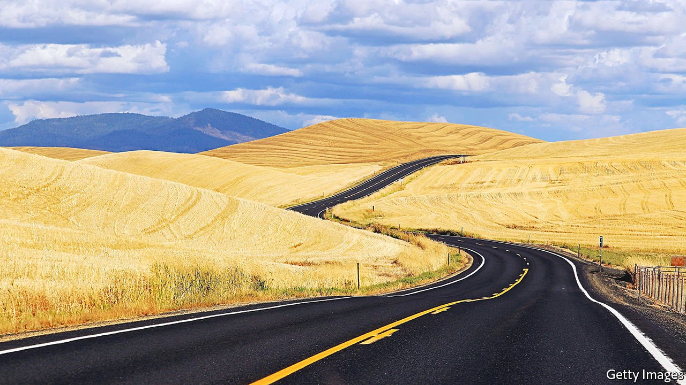
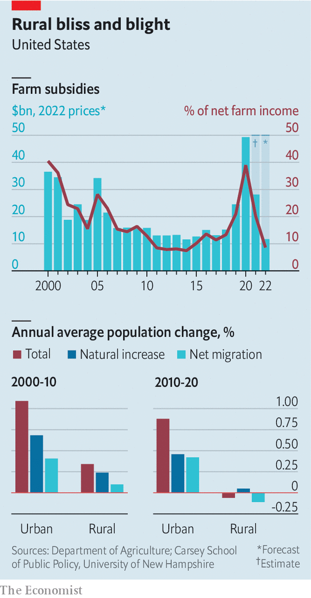

###### Fields of gold

# Why an agricultural boom does not help rural America 

##### Farms are ever more profitable, but employ fewer workers 

 

> Apr 9th 2022 

FOR A PICTURE of the evolution of modern agriculture, you could do worse than visit the barn on Philip Volk’s farm, near the city of Rugby in North Dakota. Inside the ageing building is hundreds of thousands of dollars-worth of equipment. A huge red combine harvester sits next to the green “air seeder”, which looks a little like a bread slicer, and a tractor larger than a tank. Pulled by the tractor, which follows a GPS-guided map automatically, the air seeder cuts through the soil and, in just a week or so, sows the entire crop, which on Mr Volk’s farm is mostly spring wheat. Five to six months later, the combine harvester picks it all up almost as quickly, and then trucks take it down the road to a grain elevator, where it is graded and loaded onto trains that carry it out to the west coast, mostly to be shipped to Japan.

With a team of four (and a few more relatives and neighbours roped in at harvest time) Mr Volk is able to farm 5,000 acres (2,000 hectares) of land. His great-grand father, who immigrated to America from Germany, had to plough the land with horses, then sow it manually, with dozens, if not hundreds of workers. The farm’s first tractor, purchased by Mr Volk’s grandfather almost a century ago, still sits in the barn. It is dwarfed by the modern contraptions next to it, and would not be much use on the farm now. “I would not want to go back and sit on an open-cab tractor and have the toil my grandfather had,” says Mr Volk.


America’s farmers face interesting times. On the plains of North Dakota and Montana, as across the border in Saskatchewan in Canada, the biggest crop is spring wheat, which is planted in April and harvested in late summer. Planting on farms in Montana has begun already; Mr Volk will start soon. Thanks to the war in Ukraine, wheat prices are the highest they have been since 2008, meaning that farmers ought to make a lot of money. But they have to adjust for much higher input prices, too, particularly for fertiliser and fuel. And drought for much of the past three years has lowered output.

Despite the higher prices, Mr Volk reckons that he will plant only 5-10% more wheat this year than he would have done without the war, because the risk of spending so much on inputs is too high if the crop does not actually come through. “Two weeks of the wrong weather can change the story in a heartbeat,” he says.

That is bad news for the consumers of wheat, in particular poor people in countries in north Africa which rely on now-lost Ukrainian and Russian supplies. Over half of American wheat is exported. But it ought to be good news for farmers, since a glut is unlikely to push prices down again soon.

American farmers are making good money. Net farm income last year increased by 25%, according to the Department of Agriculture (USDA), to its highest level since 2013. The department reckons that it may dip slightly this year, partly because of reduced government support linked to covid-19, and partly because of higher input costs. But only slightly. The price of farmland, an indicator of the profitability of farming, as well as interest rates, is the highest it has ever been. Farmland in Iowa, America’s most agricultural state, has sold for over $20,000 an acre.

 


In recent years politicians in Washington, DC, have funnelled money to farmers at an astonishing rate. In 2020 farmers received three times the normal level of subsidies, says Vincent Smith, an economist at Montana State University, thanks to payments related to covid and to Donald Trump’s trade wars, which went outside the normal system of farm subsidies, passed in farm bills by Congress every five years. Total payments, most to 200,000 or so large farmers, amounted to $49bn (in 2022 dollars) or 0.2% of GDP (see left-hand chart). By comparison, spending on food stamps, which are also administered by the USDA and go to 40m people, was $87bn.

Yet despite all this cash, rural America is in deep decline (see right-hand chart). According to the 2020 census, two-thirds of rural counties lost population from 2010 to 2020, and the total population of rural America fell for the first time in history. The counties that grew were mostly not farming ones but pretty places where people go to retire, near mountains or the ocean, or those with lots of oil. The midwestern areas which grow most of America’s food are shrinking fastest. Pierce County, where Mr Volk’s farm is, lost 8% of its people, even as North Dakotan counties farther west, where there has been a shale-oil boom for 15 years, grew prodigiously.

Fuelling folly

The reason why is visible in Mr Volk’s barn. As farming becomes more profitable, so do the gains from mechanisation. Today, just 6% of jobs in rural areas are directly linked to farming, points out Anne Schechinger, an agricultural economist for the Environmental Working Group, a research NGO. Most farms, even small ones, “are highly capitalised agribusinesses growing one or two commodity crops and employing very few people”, she says. Mr Volk says his farm is about as small as can be competitively run, to cover the costs of the hardware. Over the decades, it has gradually grown bigger as neighbours have retired and split their land up among heirs—many of whom end up selling their bit to Mr Volk.

Subsidies, largely in the form of crop insurance, help to ensure the food supply continues, and protect farmers from going bust during downturns. But they also determine what America farms—incentivising farmers to grow vast amounts of soyabeans and corn, as well as wheat, which is mostly exported. Corn (maize) is boosted not only by direct subsidies but also by the Renewable Fuel Standard, which forces refiners to blend ethanol made from corn into petrol, in turn pushing up the value of the crop. Such crops are best grown on large, mechanised farms. Fresh fruit and vegetables, which Americans ought to eat more of, are more expensive to grow, and require more labour, but farmers receive almost no subsidies for them.

Even if farmers are getting wealthier, the communities they live in are not. Mr Volk says that when he went to school, there were 40 children on his school bus. Today his youngest son goes on the bus with fewer than ten classmates. His eldest son is likely to take over the farm, but future children may have to go to a boarding school. It is harder to find people to serve as voluntary officials on the school board and county government. Many young people end up moving to places where the job opportunities are more exciting, if not necessarily more profitable. Over half of the churches that used to serve the community have closed. “It shrinks the community,” Mr Volk says.

Congress is beginning to consult on its next farm bill, which is due to pass next year. Even with prices as high as they are, most observers expect subsidies to stay steady or even grow. Farmers have been pushing for payments to encourage them to reduce CO emissions, says Mr Smith. “And as far as I know, every major lobbying group endorsed that notion, preferably at very substantial levels.” Helping out farmers is politically popular, not least because rural communities are over-represented in Congress. Yet the subsidies may in fact be sustaining the decline of rural America. ■

For exclusive insight and reading recommendations from our correspondents in America, , our weekly newsletter.

