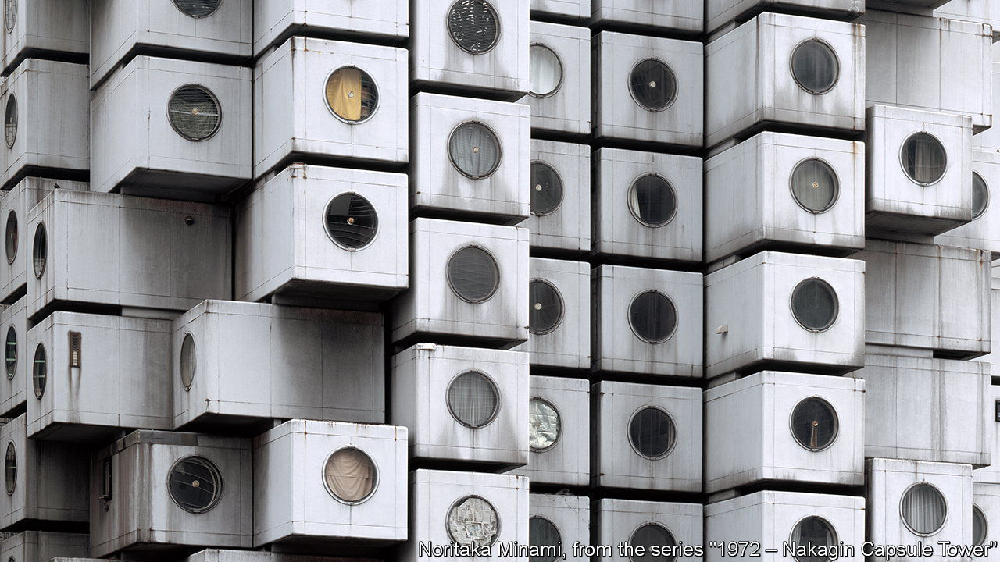
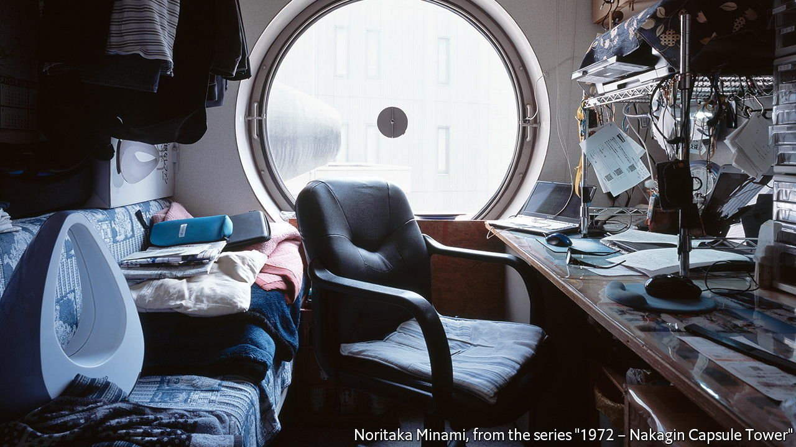
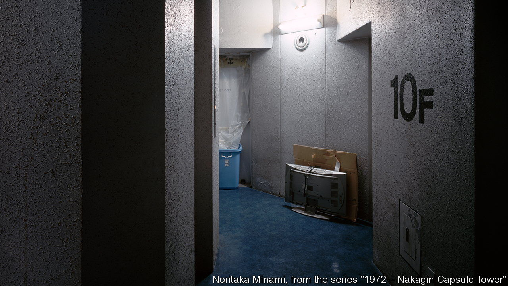
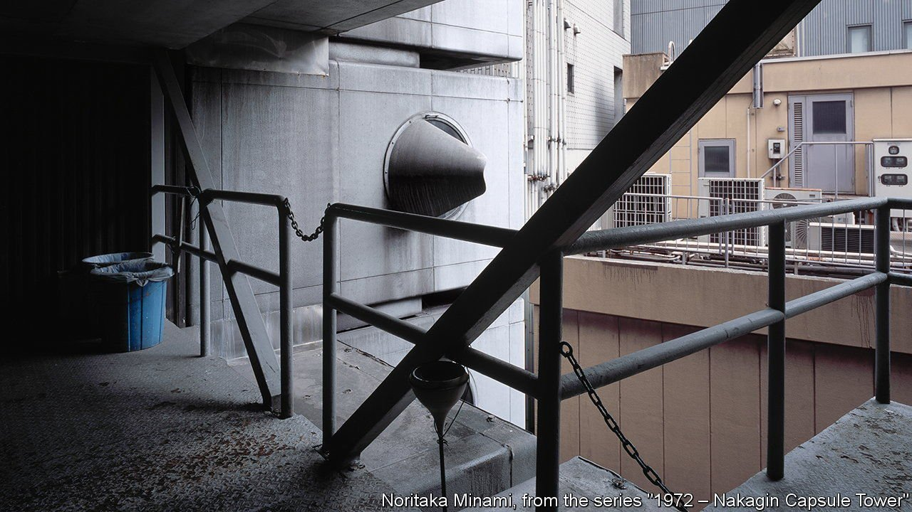

###### Metabolism, digested

# An ode to Tokyo’s Nakagin Capsule Tower 

##### And to a more optimistic time 

 

> Apr 16th 2022 

THE NAKAGIN CAPSULE TOWER stands out from its unremarkable neighbours in Tokyo’s Shimbashi district. Made up of 144 identical cuboids, stacked upon and jutting out from each other, the modular tower is both unabashedly futurist and subtly respectful of tradition. Each cuboid has a round window that evokes both space travel and the ancient architecture of Kyoto. They contain built-in living spaces composed of bath units, beds, desks and household electronics. Kurokawa Kisho, the building’s architect, envisioned his cramped “capsules” as dwellings for what he called Homo movens, or highly mobile modern humans, such as the businessmen who lived in distant suburbs and worked late in Tokyo offices.

When the tower first went up in 1972, it became a prime example of Metabolism, an influential architectural movement in post-war Japan. Metabolism’s chief exponents had studied under Tange Kenzo, an architect whose works included the park and memorial built in Hiroshima to commemorate the nuclear attack of 1945. The Metabolists designed buildings to be adaptable and replaceable, and resilient to threats such as wars and earthquakes. But not, alas, to neglect. On April 12th work started on demolishing the tower, following a long but ultimately futile battle to preserve it.

 


Given that, it is ironic that Metabolists sought to shift thinking about architecture from the mechanical to the biological, conceiving of cities as organisms that grew and changed rather than as static constructions to be planned and maintained. “We regard human society as a vital process, a continuous development from atom to nebula,” they declared in their first manifesto, written ahead of the World Design Conference in Tokyo in 1960.


Their ideas were informed both by Western modernism and Eastern philosophy, drawing particular inspiration from Japan’s Ise shrine, which has been entirely reconstructed almost every 20 years since the 7th century. Metabolism also embodied the energy of Japan’s rapid-growth era. The Metabolists did more than just design buildings: in their hands, architecture became a field for reimagining Japanese identity after the ravages of the war.

 


In their texts, the architects pondered the relationship between technology and humanity. They considered the demands of designing cities for a growing urban population and a humming economy. They envisioned structures that floated over the seas and reached for the skies. Kurokawa called his capsules “cyborg architecture”, where “man, machine and space build a new organic body”.

The ideas were characteristic of an era of change and possibility. “There was great momentum in society,” says Maeda Tatsuyuki of Nakagin Capsule Tower Preservation and Restoration Project. “It was a period when society was bolder and could afford to do such things.”

 


By the end, the structure was decaying and riddled with asbestos. Many of the capsules were no longer habitable. The tower’s destruction serves as a reminder of the relative caution of contemporary Japan. “These days, nobody would dare to build anything like that,” Mr Maeda sighs. Yet it is also reflective of the same culture of impermanence that once inspired the Metabolists. In Japan, buildings are traditionally made of wood and paper, not intended to last centuries. There is not much of a preservationist movement. “Japan seems to demolish things before there’s even debate,” says Mr Maeda.

Still, fans and residents of the Nakagin tower had hoped to raise funds to replace the capsules, in line with Kurokawa’s initial concept. They had been in negotiations about buying the building. But the pandemic halted any momentum they had. Mr Maeda’s group now hopes to rescue some 40 individual capsules, remove the asbestos, recreate the interiors and give them new lives at museums around the world. Mr Maeda compares the process to a “withered dandelion” spreading its seeds. “The capsules will take on a life of their own, scattered across different locations.” It is in keeping with the spirit of Metabolism. ■

