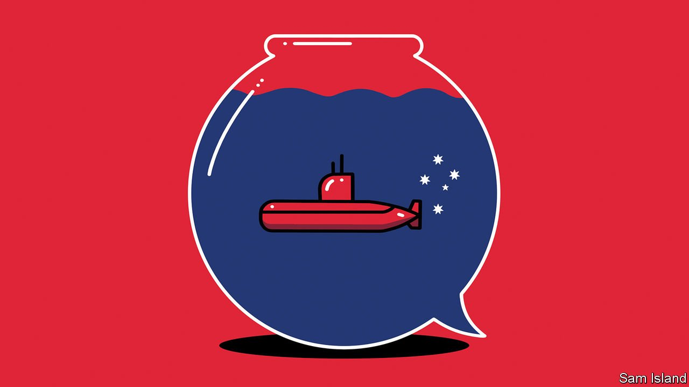

###### Banyan

# Australian politicians need to think harder about defence 

##### The country is spending freely on security. But is it spending wisely? 

 

> Apr 13th 2022 

NOW THAT Australia’s prime minister, Scott Morrison, has set a date, May 21st, for a general election, expect his beleaguered conservative coalition to ramp up attacks on the Labor Party and its supposed incompetence. On the economy, it will paint Labor as a choker of growth. On security, it will call it soft on defence. In a particularly crass move, Mr Morrison has called Anthony Albanese, Labor’s leader, Beijing’s candidate.

In truth, when it comes to Australia’s security priorities, a bipartisan consensus prevails. Both the ruling Liberal-National coalition and Labor deem the rise of an increasingly coercive China to represent what defence planners gloomily call the “most consequential strategic realignment” in the region since the second world war.


Defence spending has thus risen from about A$30bn ($22bn) in 2015 to almost A$50bn in this year’s budget, and will top A$70bn by 2030, according to the Australian Strategic Policy Institute, a think-tank in Canberra, the capital. In September Australia, America and Britain formed AUKUS, an arrangement for diplomatic and technological collaboration on security, including a deal for at least eight Australian nuclear-powered submarines. These are intended to help thwart any Chinese bid for hegemony in the Asia-Pacific region.

Other proposals (some in the works for a while) have come thick and fast before the election, from an Australian space agency to the development of hypersonic missiles. Some A$10bn is going on cyber and intelligence capabilities, and the procurement of new defensive missiles and sea mines has been sped up. The 60,000-strong armed forces will grow by a third by 2040.

The opposition has gone along with all of this. The bipartisan consensus is striking. The question is whether it is healthy. Some Australian strategists argue not—that defence priorities and implications are confused and even at odds. It is far from clear how a war with China would be fought, or where. A clarifying debate about Australian defence is still needed.

Not since Japanese aggression in the 1940s has Australia been challenged by a potentially hostile power. Today, should the priority be defending Australia’s territorial boundaries and the approaches to them, or should it be projecting power far away? The nuclear subs and hypersonic missiles embody the latter approach.

Sam Roggeveen of the Lowy Institute, a think-tank in Sydney, argues that they risk worsening Australia’s security overall, because China will see them as provocative. They also reflect “near panic” in the defence establishment over the Chinese threat to Australia. Beijing, Mr Roggeveen notes, is closer to Berlin than to Sydney.

So to its critics, AUKUS reflects American priorities in its struggle with China more than it does Australian ones. No doubt many of the priorities are shared. Yet by the mid-2050s, when (if all goes well) the subs will be in service, “the strategic contest between the United States and China will be over,” claims Hugh White of the Australian National University—and not necessarily in America’s favour.

The habit of thinking that America will “fix our defence needs”, Mr White says, “runs very deep in the Australian psychology”. Yet Donald Trump’s “America-first” sloganeering, in which he disparaged alliances, suggested that America’s long-term presence is hostage to domestic ructions and can no longer be taken for granted. Mr White argues for much greater self-reliance in preparing for the day when China can challenge Australia in its own waters.

Yet whether on the home or away side of the argument, a glaring hole exists in Australia’s defence policy—a failure to tend better to its near-abroad. News of a Chinese security agreement with the Solomon Islands has alarmed policymakers in Canberra. Mr Morrison has protected Pacific islands’ aid budgets, as part of his “Pacific step-up” campaign, intended to replace an episodic history of diplomatic engagement with something more consistent. But low-lying countries are underwhelmed by his refusal to take climate change seriously. And they resent his paternalistic talk of Australia’s Pacific “family” and “backyard”.

As for Indonesia, security co-operation falls well short of its potential, even though the giant archipelago to Australia’s north could itself evolve into a powerful buffer in its own right against Chinese military ambitions. Whichever side forms the next government would do well to remember: the first line of defence is better diplomacy.

Read more from Banyan, our columnist on Asia: (Apr 9th) (Apr 2nd)

 (Mar 26th)

